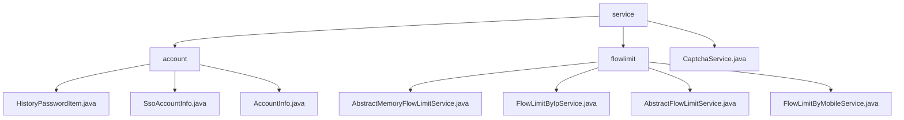

# Basic Information

|      |      |
|------|------|
| Name | service |
| Language | .java |
| Code Path | WeFe/common/java/common-web/src/main/java/com/welab/wefe/common/web/service |
| Package Name | docs.common.java.common-web.src.main.java.com.welab.wefe.common.web.service |
| Brief Description | The account management module uniformly manages user information and password security, providing standardized interfaces and data structures. The rate limiting module controls API access frequency based on a key-value strategy, supporting IP and mobile number throttling. The captcha service generates and verifies Base64 image captchas with a 60-second validity period, ensuring thread safety. |

# Description

## Overview  
This module consists of three core components: account management, traffic control, and captcha service. The account management component handles the full lifecycle management of user information and password security, providing standard data structures such as AccountInfo and HistoryPasswordItem, and relies on a JSON processing library. The traffic control component adopts a token bucket-like pattern, implementing multi-dimensional rate limiting (e.g., IP/phone number) via ConcurrentHashMap, and depends on HttpServletRequest, among others. The captcha service uses ExpiringMap to store temporary verification codes, supporting Base64 image generation and validation. For example, password modifications automatically archive historical records, while IP rate limiting configures policies via annotations.  

## Key Business Scenarios  
Account management applies to registration, login, and status transition scenarios, such as controlling permissions via adminRoleFlag. Traffic control implements a synchronous check-block process, such as returning a prompt when a phone number exceeds the limit. The captcha service is used for human-machine verification, with generated codes expiring automatically. Typical patterns include: combining SsoAccountInfo to extend single sign-on, sliding window algorithms for counting rate limits, and thread-safe captcha storage and retrieval. API integration is achieved by inheriting abstract classes (e.g., FlowLimitByIpService) or directly invoking CaptchaService, covering CRUD operations, policy configuration, and real-time validation, among other functionalities.

### Package Internal Structure View

This flowchart illustrates the service class structure within the common-web module of the WeFe project. The root node is the service directory, which contains two subdirectories (account and flowlimit) and the CaptchaService.java file. The account directory includes three account-related entity classes, while the flowlimit directory comprises four abstract and implementation classes related to flow limiting. The overall structure clearly reflects the functional module division of the web service layer.

# File List

| Name   | Type  | Description |
|-------|------|-------------|
| [CaptchaService.java](CaptchaService.md) | file | The `CaptchaService` class provides CAPTCHA functionality, including generation, storage, and validation. CAPTCHAs expire in 60 seconds, with a maximum storage limit of 10,000. The generation method supports custom width, height, and length, while the validation method deletes the CAPTCHA after verification. |
| [flowlimit](flowlimit/_module.md) | package | AbstractMemoryFlowLimitService is an abstract class that extends AbstractFlowLimitService, using ConcurrentHashMap to cache flow records and a background thread to clean up expired data. FlowLimitByIpService implements IP-based flow limiting by generating a unique key from the request IP. AbstractFlowLimitService provides the foundational flow-limiting mechanism, including the check() method and abstract strategy definitions. FlowLimitByMobileService enforces flow limiting based on mobile numbers, generating the flow-limiting key from mobile numbers extracted in request parameters. |
| [account](account/_module.md) | package | The `HistoryPasswordItem` class stores passwords and salt values, providing a constructor method. The `SsoAccountInfo` class manages single sign-on user information, including fields such as ID, name, phone number, and email. The `AccountInfo` class defines the account data structure, containing basic fields, business attributes, and historical password management functionality. |

