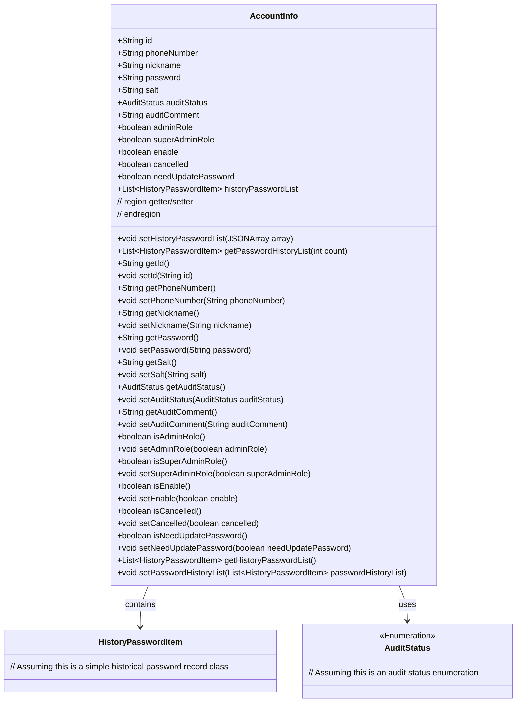
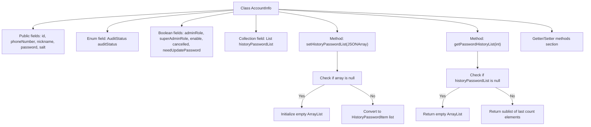

# Basic Information

|      |      |
|------|------|
| Name | AccountInfo |
| Language | .java |
| Code Path | WeFe/common/java/common-web/src/main/java/com/welab/wefe/common/web/service/account/AccountInfo.java |
| Package Name | com.welab.wefe.common.web.service.account |
| Dependencies | ['com.alibaba.fastjson.JSONArray', 'com.welab.wefe.common.wefe.enums.AuditStatus', 'java.util.ArrayList', 'java.util.List'] |
| Brief Description | The AccountInfo class contains fields such as basic account information, review status, role permissions, and password history, providing getter/setter methods. |

# Description

The `AccountInfo` class defines the data structure for account information, including basic fields such as `id`, `mobile number`, `nickname`, `password`, and `encryption salt`. It provides business attributes like `account review status`, `review comments`, `administrator role identifier`, `activation status`, `deactivation status`, and `password modification flag`. The class maintains a `historical password list`, supports initializing historical password data via a JSON array, and offers a method to retrieve the most recent N historical passwords. Standard getter and setter methods are implemented for all fields to ensure encapsulated data access. This structure comprehensively covers the core attributes and operational requirements related to account management.

# Class Summary

| Name   | Type  | Description |
|-------|------|-------------|
| AccountInfo | class | The AccountInfo class includes attributes such as account ID, phone number, nickname, password, encryption salt, audit status, administrator flag, enabled status, deactivation status, and a list of historical passwords, along with the corresponding getter/setter methods. |

## Class AccountInfo

|      |      |
|------|------|
| Access Modifier | public |
| Type | class |
| Name | AccountInfo |
| Description | The AccountInfo class includes attributes such as account ID, phone number, nickname, password, encryption salt, audit status, administrator flag, enabled status, deactivation status, and a list of historical passwords, along with the corresponding getter/setter methods. |

### UML Class Diagram

This code defines an account information class (AccountInfo) containing user basic information, permission status, audit status, and historical password records. The class stores core account data through multiple public fields and provides complete getter/setter methods for encapsulation. It specifically includes special handling methods for historical password lists (setHistoryPasswordList and getPasswordHistoryList), capable of processing JSON data conversion and paginated queries. The class diagram shows the association relationships between AccountInfo and HistoryPasswordItem, AuditStatus, presenting a clear overall structure of the core data model in the account management domain.

### Internal Method Call Graph

This flowchart illustrates the complete structure of the AccountInfo class, featuring a core data model with 12 fields (5 strings, 1 enum, 6 booleans, and 1 collection). It highlights two key methods: setHistoryPasswordList for JSON array conversion and getPasswordHistoryList for paginated retrieval of password history records. All fields are equipped with standard Getter/Setter methods, collectively forming a typical account information management entity class suitable for systems requiring granular permission control and password history tracking.

### Field List

| Name  | Type  | Description |
|-------|-------|------|
| auditStatus | AuditStatus | Audit status field, indicating the review status of an object. |
| needUpdatePassword | boolean | The boolean variable `needUpdatePassword` indicates whether a password update is required. |
| nickname | String | Declare a public string-type variable named nickname. |
| adminRole | boolean | The code defines a public boolean variable named adminRole, which represents the administrator role status. |
| password | String | Declare a public string variable password. |
| historyPasswordList | List<HistoryPasswordItem> | Historical password list, storing HistoryPasswordItem objects. |
| enable | boolean | The boolean variable `enable` indicates the enabled status. |
| superAdminRole | boolean | Declare a boolean variable superAdminRole to indicate whether it is a super administrator role. |
| id | String | Declare a public string-type variable id. |
| cancelled | boolean | The boolean variable `cancelled` indicates the cancellation status. |
| phoneNumber | String | Public string variable phoneNumber, used to store phone number. |
| salt | String | Declare a public string variable salt. |
| auditComment | String | A public string-type member variable named auditComment is defined in the class. |

### Method List

| Name  | Type  | Description |
|-------|-------|------|
| getNickname | String | The method returns the user's nickname string. |
| setId | void | Methods for setting the object ID: assign the parameter id to the id property of the current object. |
| setPhoneNumber | void | The method for setting a phone number assigns the input parameter to the class member variable phoneNumber. |
| getAuditComment | String | Methods to obtain audit comments, returning the auditComment string. |
| setAuditComment | void | This is a Java method used to set the value of the auditComment property. The method takes a string parameter auditComment and assigns it to the class member variable of the same name. |
| getPasswordHistoryList | List<HistoryPasswordItem> | Retrieve the password history list, returning up to the specified number of entries. If the list is empty, an empty list will be returned. |
| isSuperAdminRole | boolean | Check if it is a super administrator role. |
| setAdminRole | void | Define a method to set the administrator role, with a boolean parameter adminRole, and assign it to the class member variable adminRole. |
| setSuperAdminRole | void | The method to set whether a user has the super administrator role, with the parameter being a boolean value. |
| isAdminRole | boolean | Check if it is an administrator role, return the boolean value adminRole. |
| getAuditStatus | AuditStatus | Methods to obtain the audit status, returning the auditStatus value. |
| setPassword | void | Method to set password, assigns the input string to the class member variable password. |
| getId | String | The method getId returns a string-type id value. |
| setHistoryPasswordList | void | The method `setHistoryPasswordList` accepts a JSON array parameter. If the parameter is empty, it initializes an empty list; otherwise, it converts the parameter into a list of type `HistoryPasswordItem` and assigns it to the member variable. |
| setNickname | void | The method to set a user nickname assigns the input parameter to the nickname property of the object. |
| setAuditStatus | void | The method to set the audit status assigns the incoming auditStatus to the auditStatus property of the current object. |
| setSalt | void | Set the salt attribute of string type. |
| isCancelled | boolean | The method returns a boolean value indicating whether it has been canceled. |
| setCancelled | void | Common method for setting cancellation status, with a boolean parameter `cancelled` to update internal state. |
| isNeedUpdatePassword | boolean | This method returns a boolean value `needUpdatePassword`, indicating whether a password update is required. |
| setNeedUpdatePassword | void | Method for setting password update requirements by controlling whether a password update is needed via a boolean parameter. |
| getHistoryPasswordList | List<HistoryPasswordItem> | Methods to retrieve the history password list, returning a list of HistoryPasswordItem type. |
| setPasswordHistoryList | void | The method for setting the password history list assigns the input list of historical password entries to the class's historical password list variable. |
| isEnable | boolean | The method isEnable returns the state of the boolean value enable. |
| setEnable | void | Boolean method for setting the enabled state. |
| getPassword | String | Methods for obtaining password strings. |
| getPhoneNumber | String | This is a Java method that returns the value of the string-type variable phoneNumber. |
| getSalt | String | Public method to obtain the salt value. |

