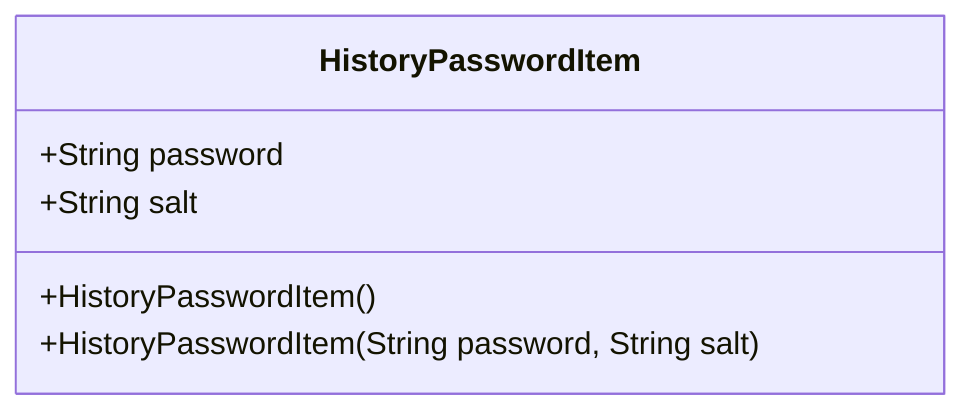
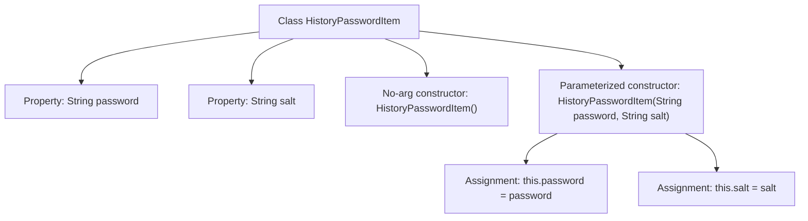

# Basic Information

|      |      |
|------|------|
| Name | HistoryPasswordItem |
| Language | .java |
| Code Path | WeFe/common/java/common-web/src/main/java/com/welab/wefe/common/web/service/account/HistoryPasswordItem.java |
| Package Name | com.welab.wefe.common.web.service.account |
| Dependencies | [] |
| Brief Description | The HistoryPasswordItem class contains fields for password and salt, providing both a no-argument constructor and a parameterized constructor. |

# Description

HistoryPasswordItem is a Java class designed to store historical password information. This class contains two string-type member variables: `password` representing the password content, and `salt` representing the encryption salt value. It provides two constructors: a no-argument constructor for default initialization, and another constructor that accepts `password` and `salt` parameters for initialization.

# Class Summary

| Name   | Type  | Description |
|-------|------|-------------|
| HistoryPasswordItem | class | The HistoryPasswordItem class stores historical passwords and salt values, including a no-argument constructor and a parameterized constructor. |

## Class HistoryPasswordItem

|      |      |
|------|------|
| Access Modifier | public |
| Type | class |
| Name | HistoryPasswordItem |
| Description | The HistoryPasswordItem class stores historical passwords and salt values, including a no-argument constructor and a parameterized constructor. |

### UML Class Diagram

This code defines a class named HistoryPasswordItem, which is used to store historical passwords and their corresponding salt values. The class contains two public string fields (password and salt), along with two constructors (a no-argument constructor and a parameterized constructor). The primary purpose of this class is to encapsulate historical password data, which can be utilized in scenarios such as password change history tracking and password security checks. The class design is straightforward, with all fields being public for easy external access and modification.

### Internal Method Call Graph

This code defines a class named HistoryPasswordItem, which stores historical passwords and their corresponding salt values. The class contains two String properties: password and salt, along with two constructors: a no-argument constructor for creating empty objects, and a parameterized constructor for initializing the password and salt properties. The flowchart clearly illustrates the class structure and the internal assignment logic of the constructors, demonstrating two approaches to object initialization.

### Field List

| Name  | Type  | Description |
|-------|-------|------|
| salt | String | Declare a public string variable salt. |
| password | String | Public string variable password, storing password information. |

### Method List

| Name  | Type  | Description |
|-------|-------|------|

