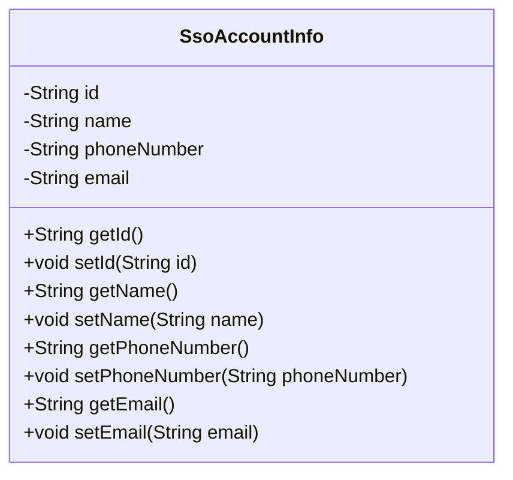

# Basic Information

|      |      |
|------|------|
| Name | SsoAccountInfo |
| Language | .java |
| Code Path | WeFe/common/java/common-web/src/main/java/com/welab/wefe/common/web/service/account/SsoAccountInfo.java |
| Package Name | com.welab.wefe.common.web.service.account |
| Dependencies | [] |
| Brief Description | SSO account information class, containing fields for user ID, name, phone number, and email, along with corresponding getter/setter methods. |

# Description

This is a Java class named SsoAccountInfo, designed to store user account information for a single sign-on system. The class contains four private string-type fields: id represents the user's unique identifier, name stores the username, phoneNumber records the user's phone number, and email holds the user's email address. Each field is equipped with corresponding getter and setter methods for retrieving and setting field values. This class provides encapsulation and management functionality for basic user information.

# Class Summary

| Name   | Type  | Description |
|-------|------|-------------|
| SsoAccountInfo | class | SSO account information class, containing fields for user ID, name, mobile number, and email, along with corresponding getter/setter methods. |

## Class SsoAccountInfo

|      |      |
|------|------|
| Access Modifier | public |
| Type | class |
| Name | SsoAccountInfo |
| Description | SSO account information class, containing fields for user ID, name, mobile number, and email, along with corresponding getter/setter methods. |

### UML Class Diagram

This code defines a class named SsoAccountInfo, which is used to store user account information in a Single Sign-On (SSO) system. The class contains four private attributes: id (unique user identifier), name (username), phoneNumber (phone number), and email (email address), along with corresponding getter and setter methods for each attribute. This class primarily serves to encapsulate basic user information, facilitating the transfer and processing of user data within the system, and exemplifies the encapsulation feature of object-oriented programming.

### Internal Method Call Graph

```mermaid
graph TD
    A["Class SsoAccountInfo"]
    B["Attribute: String id"]
    C["Attribute: String name"]
    D["Attribute: String phoneNumber"]
    E["Attribute: String email"]
    F["Method: String getId()"]
    G["Method: void setId(String id)"]
    H["Method: String getName()"]
    I["Method: void setName(String name)"]
    J["Method: String getPhoneNumber()"]
    K["Method: void setPhoneNumber(String phoneNumber)"]
    L["Method: String getEmail()"]
    M["Method: void setEmail(String email)"]

    A --> B
    A --> C
    A --> D
    A --> E
    A --> F
    A --> G
    A --> H
    A --> I
    A --> J
    A --> K
    A --> L
    A --> M
```

This flowchart illustrates the complete structure of the SsoAccountInfo class, containing 4 private attributes (id/name/phoneNumber/email) and corresponding 8 getter/setter methods. Each attribute has dedicated method pairs for read/write operations, forming a standard JavaBean pattern. The class structure is clear, with attributes and methods connected by arrows, demonstrating object-oriented encapsulation characteristics.

### Field List

| Name  | Type  | Description |
|-------|-------|------|
| id | String | Private string type variable id. |
| phoneNumber | String | Private string type variable phoneNumber |
| email | String | Define a private string type variable email. |
| name | String | Declare a private string variable named name. |

### Method List

| Name  | Type  | Description |
|-------|-------|------|
| getName | String | Methods to obtain the name, returning the value of the name variable of string type. |
| setName | void | The method to set the object name is to assign the parameter 'name' to the 'name' property of the object. |
| getPhoneNumber | String | Methods to obtain the phone number, directly return the stored phoneNumber string. |
| getId | String | Methods to obtain the object ID, returning the id value as a string type. |
| setId | void | This is a Java method used to set the id property of an object. The method takes a string parameter id and assigns it to the id member variable of the current object. |
| setPhoneNumber | void | The method to set a phone number, assigning the input parameter to the member variable of the class. |
| getEmail | String | Methods to obtain the email string. |
| setEmail | void | Method to set the object's email attribute, with the parameter being a string-type email. |

