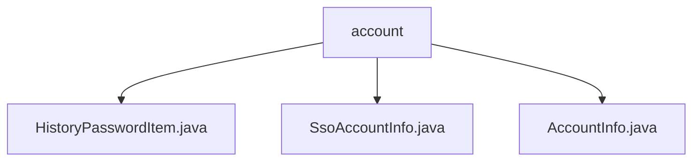

# Basic Information

|      |      |
|------|------|
| Name | account |
| Language | .java |
| Code Path | WeFe/common/java/common-web/src/main/java/com/welab/wefe/common/web/service/account |
| Package Name | docs.common.java.common-web.src.main.java.com.welab.wefe.common.web.service.account |
| Brief Description | The `HistoryPasswordItem` class stores passwords and salt values, providing a constructor method. The `SsoAccountInfo` class manages single sign-on user information, including fields such as ID, name, phone number, and email. The `AccountInfo` class defines the account data structure, containing basic fields, business attributes, and historical password management functionality. |

# Description

## Overview  
The core responsibility of this module is to uniformly manage user account information and password security data, providing standardized data structures and access interfaces. The interface specifications include getter/setter methods for basic fields, historical password management (e.g., JSON array initialization), and status flag operations. Key data structures include AccountInfo (primary account model), SsoAccountInfo (single sign-on extension information), and HistoryPasswordItem (password history record). The only external dependency is a JSON processing library. For example, AccountInfo maintains password change history through List<HistoryPasswordItem>, supporting retrieval of the most recent N records.  

## Key Business Scenarios  
The module is suitable for full lifecycle account management, including registration information storage (e.g., phone number/email), login credential maintenance (password + salt), and status transitions (review/enable/deactivation). It adopts a data aggregation-like pattern, extending single sign-on capabilities by combining SsoAccountInfo. Typical applications include automatically archiving old passwords to HistoryPasswordItem during password changes or implementing permission control through AccountInfo's adminRoleFlag. API types cover basic CRUD operations and business status queries, such as retrieving a user's last 3 historical passwords for security verification.

### Package Internal Structure View

This flowchart illustrates three Java files under the account directory: HistoryPasswordItem.java, SsoAccountInfo.java, and AccountInfo.java. These files reside at the same hierarchical level, directly located under the account service directory without deeper nested structures. Each file represents different account-related functional implementations, including modules such as historical password records, SSO account information, and basic account information.

# File List

| Name   | Type  | Description |
|-------|------|-------------|
| [HistoryPasswordItem.java](HistoryPasswordItem.md) | file | The HistoryPasswordItem class contains fields for password and salt, providing both a no-argument constructor and a parameterized constructor. |
| [SsoAccountInfo.java](SsoAccountInfo.md) | file | SSO account information class, containing fields for user ID, name, phone number, and email, along with corresponding getter/setter methods. |
| [AccountInfo.java](AccountInfo.md) | file | The AccountInfo class contains fields such as basic account information, audit status, role permissions, and password history, providing getter/setter methods. |

