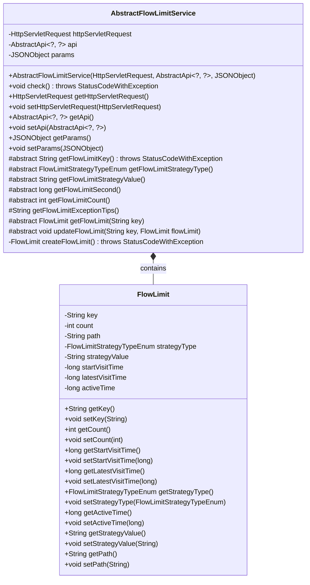
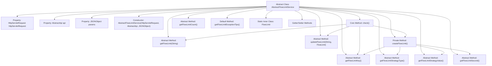

# Basic Information

|      |      |
|------|------|
| Name | AbstractFlowLimitService |
| Language | .java |
| Code Path | WeFe/common/java/common-web/src/main/java/com/welab/wefe/common/web/service/flowlimit/AbstractFlowLimitService.java |
| Package Name | com.welab.wefe.common.web.service.flowlimit |
| Dependencies | ['com.alibaba.fastjson.JSONObject', 'com.welab.wefe.common.StatusCode', 'com.welab.wefe.common.exception.StatusCodeWithException', 'com.welab.wefe.common.web.api.base.AbstractApi', 'com.welab.wefe.common.web.api.base.Api', 'com.welab.wefe.common.wefe.enums.FlowLimitStrategyTypeEnum', 'javax.servlet.http.HttpServletRequest'] |
| Brief Description | The abstract class `AbstractFlowLimitService` implements traffic limiting functionality by checking access counts within a synchronized block and throwing exceptions when thresholds are exceeded. It contains an inner class `FlowLimit` to record access information, requiring subclasses to implement key methods such as obtaining restriction keys and policy types. |

# Description

AbstractFlowLimitService is an abstract class designed to implement traffic limiting functionality. It contains three member variables: HttpServletRequest, AbstractApi, and JSONObject, which are initialized via the constructor. The core method check() ensures thread safety through a synchronized block, verifying whether the access frequency exceeds the limit and throwing an exception if it does. The class defines multiple abstract methods, such as obtaining the flow-limiting key, policy type, policy value, limiting duration, and access count limit. The inner class FlowLimit is used to store flow-limiting information, including the key, access count, API path, policy type, policy value, initial access time, last access time, and active time. This class provides a comprehensive traffic control mechanism, supporting customizable flow-limiting policies and exception messages.

# Class Summary

| Name   | Type  | Description |
|-------|------|-------------|
| AbstractFlowLimitService | class | The abstract class AbstractFlowLimitService implements traffic limiting functionality by checking access frequency through synchronized blocks and throwing exceptions when limits are exceeded. It contains an internal FlowLimit class that records access counts, timestamps, and other data. Subclasses are required to implement abstract methods for defining rate-limiting keys, policy types, durations, etc. |

## Class AbstractFlowLimitService

|      |      |
|------|------|
| Access Modifier | public abstract |
| Type | class |
| Name | AbstractFlowLimitService |
| Description | The abstract class AbstractFlowLimitService implements traffic limiting functionality by checking access frequency through synchronized blocks and throwing exceptions when limits are exceeded. It contains an internal FlowLimit class that records access counts, timestamps, and other data. Subclasses are required to implement abstract methods for defining rate-limiting keys, policy types, durations, etc. |

### UML Class Diagram

This code describes an abstract flow control service class AbstractFlowLimitService and its inner static class FlowLimit. AbstractFlowLimitService implements thread-safe flow control logic through synchronized blocks, containing core functionalities such as checking access frequency and creating flow limit objects. It enforces subclass implementation of specific strategies via abstract methods. The FlowLimit class encapsulates key flow control data like access counts, timestamps, and strategy information. This design provides an extensible flow control framework where subclasses only need to implement specific strategies to achieve customized rate-limiting functionality.

### Internal Method Call Graph

This code implements an abstract flow control service framework that ensures thread safety through synchronization blocks and employs token bucket algorithm for rate limiting. The core workflow includes: generating unique flow limit keys, querying flow limit records, creating new records (if non-existent), checking access frequency, and updating access counters with timestamps. Abstract methods require subclass implementations for specific strategies, including flow limit key generation rules, time windows, and maximum access counts. The inner class FlowLimit encapsulates rate-limiting state information, containing critical fields such as access counters and timestamps.

### Field List

| Name  | Type  | Description |
|-------|-------|------|
| api | AbstractApi<?, ?> | The private member variable `api`, of type `AbstractApi`, supports generic parameters. |
| params | JSONObject | Private JSONObject parameter object. |
| httpServletRequest | HttpServletRequest | Private HTTP request object used for handling client request data. |

### Method List

| Name  | Type  | Description |
|-------|-------|------|
| updateFlowLimit | void | Abstract method for updating the flow control limit parameters of a specified key. |
| getFlowLimit | FlowLimit | Abstract method to retrieve rate limiting configuration based on key. |
| createFlowLimit | FlowLimit | Create a FlowLimit object, set the key, count, path, policy type, policy value, start and latest access time, and active duration. |
| getFlowLimitCount | int | Abstract method to obtain the traffic limit quantity, returns an integer type. |
| getHttpServletRequest | HttpServletRequest | Methods to obtain the HTTP request object, returns the current HttpServletRequest instance. |
| getFlowLimitStrategyType | FlowLimitStrategyTypeEnum | Abstract method for obtaining traffic restriction policy types. |
| getFlowLimitExceptionTips | String | The method returns a frequent access notification: "Access attempts are too frequent, please try again later." |
| getFlowLimitSecond | long | Abstract method, returns the flow control limit time (in seconds). |
| getFlowLimitStrategyValue | String | Abstract method, returns the flow control policy value string. |
| getFlowLimitKey | String | Abstract method, returns the flow control key value, may throw a status code exception. |
| check | void | The method check() synchronously verifies traffic limits, throwing an exception if exceeded; otherwise, it updates the count or resets the timestamp. |
| setHttpServletRequest | void | This is a Java method used to set an instance variable of the HttpServletRequest object. The method takes an HttpServletRequest parameter and assigns it to the member variable of the current class. |
| getApi | AbstractApi<?, ?> | Method to obtain the current API instance, with a return type of generic AbstractApi. |
| setApi | void | This method is used to set the abstract API instance, assigning the passed AbstractApi object to the api property of the current object. |
| getParams | JSONObject | The method returns a params object of type JSONObject. |
| setParams | void | This is a Java method used to set the params property in a class, with the parameter type being JSONObject. |

