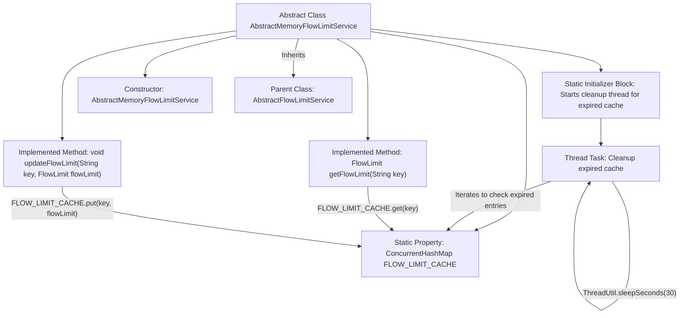

# Basic Information

|      |      |
|------|------|
| Name | AbstractMemoryFlowLimitService |
| Language | .java |
| Code Path | WeFe/common/java/common-web/src/main/java/com/welab/wefe/common/web/service/flowlimit/AbstractMemoryFlowLimitService.java |
| Package Name | com.welab.wefe.common.web.service.flowlimit |
| Dependencies | ['com.alibaba.fastjson.JSONObject', 'com.welab.wefe.common.util.ThreadUtil', 'com.welab.wefe.common.web.api.base.AbstractApi', 'javax.servlet.http.HttpServletRequest', 'java.util.Iterator', 'java.util.Map', 'java.util.concurrent.ConcurrentHashMap'] |
| Brief Description | The abstract class `AbstractMemoryFlowLimitService` extends `AbstractFlowLimitService`, utilizing `ConcurrentHashMap` to cache flow control records. A background thread periodically cleans up expired cache entries, while providing methods to retrieve and update flow control records. |

# Description

This is an abstract class `AbstractMemoryFlowLimitService`, which extends `AbstractFlowLimitService` and is used to implement a memory-based flow limiting service. It utilizes `ConcurrentHashMap` as a cache to store flow limit records and starts a background thread via a static code block to periodically clean up expired cache entries. The class provides methods for retrieving and updating flow limit records, managing flow limit data through key-value pairs. The constructor accepts an HTTP request, an API object, and a parameter JSON object.

# Class Summary

| Name   | Type  | Description |
|-------|------|-------------|
| AbstractMemoryFlowLimitService | class | The abstract class `AbstractMemoryFlowLimitService` extends `AbstractFlowLimitService`, utilizing `ConcurrentHashMap` to cache flow control records. A background thread periodically cleans up expired cache entries, while providing methods to retrieve and update flow control records. |


## Class AbstractMemoryFlowLimitService

|      |      |
|------|------|
| Access Modifier | public abstract |
| Type | class |
| Name | AbstractMemoryFlowLimitService |
| Description | The abstract class `AbstractMemoryFlowLimitService` extends `AbstractFlowLimitService`, utilizing `ConcurrentHashMap` to cache flow control records. A background thread periodically cleans up expired cache entries, while providing methods to retrieve and update flow control records. |


### UML Class Diagram

```mermaid
classDiagram
    class AbstractFlowLimitService {
        <<abstract>>
        +AbstractFlowLimitService(HttpServletRequest httpServletRequest, AbstractApi~?,?~ api, JSONObject params)
        #FlowLimit getFlowLimit(String key)
        #void updateFlowLimit(String key, FlowLimit flowLimit)
    }

    class AbstractMemoryFlowLimitService {
        -ConcurrentHashMap~String,FlowLimit~ FLOW_LIMIT_CACHE
        +AbstractMemoryFlowLimitService(HttpServletRequest httpServletRequest, AbstractApi~?,?~ api, JSONObject params)
        #FlowLimit getFlowLimit(String key)
        #void updateFlowLimit(String key, FlowLimit flowLimit)
    }

    class FlowLimit {
        <<inner>>
        +long getLatestVisitTime()
        +long getActiveTime()
    }

    AbstractMemoryFlowLimitService --|> AbstractFlowLimitService : extends
    AbstractMemoryFlowLimitService *-- FlowLimit : contains

    // Using ConcurrentHashMap to cache flow control records
    // Periodically cleaning expired cache via background thread
    // Implementing basic memory-based flow control service functionality
```

This class diagram illustrates a memory-based flow limiting service implementation. The AbstractMemoryFlowLimitService inherits from the abstract base class AbstractFlowLimitService, caching flow control records (FlowLimit) via ConcurrentHashMap and initiating a background thread to periodically clean expired entries. The class implements core methods for retrieving and updating flow control records, where FlowLimit serves as an inner class storing visit timestamps and active duration information. The entire design employs thread-safe data structures, making it suitable for high-concurrency traffic control scenarios.


### Internal Method Call Graph



This code demonstrates a memory-based flow limit service implementation that uses ConcurrentHashMap to cache flow limit records and initiates a background thread for periodic cleanup of expired entries. The flowchart clearly presents the class structure, static initialization process, cache operation methods, and the looping logic of the cleanup thread, reflecting the core mechanism of flow control. The design achieves thread-safe cache management and extends specific business logic through inheritance from an abstract parent class.

### Field List

| Name  | Type  | Description |
|-------|-------|------|
| FLOW_LIMIT_CACHE = new ConcurrentHashMap<>(16) | ConcurrentHashMap<String, AbstractFlowLimitService.FlowLimit> | Define a thread-safe static hash table FLOW_LIMIT_CACHE with an initial capacity of 16, storing mappings from strings to flow control objects. |

### Method List

| Name  | Type  | Description |
|-------|-------|------|
| getFlowLimit | FlowLimit | Get the rate limit object for the specified key from the cache. |
| updateFlowLimit | void | Update flow control limit: Store the key-value pair in the cache FLOW_LIMIT_CACHE. |


