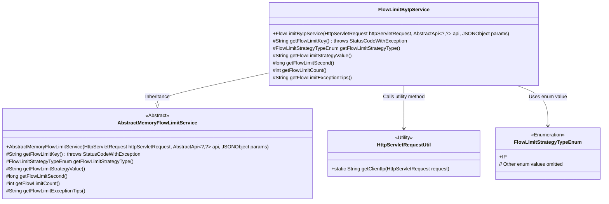
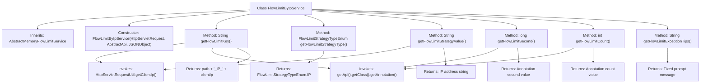

# Basic Information

|      |      |
|------|------|
| Name | FlowLimitByIpService |
| Language | .java |
| Code Path | WeFe/common/java/common-web/src/main/java/com/welab/wefe/common/web/service/flowlimit/FlowLimitByIpService.java |
| Package Name | com.welab.wefe.common.web.service.flowlimit |
| Dependencies | ['com.alibaba.fastjson.JSONObject', 'com.welab.wefe.common.exception.StatusCodeWithException', 'com.welab.wefe.common.web.api.base.AbstractApi', 'com.welab.wefe.common.web.api.base.Api', 'com.welab.wefe.common.web.api.base.FlowLimitByIp', 'com.welab.wefe.common.web.util.HttpServletRequestUtil', 'com.welab.wefe.common.wefe.enums.FlowLimitStrategyTypeEnum', 'javax.servlet.http.HttpServletRequest'] |
| Brief Description | The FlowLimitByIpService class implements traffic restriction based on IP addresses, configuring rate-limiting duration and frequency via annotations, and returns a prompt for excessive IP access attempts. |

# Description

The FlowLimitByIpService is a traffic restriction service class based on IP addresses, inheriting from AbstractMemoryFlowLimitService. It retrieves the client IP address via HttpServletRequest and combines it with the API path and policy type to generate a unique traffic restriction key. This class implements functionalities such as obtaining the traffic restriction policy type, policy value (IP address), restriction time window (in seconds), allowed request count, and prompt messages when limits are exceeded. Specific parameters are acquired from the API class through the FlowLimitByIp annotation, ultimately achieving access frequency control for individual IP addresses.

# Class Summary

| Name   | Type  | Description |
|-------|------|-------------|
| FlowLimitByIpService | class | The FlowLimitByIpService class implements traffic limiting based on IP addresses, configuring rate-limiting duration and frequency via annotations, and returns prompts for excessive IP access attempts. |

## Class FlowLimitByIpService

|      |      |
|------|------|
| Access Modifier | public |
| Type | class |
| Name | FlowLimitByIpService |
| Description | The FlowLimitByIpService class implements traffic limiting based on IP addresses, configuring rate-limiting duration and frequency via annotations, and returns prompts for excessive IP access attempts. |

### UML Class Diagram

This code demonstrates an IP-based flow limiting service implementation. FlowLimitByIpService inherits from the abstract class AbstractMemoryFlowLimitService and implements IP-based flow control strategy by overriding parent class abstract methods. Core functionalities include: obtaining client IP from HttpServletRequest as flow limit key, reading flow limit time window and threshold count from annotations, and returning customized flow restriction messages. The class diagram clearly illustrates inheritance relationships, utility class dependencies, and enum usage, reflecting the application of strategy pattern in flow control scenarios.

### Internal Method Call Graph

Flowchart description: This flowchart illustrates the complete structure of the FlowLimitByIpService class, which inherits from AbstractMemoryFlowLimitService and includes a constructor and six core methods. The main logic involves obtaining the client IP through HTTP requests, combining API paths with annotation configurations to generate flow limit keys, and implementing IP-based traffic control strategies. Each method has distinct responsibilities: generating flow limit keys, returning strategy types, retrieving strategy values, setting time intervals, limiting access counts, and providing exception prompts. All methods ultimately return specific values for upper-layer calls.

### Field List

| Name  | Type  | Description |
|-------|-------|------|

### Method List

| Name  | Type  | Description |
|-------|-------|------|
| getFlowLimitKey | String | Method override generates flow control key: combines API path, IP policy type, and client IP. |
| getFlowLimitCount | int | Java method override, obtaining IP traffic limit count via annotations. |
| getFlowLimitSecond | long | This method overrides the retrieval of flow control time limits, returning the second value defined in the FlowLimitByIp annotation. |
| getFlowLimitStrategyType | FlowLimitStrategyTypeEnum | Method override returns IP rate limiting policy type. |
| getFlowLimitStrategyValue | String | This method overrides the retrieval of the flow control policy value, returning the client IP address of the current HTTP request. |
| getFlowLimitExceptionTips | String | Java method override, returns IP access frequency alert message. |

