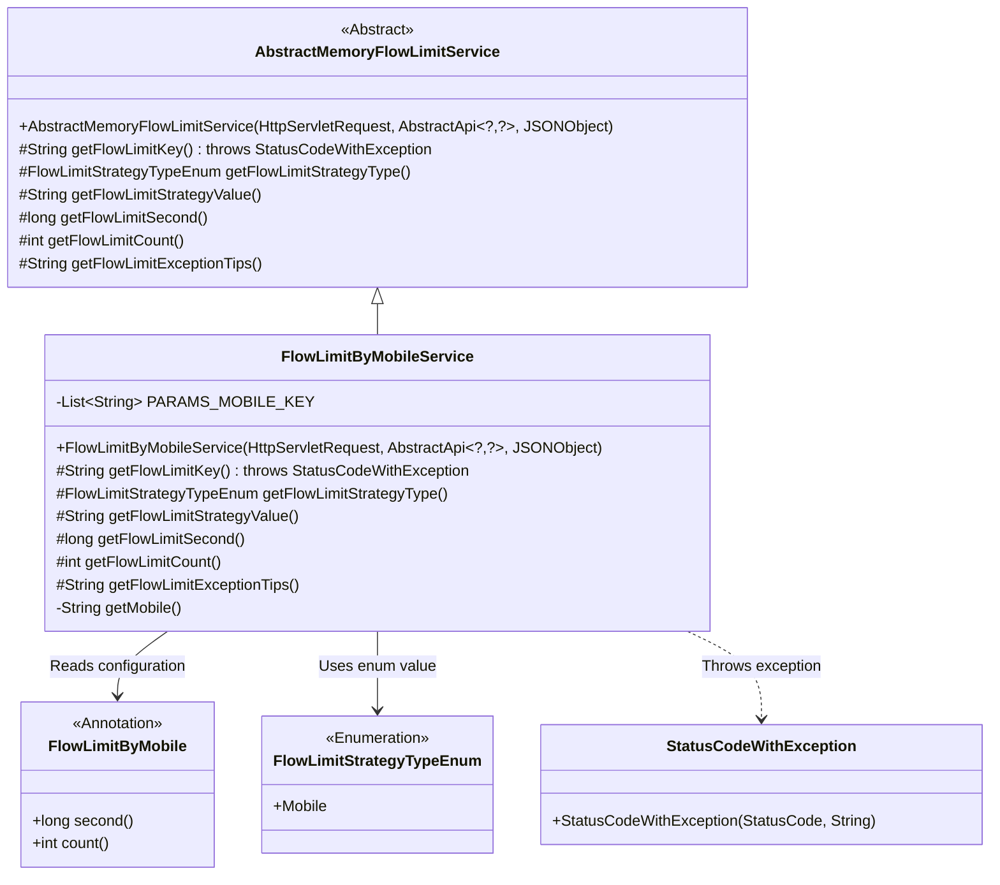
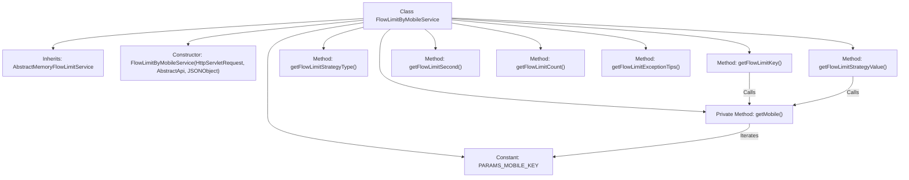
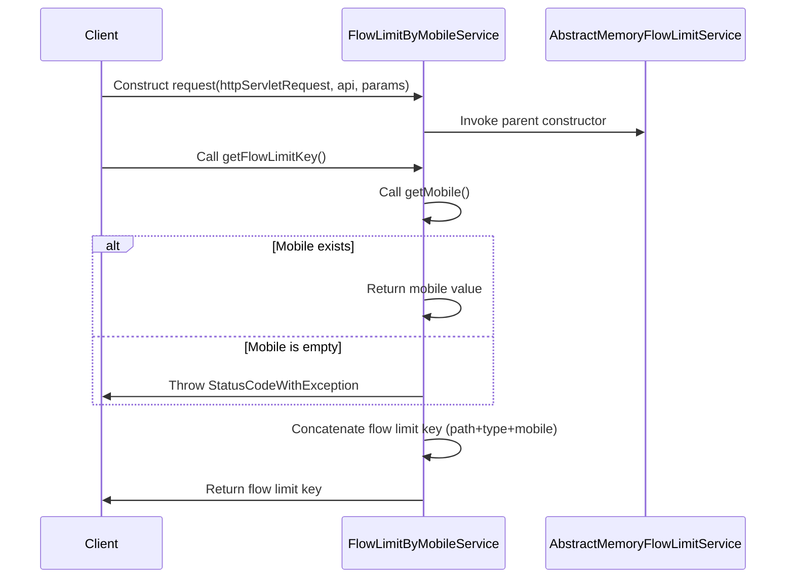

# Basic Information

|      |      |
|------|------|
| Name | FlowLimitByMobileService |
| Language | .java |
| Code Path | WeFe/common/java/common-web/src/main/java/com/welab/wefe/common/web/service/flowlimit/FlowLimitByMobileService.java |
| Package Name | com.welab.wefe.common.web.service.flowlimit |
| Dependencies | ['com.alibaba.fastjson.JSONObject', 'com.welab.wefe.common.StatusCode', 'com.welab.wefe.common.exception.StatusCodeWithException', 'com.welab.wefe.common.util.StringUtil', 'com.welab.wefe.common.web.api.base.AbstractApi', 'com.welab.wefe.common.web.api.base.Api', 'com.welab.wefe.common.web.api.base.FlowLimitByMobile', 'com.welab.wefe.common.wefe.enums.FlowLimitStrategyTypeEnum', 'javax.servlet.http.HttpServletRequest', 'java.util.Arrays', 'java.util.List'] |
| Brief Description | The FlowLimitByMobileService class implements flow restriction based on mobile phone numbers. It generates rate-limiting keys by checking the mobile number field in the parameters and sets access frequency limits along with prompt messages. |

# Description

FlowLimitByMobileService is a flow restriction service class based on mobile numbers, inheriting from AbstractMemoryFlowLimitService. It retrieves the mobile number by checking the mobile, phoneNumber, or phone_number fields in the request parameters, throwing an exception if they are empty. The flow restriction key is constructed by concatenating the API path, the Mobile policy type, and the mobile number. The restriction policy includes the time window in seconds and the allowed number of access attempts, both obtained from the FlowLimitByMobile annotation. When the restriction is triggered, it returns the message "This mobile number has been accessed too frequently. Please try again later."

# Class Summary

| Name   | Type  | Description |
|-------|------|-------------|
| FlowLimitByMobileService | class | The FlowLimitByMobileService class implements flow restriction via mobile numbers by checking the mobile number field in the parameters, generating a flow-limiting key, and setting the flow-limiting policy, duration, and count. |

## Class FlowLimitByMobileService

|      |      |
|------|------|
| Access Modifier | public |
| Type | class |
| Name | FlowLimitByMobileService |
| Description | The FlowLimitByMobileService class implements flow restriction via mobile numbers by checking the mobile number field in the parameters, generating a flow-limiting key, and setting the flow-limiting policy, duration, and count. |

### UML Class Diagram

This class diagram illustrates the implementation of a mobile number-based flow limiting service. FlowLimitByMobileService inherits from the abstract class AbstractMemoryFlowLimitService and implements core flow limiting methods. It reads configuration parameters from the FlowLimitByMobile annotation, uses FlowLimitStrategyTypeEnum.Mobile as the strategy type, and throws StatusCodeWithException exceptions upon validation failure. The system supports flexible mobile number flow control by retrieving phone numbers through multiple parameter names (e.g., mobile/phoneNumber).

### Internal Method Call Graph

Flowchart description: This flowchart illustrates the structure of the FlowLimitByMobileService class and its method invocation relationships. The class inherits from AbstractMemoryFlowLimitService and includes a constant PARAMS_MOBILE_KEY along with multiple methods. The key method getFlowLimitKey() calls getMobile() to retrieve the mobile number. If the mobile number is empty, an exception is thrown; otherwise, a flow limit key is concatenated and returned. The sequence diagram details the complete process from client request to service response, including construction initialization, mobile number validation, and flow limit key generation as critical steps.

### Field List

| Name  | Type  | Description |
|-------|-------|------|
| PARAMS_MOBILE_KEY = Arrays.asList("mobile", "phoneNumber", "phone_number") | List<String> | Define a static constant list PARAMS_MOBILE_KEY containing three common parameter names for phone numbers: mobile, phoneNumber, and phone_number. |

### Method List

| Name  | Type  | Description |
|-------|-------|------|
| getFlowLimitKey | String | Method override to obtain rate limiting key: After checking that the phone number is not empty, return a combined key of API path_phone type_phone number. If the phone number is empty, throw a permission exception. |
| getFlowLimitSecond | long | Java method overriding, obtaining the `second` value from the `FlowLimitByMobile` annotation via reflection to use as the rate-limiting time. |
| getFlowLimitCount | int | This method overrides the retrieval of traffic limit count, returning the restricted quantity via the `count` value in the `FlowLimitByMobile` annotation. |
| getFlowLimitExceptionTips | String | Code rewrite method, return prompt message: "This phone number has been accessed too frequently, please try again later." |
| getMobile | String | This method iterates through a predefined list of phone number key names, retrieves the corresponding values from the parameters, and returns the first non-empty phone number. If none is found, it returns null. |
| getFlowLimitStrategyValue | String | Method override, returning the phone number as the flow control policy value. |
| getFlowLimitStrategyType | FlowLimitStrategyTypeEnum | Method override, returns the mobile rate limiting policy type enumeration value. |

