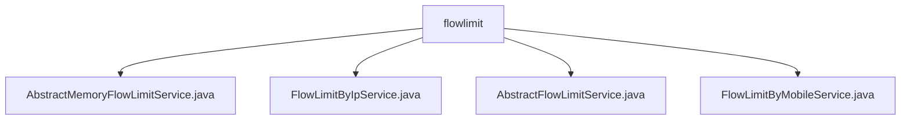

# Basic Information

|      |      |
|------|------|
| Name | flowlimit |
| Language | .java |
| Code Path | WeFe/common/java/common-web/src/main/java/com/welab/wefe/common/web/service/flowlimit |
| Package Name | docs.common.java.common-web.src.main.java.com.welab.wefe.common.web.service.flowlimit |
| Brief Description | AbstractMemoryFlowLimitService is an abstract class that extends AbstractFlowLimitService, using ConcurrentHashMap to cache flow records and a background thread to clean up expired data. FlowLimitByIpService implements IP-based flow limiting by generating a unique key from the request IP. AbstractFlowLimitService provides the foundational flow-limiting mechanism, including the check() method and abstract strategy definitions. FlowLimitByMobileService enforces flow limiting based on mobile numbers, generating the flow-limiting key from mobile numbers extracted in request parameters. |

# Description

## Overview  
This module provides an in-memory traffic limiting service framework, with the core responsibility of controlling API access frequency through key-value strategies (such as IP/mobile number). It adopts a token bucket-like model, using ConcurrentHashMap to cache traffic records and periodically clean up expired data. The interface specification includes abstract methods for obtaining flow-limiting keys, strategy types/values, time windows, and access limits. For example, FlowLimitByIpService configures IP strategies via annotations, while FlowLimitByMobileService validates mobile number fields. Key data structures include the FlowLimit inner class (storing access counts/timestamps, etc.) and strategy annotations (e.g., FlowLimitByMobile). Dependencies include HttpServletRequest, JSONObject, and ConcurrentHashMap.  

## Core Business Scenarios  
The module supports multi-dimensional traffic control, with typical scenarios including: 1) IP-based rate limiting (extracting IP from HttpServletRequest to generate a unique key); 2) Mobile number-based rate limiting (validating request parameters and concatenating strategy keys). The interaction pattern uniformly follows a synchronous check-count update-exception blocking flow. For instance, exceeding mobile number limits returns "Access too frequent." Full functionality covers strategy configuration, real-time counting, automatic cleanup, and customized prompts. API integration is achieved by inheriting abstract classes (e.g., FlowLimitByIpService). All strategies are based on time-window counting, similar to the sliding window algorithm.

### Package Internal Structure View

This flowchart illustrates the file structure relationships under the flowlimit directory, which includes four Java class files directly located in the flowlimit service directory. These files implement different flow-limiting service functionalities, including IP-based and mobile number-based flow limiting services, as well as abstract base service classes.

# File List

| Name   | Type  | Description |
|-------|------|-------------|
| [AbstractMemoryFlowLimitService.java](AbstractMemoryFlowLimitService.md) | file | The abstract class `AbstractMemoryFlowLimitService` extends `AbstractFlowLimitService`, utilizing `ConcurrentHashMap` to cache flow control records. A background thread periodically cleans up expired cache entries, while providing methods to retrieve and update flow control records. |
| [FlowLimitByIpService.java](FlowLimitByIpService.md) | file | The `FlowLimitByIpService` class implements traffic limiting based on IP addresses. It configures the rate-limiting duration and frequency through annotations and returns prompts for excessive IP access attempts. |
| [AbstractFlowLimitService.java](AbstractFlowLimitService.md) | file | The abstract class AbstractFlowLimitService implements traffic limiting functionality by checking access counts within a synchronized block and throwing exceptions when limits are exceeded. It contains an internal FlowLimit class to record access information, requiring subclasses to implement key methods such as obtaining restriction keys and policy types. |
| [FlowLimitByMobileService.java](FlowLimitByMobileService.md) | file | The FlowLimitByMobileService class implements flow restriction based on mobile numbers by generating a rate-limiting key through checking the mobile number field in the parameters, while setting access frequency limits and prompt messages. |

