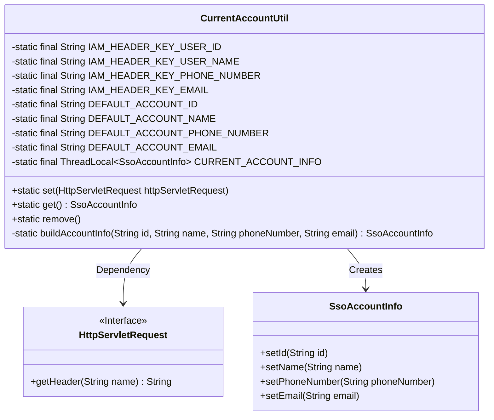
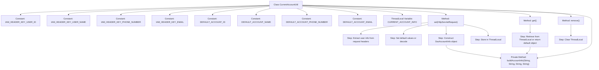

# Basic Information

|      |      |
|------|------|
| Name | CurrentAccountUtil |
| Language | .java |
| Code Path | WeFe/common/java/common-web/src/main/java/com/welab/wefe/common/web/util/CurrentAccountUtil.java |
| Package Name | com.welab.wefe.common.web.util |
| Dependencies | ['com.welab.wefe.common.util.StringUtil', 'com.welab.wefe.common.util.UrlUtil', 'com.welab.wefe.common.web.service.account.SsoAccountInfo', 'javax.servlet.http.HttpServletRequest'] |
| Brief Description | The `CurrentAccountUtil` class manages the information of the currently logged-in user, including IAM request header keys and default values. It stores user data via `ThreadLocal` and provides methods for setting, retrieving, and clearing the data. |

# Description

CurrentAccountUtil is a utility class designed for managing the information of the currently logged-in user. It defines four IAM request header constants to retrieve the user ID, name, phone number, and email from HTTP request headers. Default user information values are also provided. The class employs ThreadLocal to store current user information, ensuring thread safety. Key functionalities include: extracting and storing user information from request headers via the set method, with default values applied if the information is empty; retrieving current user information via the get method, returning default values if none exists; and clearing current user information via the remove method. The buildAccountInfo method is used to construct a user information object.

# Class Summary

| Name   | Type  | Description |
|-------|------|-------------|
| CurrentAccountUtil | class | The CurrentAccountUtil class manages information of the currently logged-in user, including IAM request header keys and default values. It stores user data via ThreadLocal and provides methods for setting, retrieving, and clearing the data. |

## Class CurrentAccountUtil

|      |      |
|------|------|
| Access Modifier | public |
| Type | class |
| Name | CurrentAccountUtil |
| Description | The CurrentAccountUtil class manages information of the currently logged-in user, including IAM request header keys and default values. It stores user data via ThreadLocal and provides methods for setting, retrieving, and clearing the data. |

### UML Class Diagram

This code defines a CurrentAccountUtil utility class for managing currently logged-in user information. It stores user data via ThreadLocal and provides methods to set, retrieve, and remove user information. Default values are used when user information is missing from request headers. The class diagram illustrates the relationship between CurrentAccountUtil, the HttpServletRequest interface, and the SsoAccountInfo class, demonstrating the process of extracting information from request headers to construct user objects.

### Internal Method Call Graph

This code implements a utility class for managing current logged-in user information. Its core functionalities include: retrieving user information from HTTP request headers and storing it in ThreadLocal, providing methods to access and clear user data. Default values are used when header information is missing. The flowchart illustrates constant definitions, core method invocation relationships, and data processing flow, demonstrating a thread-safe user information management mechanism. The private method buildAccountInfo uniformly constructs user information objects and is invoked by both set() and get() methods.

### Field List

| Name  | Type  | Description |
|-------|-------|------|
| DEFAULT_ACCOUNT_EMAIL = "12346@163.com" | String | Define the default account email constant with the value "12346@163.com". |
| DEFAULT_ACCOUNT_PHONE_NUMBER = "18888888888" | String | Define the default account phone number constant with the value "18888888888". |
| DEFAULT_ACCOUNT_NAME = "admin" | String | The default account name is "admin". |
| IAM_HEADER_KEY_EMAIL = "x-jwt-email" | String | The constant string IAM_HEADER_KEY_EMAIL is defined as the JWT email header identifier "x-jwt-email". |
| CURRENT_ACCOUNT_INFO = new InheritableThreadLocal() | ThreadLocal<SsoAccountInfo> | Define the thread-local variable CURRENT_ACCOUNT_INFO to store the SsoAccountInfo of the current thread, supporting inheritance by child threads. |
| DEFAULT_ACCOUNT_ID = "ac1173fef3bc4d8493f660a66e7f004a" | String | Define the default account ID constant with the value "ac1173fef3bc4d8493f660a66e7f004a". |
| IAM_HEADER_KEY_USER_ID = "x-jwt-user-id" | String | Define the static constant IAM_HEADER_KEY_USER_ID with the value "x-jwt-user-id", which serves as the HTTP header identifier for JWT user IDs. |
| IAM_HEADER_KEY_PHONE_NUMBER = "x-jwt-phone-number" | String | Define the constant IAM_HEADER_KEY_PHONE_NUMBER with the value "x-jwt-phone-number", used for JWT header phone number identification. |
| IAM_HEADER_KEY_USER_NAME = "x-jwt-user-name" | String | The constant IAM_HEADER_KEY_USER_NAME is defined as the JWT username request header key "x-jwt-user-name". |

### Method List

| Name  | Type  | Description |
|-------|-------|------|
| set | void | Retrieve user ID, name, phone number, and email information from HTTP request headers, use default values if empty, construct account information, and store it. |
| get | SsoAccountInfo | Retrieve the current SSO account information, and return the default account information if it is empty. |
| remove | void | Remove current account information. |
| buildAccountInfo | SsoAccountInfo | Construct an SsoAccountInfo object, set the id, name, phoneNumber, and email attributes, and return it. |

