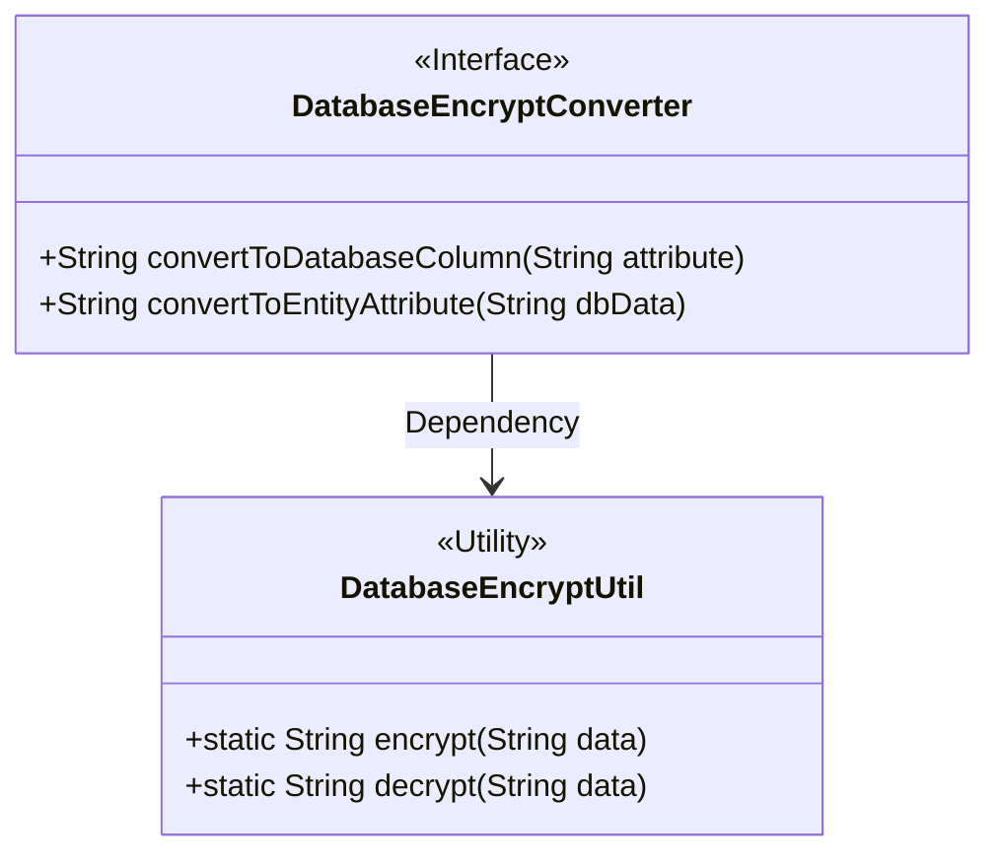
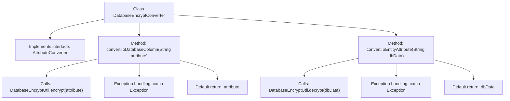

# Basic Information

|      |      |
|------|------|
| Name | DatabaseEncryptConverter |
| Language | .java |
| Code Path | WeFe/common/java/common-web/src/main/java/com/welab/wefe/common/web/util/DatabaseEncryptConverter.java |
| Package Name | com.welab.wefe.common.web.util |
| Dependencies | ['javax.persistence.AttributeConverter'] |
| Brief Description | The DatabaseEncryptConverter class implements the AttributeConverter interface, which is used for database field encryption and decryption conversion. It returns the original value if encryption fails. |

# Description

The content describes a class named DatabaseEncryptConverter, which implements the AttributeConverter interface, used for encrypting and decrypting conversions between string-type attributes and database columns. This class contains two methods: the convertToDatabaseColumn method calls DatabaseEncryptUtil.encrypt to encrypt the attribute value before storing it in the database, returning the original value if encryption fails; the convertToEntityAttribute method calls DatabaseEncryptUtil.decrypt to decrypt the database value and restore it as an entity attribute, returning the original value if decryption fails. The entire process achieves automatic encryption during data storage and automatic decryption during data retrieval.

# Class Summary

| Name   | Type  | Description |
|-------|------|-------------|
| DatabaseEncryptConverter | class | The `DatabaseEncryptConverter` class implements the `AttributeConverter` interface, which is used for database encryption and decryption conversion of strings. It returns the original value if encryption fails. |

## Class DatabaseEncryptConverter

|      |      |
|------|------|
| Access Modifier | public |
| Type | class |
| Name | DatabaseEncryptConverter |
| Description | The `DatabaseEncryptConverter` class implements the `AttributeConverter` interface, which is used for database encryption and decryption conversion of strings. It returns the original value if encryption fails. |

### UML Class Diagram

This code demonstrates a database encryption converter `DatabaseEncryptConverter` that implements the `AttributeConverter<String, String>` interface for encrypting/decrypting conversions between entity attributes and database columns. The class relies on the static encryption/decryption methods provided by the utility class `DatabaseEncryptUtil`. When exceptions occur during conversion, the original data is returned as a fallback. The class diagram clearly reflects this implementation relationship and utility class dependency.

### Internal Method Call Graph

This flowchart illustrates the structure of the DatabaseEncryptConverter class, which implements the AttributeConverter interface and contains two core methods: convertToDatabaseColumn for encrypting data to be stored in the database, and convertToEntityAttribute for decrypting data retrieved from the database. Both methods employ a try-catch structure, returning the original data in case of exceptions, while the normal flow invokes encryption/decryption utility classes for processing. The class design exemplifies a typical pattern for database field encryption/decryption.

### Field List

| Name  | Type  | Description |
|-------|-------|------|

### Method List

| Name  | Type  | Description |
|-------|-------|------|
| convertToDatabaseColumn | String | The method `convertToDatabaseColumn` calls `DatabaseEncryptUtil.encrypt` to encrypt the input parameter and returns the original value if encryption fails. |
| convertToEntityAttribute | String | The method `convertToEntityAttribute` attempts to decrypt `dbData` and returns the original value if decryption fails. |

