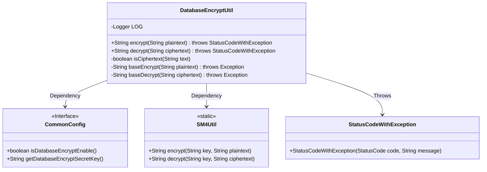
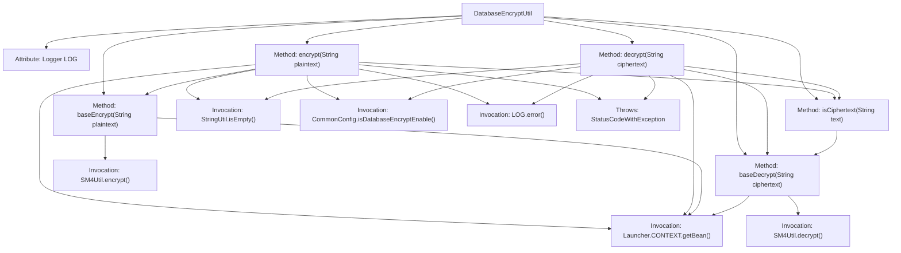

# Basic Information

|      |      |
|------|------|
| Name | DatabaseEncryptUtil |
| Language | .java |
| Code Path | WeFe/common/java/common-web/src/main/java/com/welab/wefe/common/web/util/DatabaseEncryptUtil.java |
| Package Name | com.welab.wefe.common.web.util |
| Dependencies | ['com.welab.wefe.common.StatusCode', 'com.welab.wefe.common.exception.StatusCodeWithException', 'com.welab.wefe.common.util.SM4Util', 'com.welab.wefe.common.util.StringUtil', 'com.welab.wefe.common.web.Launcher', 'com.welab.wefe.common.web.config.CommonConfig', 'org.slf4j.Logger', 'org.slf4j.LoggerFactory'] |
| Brief Description | The DatabaseEncryptUtil class provides database encryption and decryption functionality, supports the SM4 algorithm, enables/disables features based on configuration switches, and has robust exception handling. |

# Description

DatabaseEncryptUtil is a utility class that provides database encryption and decryption functionalities, featuring two core methods: encrypt and decrypt. Before encryption, it checks whether the plaintext is empty or already ciphertext. Similarly, before decryption, it verifies if the ciphertext is empty or not actual ciphertext. Both methods rely on the CommonConfig configuration to determine whether encryption is enabled. The actual encryption and decryption operations are implemented via SM4Util. In case of exceptions, logs are recorded, and a StatusCodeWithException is thrown. The isCiphertext method is used to detect whether a string is valid ciphertext.

# Class Summary

| Name   | Type  | Description |
|-------|------|-------------|
| DatabaseEncryptUtil | class | Database encryption utility class, providing encryption and decryption functions, supporting the SM4 algorithm. Encryption is enabled based on configuration, with logs recorded and errors thrown in case of exceptions. |

## Class DatabaseEncryptUtil

|      |      |
|------|------|
| Access Modifier | public |
| Type | class |
| Name | DatabaseEncryptUtil |
| Description | Database encryption utility class, providing encryption and decryption functions, supporting the SM4 algorithm. Encryption is enabled based on configuration, with logs recorded and errors thrown in case of exceptions. |

### UML Class Diagram

This code demonstrates a database encryption utility class DatabaseEncryptUtil, which provides two main methods: encrypt and decrypt. The class relies on the CommonConfig interface to obtain encryption configurations, utilizes SM4Util for actual cryptographic operations, and throws StatusCodeWithException exceptions when errors occur. Private methods include checking whether text is ciphertext (isCiphertext) and basic encryption/decryption methods (baseEncrypt/baseDecrypt). The design employs static methods to implement utility class functionality, controls encryption toggle through configuration, and features comprehensive error handling and logging capabilities.

### Internal Method Call Graph

This code demonstrates a database encryption utility class DatabaseEncryptUtil, primarily providing encryption (encrypt) and decryption (decrypt) functionalities. The flowchart clearly illustrates the class structure, method invocation relationships, and exception handling paths. The encryption/decryption process validates input effectiveness, configuration switch status, and ciphertext format, with core cryptographic operations delegated to SM4Util. The entire process incorporates comprehensive error logging and exception handling mechanisms.

### Field List

| Name  | Type  | Description |
|-------|-------|------|
| LOG = LoggerFactory.getLogger(DatabaseEncryptUtil.class) | Logger | The private static log constant LOG in the DatabaseEncryptUtil class. |

### Method List

| Name  | Type  | Description |
|-------|-------|------|
| baseEncrypt | String | The private static method `baseEncrypt` takes a plaintext parameter, encrypts it using the configured key via `SM4Util`, and returns the ciphertext. |
| isCiphertext | boolean | Check if the string is ciphertext: Attempt decryption, return true if successful, false if failed. |
| decrypt | String | The static method `decrypt` is used to decrypt strings. It directly returns the original value when checking for null or if encryption is not enabled. Otherwise, it calls `baseDecrypt` for decryption. If decryption fails, it logs the error and throws an exception. |
| encrypt | String | Encryption method: Return directly if the text is empty or already encrypted; skip processing if encryption is not enabled in the configuration; otherwise, invoke basic encryption; log and throw an exception upon failure. |
| baseDecrypt | String | This method decrypts the string using the SM4 algorithm, with the key obtained from the configuration class. |

