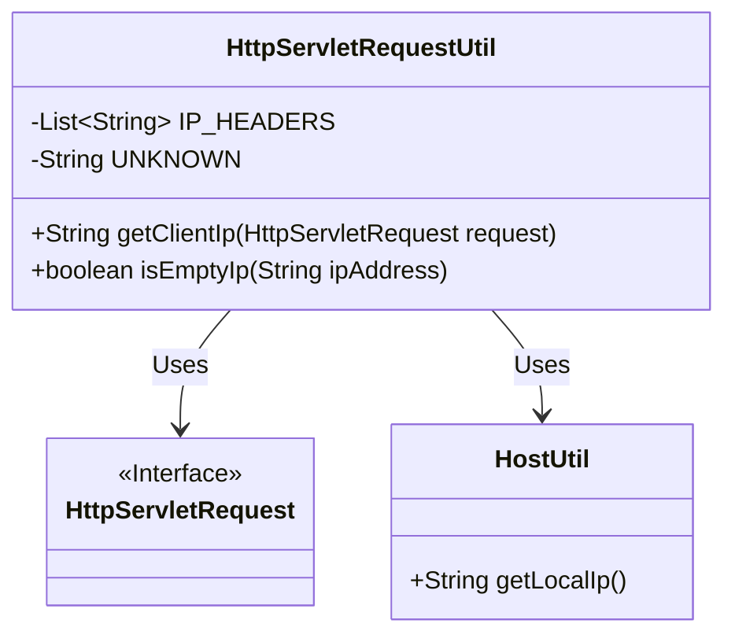
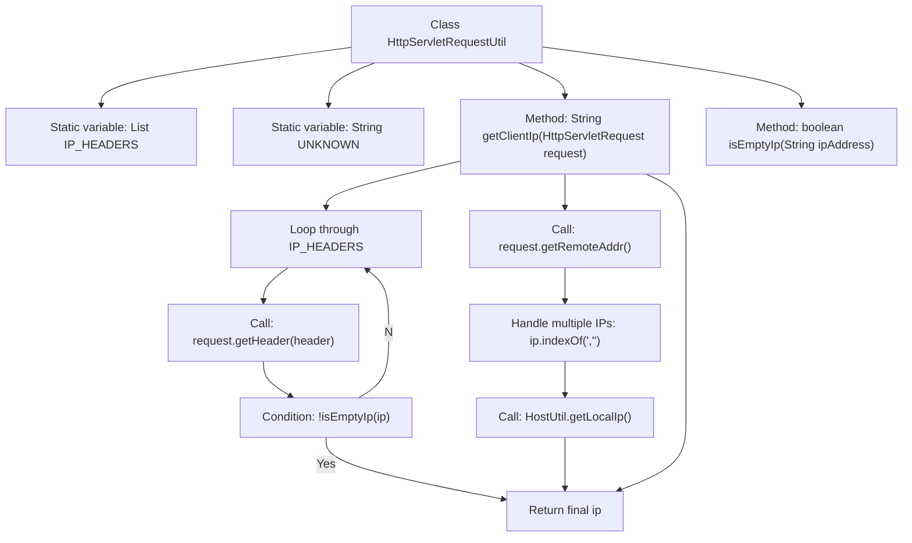

# Basic Information

|      |      |
|------|------|
| Name | HttpServletRequestUtil |
| Language | .java |
| Code Path | WeFe/common/java/common-web/src/main/java/com/welab/wefe/common/web/util/HttpServletRequestUtil.java |
| Package Name | com.welab.wefe.common.web.util |
| Dependencies | ['com.welab.wefe.common.util.HostUtil', 'javax.servlet.http.HttpServletRequest', 'java.util.Arrays', 'java.util.List'] |
| Brief Description | The HttpServletRequestUtil class is used to retrieve the client IP address, prioritizing extraction from multiple HTTP headers. If unsuccessful, it falls back to the remote address, handling multi-proxy scenarios and checking for local IP. |

# Description

HttpServletRequestUtil is a utility class designed to retrieve the HTTP client's IP address. It first attempts to obtain the IP from multiple common proxy headers (such as x-forwarded-for, etc.). If unsuccessful, it falls back to using the remote address. For scenarios involving multiple proxies, it extracts the first IP in the list. Local addresses are replaced with the actual local IP. The isEmptyIp method is used to check whether an IP is empty or invalid. The entire process accounts for proxy forwarding and local testing scenarios.

# Class Summary

| Name   | Type  | Description |
|-------|------|-------------|
| HttpServletRequestUtil | class | The HttpServletRequestUtil class provides methods for obtaining the client IP address, checking multiple proxy headers, and handling scenarios involving multiple IPs and local addresses. |

## Class HttpServletRequestUtil

|      |      |
|------|------|
| Access Modifier | public |
| Type | class |
| Name | HttpServletRequestUtil |
| Description | The HttpServletRequestUtil class provides methods for obtaining the client IP address, checking multiple proxy headers, and handling scenarios involving multiple IPs and local addresses. |

### UML Class Diagram

This code demonstrates an HTTP request utility class HttpServletRequestUtil, primarily used to extract the client's real IP address from an HttpServletRequest object. The class contains two static methods: getClientIp() retrieves the IP by checking multiple proxy header fields and handles multi-proxy scenarios; isEmptyIp() validates IP address validity. The class relies on the HttpServletRequest interface to obtain request information and calls HostUtil to get the local IP in case of local requests. The diagram clearly illustrates the relationships and dependencies between the classes.

### Internal Method Call Graph

This flowchart illustrates the complete logic of the HttpServletRequestUtil class for obtaining client IP addresses. The process starts by checking a predefined list of HTTP headers, sequentially attempting to retrieve valid IPs; if header information is invalid, it falls back to the remote address; when handling proxy IPs, it extracts the first address; special local addresses are converted to the server's local IP. The entire process involves 4 levels of judgment and 3 acquisition methods, ultimately returning a validated effective IP address.

### Field List

| Name  | Type  | Description |
|-------|-------|------|
| UNKNOWN = "unknown" | String | Define a private static string constant UNKNOWN with the value "unknown". |
| IP_HEADERS = Arrays.asList(            "x-forwarded-for",            "Proxy-Client-IP",            "WL-Proxy-Client-IP",            "HTTP_CLIENT_IP",            "HTTP_X_FORWARDED_FOR"    ) | List<String> | Define a list of common IP header fields, including five key HTTP headers such as x-forwarded-for. |

### Method List

| Name  | Type  | Description |
|-------|-------|------|
| getClientIp | String | This method retrieves the client IP from the HTTP request headers, and falls back to the remote address if unsuccessful. In cases involving multiple proxies, it takes the first IP, while local addresses are converted to the server IP. |
| isEmptyIp | boolean | Check if the IP address is empty: Return true if it is null, has zero length, or equals "UNKNOWN" (case-insensitive). |

