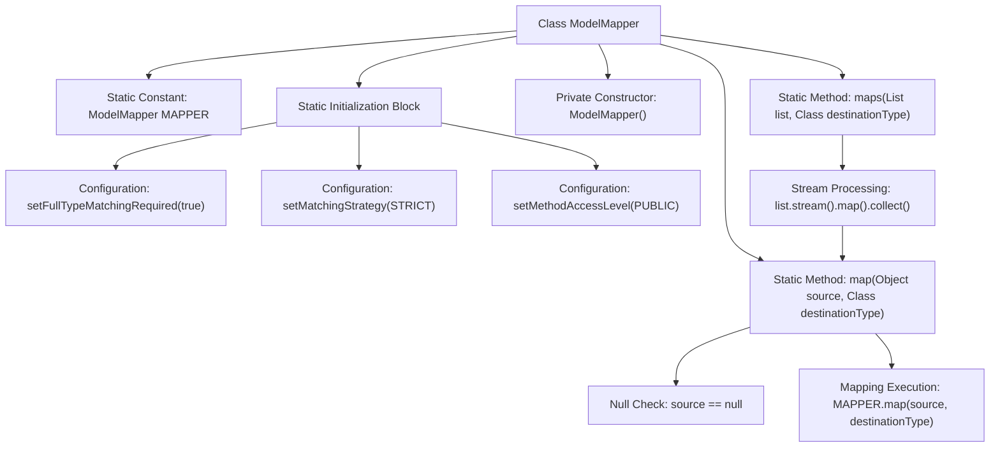

# Basic Information

|      |      |
|------|------|
| Name | ModelMapper |
| Language | .java |
| Code Path | WeFe/common/java/common-web/src/main/java/com/welab/wefe/common/web/util/ModelMapper.java |
| Package Name | com.welab.wefe.common.web.util |
| Dependencies | ['org.modelmapper.config.Configuration', 'org.modelmapper.convention.MatchingStrategies', 'java.util.List', 'java.util.stream.Collectors'] |
| Brief Description | ModelMapper utility class, thread-safe, configured with strict matching strategy, provides mapping methods for objects and lists. |

# Description

The code defines a utility class named ModelMapper for object mapping conversion. The class contains a static and thread-safe ModelMapper instance MAPPER, which is initialized with configurations such as strict type matching strategy and public method access level. It provides two static methods: the map method converts a single source object to a target type object while handling null cases; the maps method performs batch conversion of a source object list to a target type list. The class adopts the singleton pattern with a privatized constructor to ensure the mapping functionality can only be accessed through static methods.

# Class Summary

| Name   | Type  | Description |
|-------|------|-------------|
| ModelMapper | class | ModelMapper utility class, thread-safe, configured with strict matching strategy, provides mapping methods for objects and lists. |


## Class ModelMapper

|      |      |
|------|------|
| Access Modifier | public |
| Type | class |
| Name | ModelMapper |
| Description | ModelMapper utility class, thread-safe, configured with strict matching strategy, provides mapping methods for objects and lists. |


### UML Class Diagram

```mermaid
classDiagram
    class ModelMapper {
        -org.modelmapper.ModelMapper MAPPER
        +map(Object source, Class~T~ destinationType) T
        +maps(List~?~ list, Class~T~ destinationType) List~T~
    }
    class org..modelmapper..ModelMapper {
        <<External>>
    }
    class Configuration {
        <<External>>
    }
    class MatchingStrategies {
        <<External>>
    }

    ModelMapper --> org..modelmapper..ModelMapper : Uses
    ModelMapper --> Configuration : Configuration Dependency
    ModelMapper --> MatchingStrategies : Strategy Dependency
```

Class Diagram Description: The ModelMapper class encapsulates a static thread-safe instance of org.modelmapper.ModelMapper, providing generic object mapping functionality. A private constructor ensures singleton pattern, while static initialization blocks configure strict type matching strategy and public method access levels. The core method map() handles single object conversion, and the maps() method performs batch conversion of list elements through stream operations, both supporting generic type parameters. The underlying mapping logic relies on external library classes ModelMapper, Configuration, and MatchingStrategies.


### Internal Method Call Graph



This flowchart illustrates the core structure and workflow of the ModelMapper utility class. The class contains a thread-safe static ModelMapper instance configured with strict type matching and public method access in the static initialization block. It primarily provides two static mapping methods: single-object mapping (with null check) and batch collection mapping (using stream processing). Arrows clearly show the configuration loading sequence and method invocation relationships, particularly the nested logic where the maps method internally calls the map method via stream.

### Field List

| Name  | Type  | Description |
|-------|-------|------|
| MAPPER = new org.modelmapper.ModelMapper() | org.modelmapper.ModelMapper | Initialization of private static final ModelMapper instance. |

### Method List

| Name  | Type  | Description |
|-------|-------|------|
| map | T | Static methods map the source object to the target type, returning null if the source is empty. |
| maps | List<T> | Java Method: Map List Elements to a New List of Specified Type Using Stream Processing and Collectors. |


