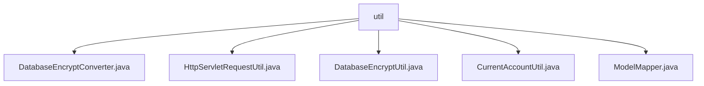

# Basic Information

|      |      |
|------|------|
| Name | util |
| Language | .java |
| Code Path | WeFe/common/java/common-web/src/main/java/com/welab/wefe/common/web/util |
| Package Name | docs.common.java.common-web.src.main.java.com.welab.wefe.common.web.util |
| Brief Description | The `DatabaseEncryptConverter` class implements encryption and decryption conversion between attributes and database columns. The `HttpServletRequestUtil` utility class retrieves client IP addresses, handling proxy and local scenarios. `DatabaseEncryptUtil` provides database encryption and decryption functionality, relying on `SM4Util` for implementation. `CurrentAccountUtil` manages logged-in user information, storing it using `ThreadLocal`. The `ModelMapper` utility class performs object mapping and conversion, adopting the singleton pattern. |

# Description

## Overview  
The core responsibility of this module is to provide a foundational toolkit for web applications, including data encryption and conversion, HTTP request processing, user information management, and object mapping. The interface specifications comply with the JPA AttributeConverter standard (e.g., DatabaseEncryptConverter) and the ThreadLocal thread-safe pattern (e.g., CurrentAccountUtil). Key data structures include the SM4 ciphertext format, user information objects, and proxy IP chains. External dependencies include the SM4Util encryption library, CommonConfig configuration system, and ModelMapper mapping framework. For example, DatabaseEncryptUtil implements field-level encryption using the SM4 algorithm, similar to Vault's transparent encryption and decryption mechanism.  

## Key Business Scenarios  
The module supports typical web application security scenarios: automatic database field encryption and decryption (similar to Hibernate interceptors), extraction of real IPs under multi-level proxies, and thread-safe user session management. The interaction pattern uniformly adopts static method calls to utility classes, such as ModelMapper for DTO conversion, which resembles Spring BeanUtils but supports batch operations. The full functionality covers the entire process from request inbound (HttpServletRequestUtil) to data persistence (DatabaseEncryptConverter). For example, CurrentAccountUtil injects user information through request headers, suitable for identity transfer scenarios between microservices. All APIs employ defensive programming to handle null values and exceptions safely.

### Package Internal Structure View

This flowchart illustrates the hierarchical structure of the util package under the common-web module in the WeFe project. The root node is the util folder, which contains five utility class files: DatabaseEncryptConverter, HttpServletRequestUtil, DatabaseEncryptUtil, CurrentAccountUtil, and ModelMapper. All files are directly subordinate to the util directory with no deeper subdirectory structure.

# File List

| Name   | Type  | Description |
|-------|------|-------------|
| [DatabaseEncryptConverter.java](DatabaseEncryptConverter.md) | file | The `DatabaseEncryptConverter` class implements the `AttributeConverter` interface and is used for database field encryption/decryption conversion. It returns the original value if encryption fails. |
| [HttpServletRequestUtil.java](HttpServletRequestUtil.md) | file | The HttpServletRequestUtil class is used to retrieve the client's IP address, prioritizing extraction from multiple HTTP headers. If unsuccessful, it falls back to the remote address, handling multi-proxy scenarios and checking for local IPs. |
| [DatabaseEncryptUtil.java](DatabaseEncryptUtil.md) | file | The DatabaseEncryptUtil class provides database encryption and decryption functionality, supports the SM4 algorithm, enables/disables operations based on configuration switches, and features robust exception handling. |
| [CurrentAccountUtil.java](CurrentAccountUtil.md) | file | The `CurrentAccountUtil` class manages the information of the currently logged-in user, including IAM request header keys and default values. It stores user data via `ThreadLocal` and provides methods for setting, retrieving, and clearing the data. |
| [ModelMapper.java](ModelMapper.md) | file | ModelMapper utility class, thread-safe, configured with strict matching strategy, provides mapping methods for objects and lists. |

