# Basic Information

|      |      |
|------|------|
| Name | com |
| Language | .java |
| Code Path | WeFe/common/java/common-wefe/src/main/java/com |
| Package Name | docs.common.java.common-wefe.src.main.java.com |
| Brief Description | The service inspection framework implements hierarchical health checks, the enumeration module defines federated learning type states, the configuration management module uniformly handles multi-source connections, and the data type inferrer analyzes field types. |

# Description

## Overview  
This module serves as the core supporting framework for federated learning systems, integrating four key functionalities: service health checks, enumeration definitions, configuration management, and data type inference. It adopts a layered abstraction design, with critical interfaces including AbstractCheckpoint (checkpoint), AbstractConfigModel (configuration model), and Consumer (data type inference). Core data structures encompass ServiceCheckPointOutput (inspection results), 11 ServiceType (service type enumerations), and ColumnDataType (field types). Dependencies include the Spring framework, JDBC drivers, and cloud service SDKs. For instance, CheckpointManager can concurrently test UnionService connectivity, or ColumnDataTypeInferrer can infer field types.  

## Key Business Scenarios  
The module supports full lifecycle management of federated learning: 1) Service health checks employ a sentinel pattern, such as 5-second timeout detection; 2) Enumeration-driven state machines, like JobStatus controlling task workflows; 3) Factory pattern for managing multi-source configurations, e.g., generating specialized database URLs; 4) Multithreaded field type inference (similar to MapReduce). Typical workflows include configuration validation → parallel checks → result aggregation, with hierarchical escalation for UnionService failures. Integration cases span horizontal federated learning (using XGBoost algorithms) and cloud storage switching (e.g., OSS credential management).

### Package Internal Structure View

```mermaid
graph TD
    com --> welab
    welab --> wefe
    wefe --> common
    wefe --> dto
    common --> checkpoint
    common --> enums
    checkpoint --> dto
    checkpoint --> AbstractUnionConnectionCheckpoint.java
    checkpoint --> CheckpointManager.java
    checkpoint --> AbstractCheckpoint.java
    dto --> ServiceCheckPointOutput.java
    dto --> ServiceAvailableCheckOutput.java
    dto --> MemberAvailableCheckOutput.java
    dto --> global_config
    global_config --> storage
    global_config --> calculation_engine
    global_config --> base
    storage --> StorageBaseConfigModel.java
    storage --> ClickHouseStorageConfigModel.java
    calculation_engine --> fc
    calculation_engine --> spark
    fc --> FunctionComputeBaseConfigModel.java
    fc --> AliyunFunctionComputeConfigModel.java
    fc --> TencentServerlessCloudFunctionConfigModel.java
    spark --> SparkStandaloneConfigModel.java
    base --> GlobalConfigInput.java
    base --> ConfigModel.java
    base --> AbstractConfigModel.java
    base --> ConfigGroupConstant.java
    enums --> ServiceType.java
    enums --> env
    enums --> ModelExportLanguage.java
    enums --> BoardUserSource.java
    enums --> DeepLearningJobType.java
    enums --> MessageLevel.java
    enums --> Binning.java
    enums --> VerificationCodeSendChannel.java
    enums --> JobStatus.java
    enums --> HashOptions.java
    enums --> ProjectType.java
    enums --> FederatedLearningModel.java
    enums --> DataResourcePublicLevel.java
    enums --> TaskStatus.java
    enums --> DataResourceType.java
    enums --> ContractName.java
    enums --> SmsBusinessType.java
    enums --> PredictFeatureDataSource.java
    enums --> DataResourceStorageType.java
    enums --> ChatListType.java
    enums --> BloomFilterProgressType.java
    enums --> GatewayProcessorType.java
    enums --> ProducerType.java
    enums --> VerificationCodeBusinessType.java
    enums --> TaskResultType.java
    enums --> ProjectFlowStatisticsStatus.java
    enums --> FileRurpose.java
    enums --> JobMemberRole.java
    enums --> MessageEvent.java
    enums --> ColumnDataType.java
    enums --> FcCloudProvider.java
    enums --> ProjectFlowStatus.java
    enums --> Algorithm.java
    enums --> AuditStatus.java
    enums --> ComponentType.java
    enums --> JobBackendType.java
    enums --> DataResourceUploadStatus.java
    enums --> FlowActionType.java
    enums --> FlowLimitStrategyTypeEnum.java
    enums --> BloomFilterPublicLevel.java
    enums --> PredictType.java
    enums --> DataResourceStorageServiceType.java
    enums --> FederatedLearningType.java
    env --> EnvName.java
    env --> EnvBranch.java
```

This flowchart illustrates the Java code structure of the common module in the WeFe project, starting from the top-level com package and expanding through welab and wefe levels. It highlights the hierarchical relationships of core modules such as common, dto, checkpoint, and enums. The enums module contains numerous enumeration class files, while the dto module includes submodules and files related to global_config configuration. The overall structure clearly demonstrates the project's infrastructure and configuration management architecture.

# File List

| Name   | Type  | Description |
|-------|------|-------------|
| [welab](welab/_module.md) | package | The service inspection framework implements hierarchical health checks, the enumeration module defines federated learning type states, the configuration management module uniformly handles multi-source connections, and the data type inferrer analyzes field types. |

