# Basic Information

|      |      |
|------|------|
| Name | common |
| Language | .java |
| Code Path | WeFe/common/java/common-wefe/src/main/java/com/welab/wefe/common |
| Package Name | docs.common.java.common-wefe.src.main.java.com.welab.wefe.common |
| Brief Description | The service inspection framework implements hierarchical health checks, the enumeration module defines federated learning type states, the configuration management module uniformly handles multi-source connections, and the data type inferrer analyzes field types. |

# Description

## Overview  
This module serves as the core supporting framework for the federated learning system, encompassing four major functionalities: service health check, enumeration definitions, configuration management, and data type inference. It adopts a layered abstraction design, with key interfaces including AbstractCheckpoint (checkpoint), AbstractConfigModel (configuration model), and Consumer (data type inference). Core data structures cover ServiceCheckPointOutput (inspection results), 11 ServiceType (service type enumerations), and ColumnDataType (field type). It relies on the Spring framework, JDBC drivers, and cloud service SDKs. For example, CheckpointManager can concurrently test UnionService connectivity, or ColumnDataTypeInferrer can infer field types.  

## Key Business Scenarios  
The module supports full lifecycle management of federated learning: 1) Service health checks adopt a sentinel pattern, such as 5-second timeout detection; 2) Enumeration-driven state machines, like JobStatus controlling task flow; 3) Factory pattern for managing multi-source configurations, such as generating specialized database URLs; 4) Multi-threaded field type inference (similar to MapReduce). Typical workflows include configuration validation → parallel checks → result aggregation, such as escalating UnionService check failures hierarchically. Integration cases cover horizontal federated learning (using XGBoost algorithms) and cloud storage switching (e.g., OSS credential management).

### Package Internal Structure View

```mermaid
graph TD
    wefe --> checkpoint
    wefe --> enums
    wefe --> dto
    checkpoint --> dto
    checkpoint --> AbstractUnionConnectionCheckpoint.java
    checkpoint --> CheckpointManager.java
    checkpoint --> AbstractCheckpoint.java
    dto --> ServiceCheckPointOutput.java
    dto --> ServiceAvailableCheckOutput.java
    dto --> MemberAvailableCheckOutput.java
    enums --> ServiceType.java
    enums --> env
    enums --> ModelExportLanguage.java
    enums --> BoardUserSource.java
    enums --> DeepLearningJobType.java
    enums --> MessageLevel.java
    enums --> Binning.java
    enums --> VerificationCodeSendChannel.java
    enums --> JobStatus.java
    enums --> HashOptions.java
    enums --> ProjectType.java
    enums --> FederatedLearningModel.java
    enums --> DataResourcePublicLevel.java
    enums --> TaskStatus.java
    enums --> DataResourceType.java
    enums --> ContractName.java
    enums --> SmsBusinessType.java
    enums --> PredictFeatureDataSource.java
    enums --> DataResourceStorageType.java
    enums --> ChatListType.java
    enums --> BloomFilterProgressType.java
    enums --> GatewayProcessorType.java
    enums --> ProducerType.java
    enums --> VerificationCodeBusinessType.java
    enums --> TaskResultType.java
    enums --> ProjectFlowStatisticsStatus.java
    enums --> FileRurpose.java
    enums --> JobMemberRole.java
    enums --> MessageEvent.java
    enums --> ColumnDataType.java
    enums --> FcCloudProvider.java
    enums --> ProjectFlowStatus.java
    enums --> Algorithm.java
    enums --> AuditStatus.java
    enums --> ComponentType.java
    enums --> JobBackendType.java
    enums --> DataResourceUploadStatus.java
    enums --> FlowActionType.java
    enums --> FlowLimitStrategyTypeEnum.java
    enums --> BloomFilterPublicLevel.java
    enums --> PredictType.java
    enums --> DataResourceStorageServiceType.java
    enums --> FederatedLearningType.java
    env --> EnvName.java
    env --> EnvBranch.java
    dto --> global_config
    dto --> storage
    global_config --> storage
    global_config --> calculation_engine
    global_config --> base
    global_config --> GatewayConfigModel.java
    global_config --> ServerCertInfoModel.java
    global_config --> BoardConfigModel.java
    global_config --> DeepLearningConfigModel.java
    global_config --> MailServerModel.java
    global_config --> PrivacyConfigModel.java
    global_config --> ServingConfigModel.java
    global_config --> GlobalConfigFlag.java
    global_config --> AlertConfigModel.java
    global_config --> MemberInfoModel.java
    global_config --> FlowConfigModel.java
    global_config --> AliyunSmsChannelConfigModel.java
    storage --> StorageBaseConfigModel.java
    storage --> ClickHouseStorageConfigModel.java
    calculation_engine --> fc
    calculation_engine --> spark
    calculation_engine --> CalculationEngineBaseConfigModel.java
    fc --> FunctionComputeBaseConfigModel.java
    fc --> AliyunFunctionComputeConfigModel.java
    fc --> TencentServerlessCloudFunctionConfigModel.java
    spark --> SparkStandaloneConfigModel.java
    base --> GlobalConfigInput.java
    base --> ConfigModel.java
    base --> AbstractConfigModel.java
    base --> ConfigGroupConstant.java
    storage --> DataSourceConfig.java
    storage --> ClickhouseConfig.java
    wefe --> ColumnDataTypeInferrer.java
```

This flowchart illustrates the complex hierarchical structure of the common module in the WeFe project, encompassing three core directories—checkpoint, enums, and dto—along with their subcomponents. The enums directory contains over 40 enumeration type files, while the dto directory is subdivided into submodules such as global_config and storage. The global_config module further includes deeply nested structures like calculation_engine and base. The overall diagram presents a typical layered architecture of a Java project, with modules organized through clear parent-child relationships, reflecting a highly modular design philosophy.

# File List

| Name   | Type  | Description |
|-------|------|-------------|
| [wefe](wefe/_module.md) | package | The service inspection framework implements hierarchical health detection, the enumeration module defines federated learning type states, the configuration management module uniformly handles multi-source connections, and the data type inferrer analyzes field types. |

