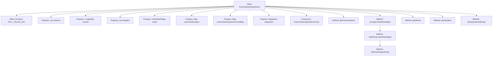
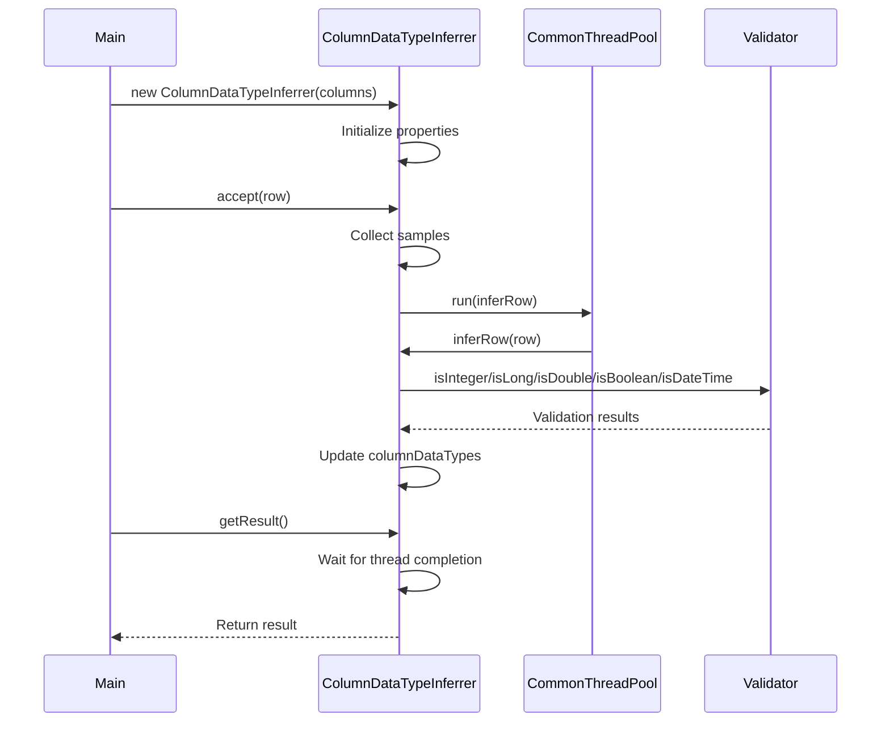

# Basic Information

|      |      |
|------|------|
| Name | ColumnDataTypeInferrer |
| Language | .java |
| Code Path | WeFe/common/java/common-wefe/src/main/java/com/welab/wefe/common/wefe/ColumnDataTypeInferrer.java |
| Package Name | com.welab.wefe.common.wefe |
| Dependencies | ['com.welab.wefe.common.CommonThreadPool', 'com.welab.wefe.common.Stopwatch', 'com.welab.wefe.common.Validator', 'com.welab.wefe.common.util.ThreadUtil', 'com.welab.wefe.common.wefe.enums.ColumnDataType', 'java.util', 'java.util.concurrent.ConcurrentHashMap', 'java.util.concurrent.atomic.LongAdder', 'java.util.function.Consumer'] |
| Brief Description | The `ColumnDataTypeInferrer` class is designed for multithreaded inference of field data types, supporting common types such as integers and booleans. It determines the final type through sample analysis and concurrent processing. |

# Description

ColumnDataTypeInferrer is a Java class designed for inferring field data types, implementing the Consumer interface. It analyzes input data rows in a multi-threaded manner to deduce the data types of each field. Key functionalities include: initializing with a target field list for inference; tracking processing progress using counters; collecting data samples; maintaining intermediate results such as field type sets and inference frequency statistics; and providing methods to terminate inference and return final results. The inference logic determines data types based on string values, supporting integer, long, double, boolean, datetime, and other types while handling null values. The class also includes timers for performance debugging purposes.

# Class Summary

| Name   | Type  | Description |
|-------|------|-------------|
| ColumnDataTypeInferrer | class | The `ColumnDataTypeInferrer` class is designed for multithreaded inference of field data types, supporting common types such as integers and booleans. It determines the final type through sample analysis and concurrent processing. |


## Class ColumnDataTypeInferrer

|      |      |
|------|------|
| Access Modifier | public |
| Type | class |
| Name | ColumnDataTypeInferrer |
| Description | The `ColumnDataTypeInferrer` class is designed for multithreaded inference of field data types, supporting common types such as integers and booleans. It determines the final type through sample analysis and concurrent processing. |


### UML Class Diagram

```mermaid
classDiagram
    class ColumnDataTypeInferrer {
        -List~String~ NULL_VALUE_LIST
        -List~String~ columns
        -LongAdder counter
        -List~Map~String~Object~~ samples
        -LinkedHashMap~String~ColumnDataType~ result
        -Map~String~Set~ColumnDataType~~ columnDataTypes
        -Map~String~LongAdder~ columnDataTypeInferCountMap
        -Stopwatch stopwatch
        +ColumnDataTypeInferrer(List~String~ columns)
        +List~String~ getColumnNames()
        +void accept(LinkedHashMap~String~Object~ row)
        -void inferRow(LinkedHashMap~String~Object~ row)
        +Map~String~ColumnDataType~ getResult()
        -ColumnDataType inferDataType(String value)
        +List~Map~String~Object~~ getSamples()
        +static boolean isEmptyValue(String value)
    }

    class ColumnDataType {
        <<Enumeration>>
        +String
        +Enum
        +DateTime
        +Double
        +Long
        +Integer
        +Boolean
    }

    class Validator {
        <<Utility>>
        +static boolean isInteger(String value)
        +static boolean isLong(String value)
        +static boolean isDouble(String value)
        +static boolean isBoolean(String value)
        +static boolean isDateTime(String value)
    }

    ColumnDataTypeInferrer --> ColumnDataType : Uses
    ColumnDataTypeInferrer --> Validator : Invokes static methods
    ColumnDataTypeInferrer ..|> Consumer~LinkedHashMap~String~Object~~ : Implements
```

This code implements a column data type inferrer that automatically deduces the data types of each column by analyzing input data samples. The core class ColumnDataTypeInferrer implements the Consumer interface, processes data in a multi-threaded manner, tracks progress using counters, and performs data type validation via the Validator utility class. The system maintains multiple intermediate state mapping tables, where a column's final type is determined upon reaching 100 valid inference samples, supporting recognition of common data types including integers, floats, booleans, dates, etc. The enumeration class ColumnDataType defines all supported data type categories.


### Internal Method Call Graph





This code implements a multi-threaded column data type inferrer, whose primary function is to automatically deduce the data types of each column by analyzing data samples. The flowchart illustrates the class structure and main method call relationships, while the sequence diagram depicts the complete workflow from initialization and data reception to result retrieval. Core logic includes: 1) Receiving data rows via the accept method; 2) Processing each row in parallel using a thread pool; 3) Validating various data types through Validator; 4) Stopping inference for a column when it reaches 100 valid inferences; 5) Aggregating all column data types via getResult. The entire process considers multi-threading safety and performance monitoring, making it suitable for processing large-scale datasets.

### Field List

| Name  | Type  | Description |
|-------|-------|------|
| columnDataTypeInferCountMap = new ConcurrentHashMap<>() | Map<String, LongAdder> | A thread-safe concurrent map with string keys and long integer accumulators as values, used for counting the occurrences of column data type inference. |
| columns | List<String> | Declare a private string list variable columns. |
| NULL_VALUE_LIST = Arrays.asList("", "null", "NA", "nan", "None") | List<String> | Define a constant list NULL_VALUE_LIST containing five invalid strings: empty value, null, NA, nan, and None. |
| stopwatch = Stopwatch.startNew() | Stopwatch | Initialize and start a private stopwatch timer. |
| result = new LinkedHashMap<>() | LinkedHashMap<String, ColumnDataType> | Declare an immutable LinkedHashMap variable named result with keys of type String and values of type ColumnDataType. |
| counter = new LongAdder() | LongAdder | Create a thread-safe LongAdder counter object. |
| samples = new ArrayList<>() | List<Map<String, Object>> | Declare a list variable named samples to store key-value pair mappings, initialized as an empty ArrayList. |
| columnDataTypes = new ConcurrentHashMap<>() | Map<String, Set<ColumnDataType>> | A thread-safe map with string keys and a collection of column data types as values. |

### Method List

| Name  | Type  | Description |
|-------|-------|------|
| inferRow | void | This method is used to infer the data types of each column in row data. It iterates through column names, infers types based on values, and records them. If the inference count for a column reaches 100, further inference for that column is stopped. It supports multi-threaded operations. |
| accept | void | The method accepts row data, storing it if the sample size is fewer than 10. If the field type has already been inferred, processing stops; otherwise, it counts and asynchronously infers the row. |
| getSamples | List<Map<String, Object>> | Get the sample list, the return type is a list of mappings containing strings and objects. |
| getColumnNames | List<String> | The method returns a list of column names. |
| getResult | Map<String, ColumnDataType> | After the method waits for the thread to complete, it iterates through the column data type collection, sets the result mapping based on type priority, and finally returns the result. If an unknown type is encountered, an exception is thrown. |
| inferDataType | ColumnDataType | The method infers the data type based on the input string, returns null for empty values, sequentially checks integer, long, float, boolean, and datetime, and returns the string type if none match. |
| isEmptyValue | boolean | Check if the string is a case-insensitive match for any of the predefined null values in the list. |


