# Basic Information

|      |      |
|------|------|
| Name | wefe |
| Language | .java |
| Code Path | WeFe/common/java/common-wefe/src/main/java/com/welab/wefe/common/wefe |
| Package Name | docs.common.java.common-wefe.src.main.java.com.welab.wefe.common.wefe |
| Brief Description | The service inspection framework implements hierarchical health detection, the enumeration module defines federated learning type states, the configuration management module uniformly handles multi-source connections, and the data type inferrer analyzes field types. |

# Description

## Overview  
This module serves as the core supporting framework for the federated learning system, encompassing four major functionalities: service health checks, enumeration definitions, configuration management, and data type inference. It adopts a layered abstraction design, with key interfaces including AbstractCheckpoint (checkpoint), AbstractConfigModel (configuration model), and Consumer (data type inference). Core data structures cover ServiceCheckPointOutput (inspection results), 11 types of ServiceType (service type enumerations), and ColumnDataType (field types). It relies on the Spring framework, JDBC drivers, and cloud service SDKs. For example, CheckpointManager concurrently detects UnionService connectivity, or ColumnDataTypeInferrer infers field types.  

## Key Business Scenarios  
The module supports full lifecycle management of federated learning: 1) Service health checks employ a sentinel mode, such as 5-second timeout detection; 2) Enumeration-driven state machines, like JobStatus controlling task transitions; 3) Factory pattern management for multi-data source configurations, such as generating specialized database URLs; 4) Multithreaded field type inference (similar to MapReduce). Typical workflows include configuration validation → parallel checks → result aggregation, such as escalating UnionService check failures hierarchically. Integration cases span horizontal federated learning (using XGBoost algorithms) and cloud storage switching (e.g., OSS credential management).

### Package Internal Structure View

```mermaid
graph TD
    wefe --> checkpoint
    wefe --> enums
    wefe --> dto
    wefe --> ColumnDataTypeInferrer.java
    checkpoint --> dto
    checkpoint --> AbstractUnionConnectionCheckpoint.java
    checkpoint --> CheckpointManager.java
    checkpoint --> AbstractCheckpoint.java
    dto --> ServiceCheckPointOutput.java
    dto --> ServiceAvailableCheckOutput.java
    dto --> MemberAvailableCheckOutput.java
    dto --> global_config
    dto --> storage
    global_config --> storage
    global_config --> calculation_engine
    global_config --> base
    global_config --> GatewayConfigModel.java
    global_config --> ServerCertInfoModel.java
    global_config --> BoardConfigModel.java
    global_config --> DeepLearningConfigModel.java
    global_config --> MailServerModel.java
    global_config --> PrivacyConfigModel.java
    global_config --> ServingConfigModel.java
    global_config --> GlobalConfigFlag.java
    global_config --> AlertConfigModel.java
    global_config --> MemberInfoModel.java
    global_config --> FlowConfigModel.java
    global_config --> AliyunSmsChannelConfigModel.java
    storage --> DataSourceConfig.java
    storage --> ClickhouseConfig.java
    calculation_engine --> fc
    calculation_engine --> spark
    calculation_engine --> CalculationEngineBaseConfigModel.java
    fc --> FunctionComputeBaseConfigModel.java
    fc --> AliyunFunctionComputeConfigModel.java
    fc --> TencentServerlessCloudFunctionConfigModel.java
    spark --> SparkStandaloneConfigModel.java
    base --> GlobalConfigInput.java
    base --> ConfigModel.java
    base --> AbstractConfigModel.java
    base --> ConfigGroupConstant.java
    enums --> ServiceType.java
    enums --> env
    enums --> ModelExportLanguage.java
    enums --> BoardUserSource.java
    enums --> DeepLearningJobType.java
    enums --> MessageLevel.java
    enums --> Binning.java
    enums --> VerificationCodeSendChannel.java
    enums --> JobStatus.java
    enums --> HashOptions.java
    enums --> ProjectType.java
    enums --> FederatedLearningModel.java
    enums --> DataResourcePublicLevel.java
    enums --> TaskStatus.java
    enums --> DataResourceType.java
    enums --> ContractName.java
    enums --> SmsBusinessType.java
    enums --> PredictFeatureDataSource.java
    enums --> DataResourceStorageType.java
    enums --> ChatListType.java
    enums --> BloomFilterProgressType.java
    enums --> GatewayProcessorType.java
    enums --> ProducerType.java
    enums --> VerificationCodeBusinessType.java
    enums --> TaskResultType.java
    enums --> ProjectFlowStatisticsStatus.java
    enums --> FileRurpose.java
    enums --> JobMemberRole.java
    enums --> MessageEvent.java
    enums --> ColumnDataType.java
    enums --> FcCloudProvider.java
    enums --> ProjectFlowStatus.java
    enums --> Algorithm.java
    enums --> AuditStatus.java
    enums --> ComponentType.java
    enums --> JobBackendType.java
    enums --> DataResourceUploadStatus.java
    enums --> FlowActionType.java
    enums --> FlowLimitStrategyTypeEnum.java
    enums --> BloomFilterPublicLevel.java
    enums --> PredictType.java
    enums --> DataResourceStorageServiceType.java
    enums --> FederatedLearningType.java
    env --> EnvName.java
    env --> EnvBranch.java
```

This flowchart presents the complete directory structure of the common-wefe module in the WeFe project, comprising three core modules - checkpoint, enums, and dto - along with their subfiles. The checkpoint module contains abstract classes and checkpoint management files, the enums module consolidates over 40 enumeration type definition files, while the dto module is subdivided into the global_config configuration system and storage configurations. The global configuration section adopts a multi-level nested structure, encompassing computation engine configurations, basic configuration models, and various service configuration models, forming a comprehensive configuration management system.

# File List

| Name   | Type  | Description |
|-------|------|-------------|
| [ColumnDataTypeInferrer.java](ColumnDataTypeInferrer.md) | file | The `ColumnDataTypeInferrer` class is designed for multithreaded inference of field data types, supporting common types such as integers and booleans. It determines the final type through sample analysis and concurrent processing. |
| [checkpoint](checkpoint/_module.md) | package | This module encapsulates service availability checks, providing standardized output structures and status judgment logic. It includes three types of DTOs to record inspection details, aggregate results, and member-level mappings. Through abstract classes and checkpoint managers, it implements service connectivity checks, result collection and aggregation, supporting single-service checks, batch aggregation, and data cleanup. |
| [dto](dto/_module.md) | package | The core module centrally manages global configurations and data source connections, supporting standardized multi-scenario configurations and database-specific management. It enables flexible extension through base classes, annotations, and inheritance, covering full lifecycle functionalities such as validation, versioning, and URL generation. It relies on reflection mechanisms and cloud service SDKs. |
| [enums](enums/_module.md) | package | A collection of enumeration types, including service types, environment branches, model languages, user sources, task statuses, data resource types, captcha channels, hash algorithms, federated learning modes, and over 40 business-related enumeration definitions, used for state management and type identification across various system modules. |

