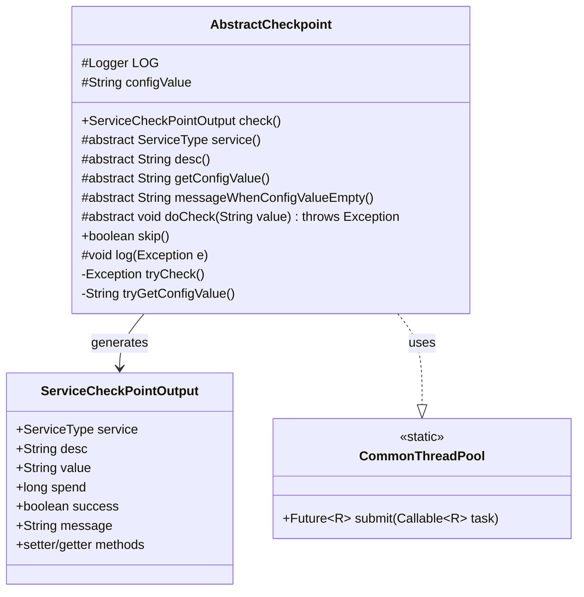
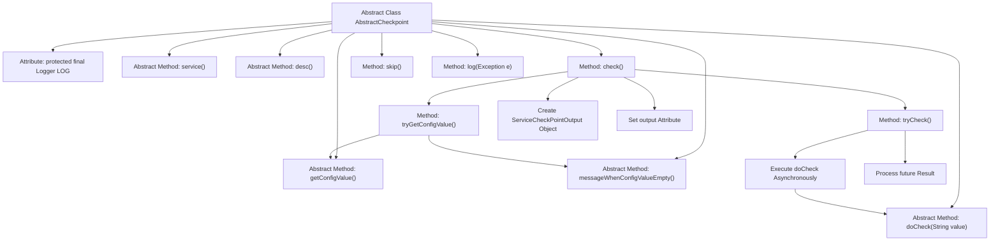

# Basic Information

|      |      |
|------|------|
| Name | AbstractCheckpoint |
| Language | .java |
| Code Path | WeFe/common/java/common-wefe/src/main/java/com/welab/wefe/common/wefe/checkpoint/AbstractCheckpoint.java |
| Package Name | com.welab.wefe.common.wefe.checkpoint |
| Dependencies | ['com.welab.wefe.common.CommonThreadPool', 'com.welab.wefe.common.util.StringUtil', 'com.welab.wefe.common.wefe.checkpoint.dto.ServiceCheckPointOutput', 'com.welab.wefe.common.wefe.enums.ServiceType', 'org.slf4j.Logger', 'org.slf4j.LoggerFactory', 'java.util.concurrent.Future', 'java.util.concurrent.TimeUnit', 'java.util.concurrent.TimeoutException'] |
| Brief Description | The abstract class AbstractCheckpoint defines a checkpoint framework, incorporating configuration retrieval, validation logic, and result output functionality, with support for timeout control and exception handling. |

# Description

AbstractCheckpoint is an abstract class that defines the basic structure and behavior of checkpoints. It includes core methods such as obtaining configuration values, performing checks, and handling exceptions. Subclasses need to implement abstract methods like service, desc, and getConfigValue. The checking process involves obtaining configuration values, executing checks, recording time consumption, and returning a ServiceCheckPointOutput object containing the check results. The check operation is executed in an asynchronous thread with a timeout of 5 seconds. When the configuration value is empty, an exception is thrown to alert the user. The class also provides default implementations for logging and skipping checks.

# Class Summary

| Name   | Type  | Description |
|-------|------|-------------|
| AbstractCheckpoint | class | The abstract class `AbstractCheckpoint` defines the base class for checkpoints, containing core logic such as obtaining configurations, executing checks, and handling exceptions. Subclasses must implement abstract methods including service type, description, and configuration value retrieval. Check results are returned via `ServiceCheckPointOutput`, supporting timeout handling and check-skipping functionality. |

## Class AbstractCheckpoint

|      |      |
|------|------|
| Access Modifier | public abstract |
| Type | class |
| Name | AbstractCheckpoint |
| Description | The abstract class `AbstractCheckpoint` defines the base class for checkpoints, containing core logic such as obtaining configurations, executing checks, and handling exceptions. Subclasses must implement abstract methods including service type, description, and configuration value retrieval. Check results are returned via `ServiceCheckPointOutput`, supporting timeout handling and check-skipping functionality. |

### UML Class Diagram

This code defines an abstract class `AbstractCheckpoint` that implements the checkpoint pattern. It outlines the inspection process through the template method `check()`: retrieving configuration values, performing checks, and generating results. Subclasses must implement abstract methods to define specific inspection logic. The inspection process supports timeout control (5 seconds) and null value validation, with results returned via the `ServiceCheckPointOutput` object. The class diagram illustrates core classes and their relationships, including collaboration with the thread pool `CommonThreadPool`.

### Internal Method Call Graph

This code demonstrates the implementation flow of an abstract checkpoint class. The abstract class defines core checkpoint logic including key steps such as obtaining configuration values, performing checks, and processing results. The main flow starts from the check() method, which first attempts to retrieve configuration values, then asynchronously executes the check operation, and finally assembles the output. The process involves multiple abstract methods requiring subclass implementation, such as obtaining service type, description information, and configuration values. The check operation is executed asynchronously via a thread pool with a 5-second timeout mechanism. The entire flow incorporates exception handling and logging, representing a classic implementation of the Template Method design pattern.

### Field List

| Name  | Type  | Description |
|-------|-------|------|
| configValue | String | Protected string configuration values. |
| LOG = LoggerFactory.getLogger(this.getClass()) | Logger | A protected final log object LOG is defined in the class for recording the log information of the current class. |

### Method List

| Name  | Type  | Description |
|-------|-------|------|
| tryCheck | Exception | Asynchronous execution check, returns corresponding error on timeout or exception, defaults to waiting for 5 seconds. |
| doCheck | void | Abstract method doCheck with parameter String value, which may throw an exception. |
| getConfigValue | String | Abstract method for retrieving configuration values, returning a string type. |
| messageWhenConfigValueEmpty | String | Abstract method that returns the prompt message when the configuration value is empty. |
| check | ServiceCheckPointOutput | The method check() performs service inspection: retrieves configuration items, attempts the check operation, records time consumption, and returns an output object containing status, description, duration, and result information. It sets corresponding messages for both success and failure scenarios. |
| desc | String | Abstract method, returns a string description. |
| service | ServiceType | Abstract methods define service types and require implementation by subclasses. |
| tryGetConfigValue | String | The method attempts to retrieve a configuration value, throws an exception if the value is empty and the error message is non-empty, otherwise returns the configuration value. |
| skip | boolean | The method skip returns a fixed value false, indicating no skipping. |
| log | void | This method is used to log exceptions, outputting the exception class name, message, and exception object to the error log. |

