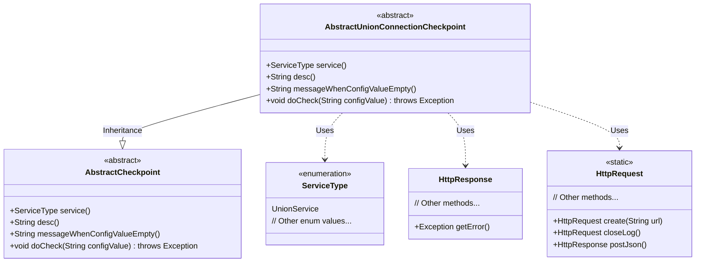
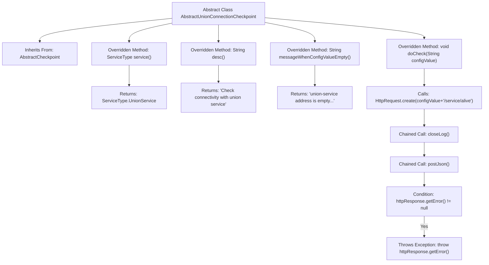

# Basic Information

|      |      |
|------|------|
| Name | AbstractUnionConnectionCheckpoint |
| Language | .java |
| Code Path | WeFe/common/java/common-wefe/src/main/java/com/welab/wefe/common/wefe/checkpoint/AbstractUnionConnectionCheckpoint.java |
| Package Name | com.welab.wefe.common.wefe.checkpoint |
| Dependencies | ['com.welab.wefe.common.http.HttpRequest', 'com.welab.wefe.common.http.HttpResponse', 'com.welab.wefe.common.wefe.enums.ServiceType'] |
| Brief Description | The abstract class AbstractUnionConnectionCheckpoint extends AbstractCheckpoint to verify the connectivity of UnionService. It requires configuring service addresses and validates service availability status through HTTP requests. |

# Description

AbstractUnionConnectionCheckpoint is an abstract class that inherits from AbstractCheckpoint. It overrides the service method to return ServiceType.UnionService; overrides the desc method to return a description for checking connectivity with the union service; and overrides the messageWhenConfigValueEmpty method to prompt configuring the union-service address. The doCheck method verifies service connectivity via HTTP requests, throwing exceptions if the configuration value is empty or the request fails.

# Class Summary

| Name   | Type  | Description |
|-------|------|-------------|
| AbstractUnionConnectionCheckpoint | class | The abstract class `AbstractUnionConnectionCheckpoint` extends `AbstractCheckpoint` and defines the logic for checking the connectivity of union services. The service type is `UnionService`, which throws an error when the configuration is empty, and verifies the service's alive status via HTTP requests. |

## Class AbstractUnionConnectionCheckpoint

|      |      |
|------|------|
| Access Modifier | public abstract |
| Type | class |
| Name | AbstractUnionConnectionCheckpoint |
| Description | The abstract class `AbstractUnionConnectionCheckpoint` extends `AbstractCheckpoint` and defines the logic for checking the connectivity of union services. The service type is `UnionService`, which throws an error when the configuration is empty, and verifies the service's alive status via HTTP requests. |

### UML Class Diagram

This code demonstrates an abstract class `AbstractUnionConnectionCheckpoint`, which inherits from `AbstractCheckpoint` and is specifically designed to check connectivity with union services. It overrides the parent class's abstract methods, including retrieving the service type, description information, prompt messages when configurations are empty, and the core logic for performing checks. The checking process involves accessing the union service's health check interface via HTTP requests and handling potential error responses. The class diagram clearly illustrates the inheritance relationship and dependencies on utility classes such as `ServiceType`, `HttpRequest`, and `HttpResponse`.

### Internal Method Call Graph

This flowchart illustrates the structure of the AbstractUnionConnectionCheckpoint abstract class and its method invocation relationships. The class inherits from AbstractCheckpoint and overrides four key methods: service() returns the service type, desc() provides a check description, messageWhenConfigValueEmpty() returns configuration error prompts, while the core method doCheck() executes the HTTP health check process. The check process includes creating a request, disabling logs, sending a POST request, and determining whether to throw an exception based on response errors. All methods revolve around the core functionality of verifying connectivity with the Union service.

### Field List

| Name  | Type  | Description |
|-------|-------|------|

### Method List

| Name  | Type  | Description |
|-------|-------|------|
| desc | String | Check the connectivity with the union service. |
| service | ServiceType | Rewrite the service method to return the UnionService type. |
| messageWhenConfigValueEmpty | String | When the union-service address is not configured, prompt that it needs to be set in config.properties. |
| doCheck | void | Check service availability status: Verify whether the service at the configured address is accessible via HTTP request, and throw an exception if an error occurs. |

