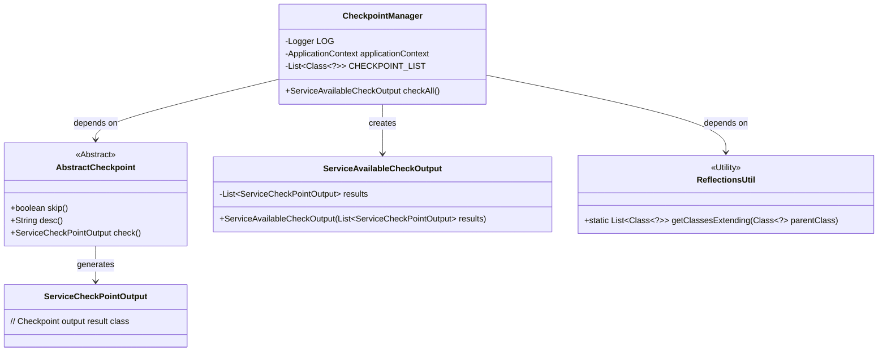
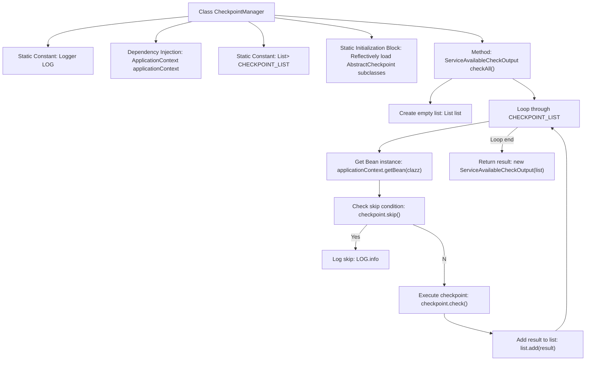

# Basic Information

|      |      |
|------|------|
| Name | CheckpointManager |
| Language | .java |
| Code Path | WeFe/common/java/common-wefe/src/main/java/com/welab/wefe/common/wefe/checkpoint/CheckpointManager.java |
| Package Name | com.welab.wefe.common.wefe.checkpoint |
| Dependencies | ['com.welab.wefe.common.util.ReflectionsUtil', 'com.welab.wefe.common.wefe.checkpoint.dto.ServiceAvailableCheckOutput', 'com.welab.wefe.common.wefe.checkpoint.dto.ServiceCheckPointOutput', 'org.slf4j.Logger', 'org.slf4j.LoggerFactory', 'org.springframework.beans.factory.annotation.Autowired', 'org.springframework.context.ApplicationContext', 'org.springframework.stereotype.Service', 'java.util.ArrayList', 'java.util.List'] |
| Brief Description | The CheckpointManager class scans all classes inheriting from AbstractCheckpoint through reflection, invokes their check methods to perform service availability checks, skips checkpoints marked as skip, and ultimately returns a list of inspection results. |

# Description

CheckpointManager is a Spring service class designed to manage all checkpoint implementations that inherit from AbstractCheckpoint. It utilizes the reflection tool ReflectionsUtil in a static code block to scan and retrieve all checkpoint classes. The core method checkAll iterates through these checkpoint classes, obtains instances from the Spring container, skips checkpoints marked as skip, executes the check method of the remaining checkpoints, and collects the results. Ultimately, it returns a ServiceAvailableCheckOutput object containing all the inspection results. During the process, log messages for skipped checkpoints are recorded.

# Class Summary

| Name   | Type  | Description |
|-------|------|-------------|
| CheckpointManager | class | The CheckpointManager class scans and retrieves all checkpoints inheriting from AbstractCheckpoint through reflection, executes the inspection logic one by one, skips checkpoints marked as skip, and finally returns the list of inspection results. |

## Class CheckpointManager

|      |      |
|------|------|
| Access Modifier | @Service;public |
| Type | class |
| Name | CheckpointManager |
| Description | The CheckpointManager class scans and retrieves all checkpoints inheriting from AbstractCheckpoint through reflection, executes the inspection logic one by one, skips checkpoints marked as skip, and finally returns the list of inspection results. |

### UML Class Diagram

This code demonstrates a checkpoint management system where CheckpointManager serves as the core service class. It retrieves all checkpoint classes extending AbstractCheckpoint through reflection mechanism and sequentially executes their check logic. AbstractCheckpoint is an abstract base class defining methods like skip(), desc(), and check(). ServiceAvailableCheckOutput acts as the container class for final check results, containing multiple ServiceCheckPointOutput instances. The entire system manages checkpoint instances through Spring container, implementing a flexible and extensible inspection mechanism.

### Internal Method Call Graph

This flowchart illustrates the core logical structure of the CheckpointManager class. The class reflectively loads all AbstractCheckpoint subclasses through a static initialization block. The checkAll method iterates through these checkpoint classes, retrieves instances via the Spring container, first determines whether to skip the check, and if not skipped, executes the check logic and collects results, ultimately aggregating and returning all check results. The logging module records skipped checkpoint information, with the entire process demonstrating the core control logic of checkpoint management.

### Field List

| Name  | Type  | Description |
|-------|-------|------|
| LOG = LoggerFactory.getLogger(CheckpointManager.class) | Logger | Define a private static log constant LOG for the CheckpointManager class. |
| applicationContext | ApplicationContext | Automatically inject Spring application context objects. |
| CHECKPOINT_LIST | List<Class<?>> | The static constant CHECKPOINT_LIST stores a list of class types to be checked. |

### Method List

| Name  | Type  | Description |
|-------|-------|------|
| checkAll | ServiceAvailableCheckOutput | Method checks the availability of all services, iterates through the checkpoint list, skips checkpoints marked as skipped, performs checks and collects results, and finally returns a summarized output. |

