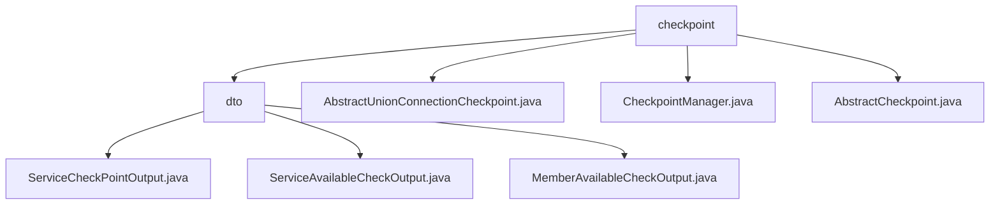

# Basic Information

|      |      |
|------|------|
| Name | checkpoint |
| Language | .java |
| Code Path | WeFe/common/java/common-wefe/src/main/java/com/welab/wefe/common/wefe/checkpoint |
| Package Name | docs.common.java.common-wefe.src.main.java.com.welab.wefe.common.wefe.checkpoint |
| Brief Description | This module encapsulates service availability checks, providing standardized output structures and status judgment logic. It includes three types of DTOs to record inspection details, aggregate results, and member-level mappings. Through abstract classes and checkpoint managers, it implements service connectivity checks, result collection and aggregation, supporting single-service checks, batch aggregation, and data cleanup. |

# Description

## Overview  
The core responsibility of this module is to implement a service availability checking framework, providing unified service health assessment capabilities through layered abstraction and standardized output structures. The interface specification consists of a three-tier structure: AbstractCheckpoint defines basic checking behaviors, AbstractUnionConnectionCheckpoint implements specific service connectivity detection, and CheckpointManager uniformly schedules the checking process. Key data structures include ServiceCheckPointOutput (atomic check result), ServiceAvailableCheckOutput (aggregated result), and check status enumerations. It relies on the Spring framework and Java reflection mechanism. For example, AbstractUnionConnectionCheckpoint detects UnionService connectivity via HTTP, where timeouts or missing configurations trigger exceptions.  

## Main Business Scenarios  
The typical workflow involves CheckpointManager driving the check lifecycle: reflectively loading all AbstractCheckpoint subclasses, filtering items marked with skip, and then executing checks concurrently (similar to a sentinel pattern), ultimately aggregating results into ServiceAvailableCheckOutput. Specific implementations, such as Union service checks, validate the effectiveness of configured addresses with a timeout control of 5 seconds. The functionality covers configuration validation, parallel multi-service detection, and hierarchical result aggregation. For instance, when a service is unreachable, errors are reported level by level through ServiceCheckPointOutput to the aggregated result.

### Package Internal Structure View

This flowchart illustrates the structural relationships within the checkpoint directory, which includes a dto subdirectory and three Java class files. The dto directory further contains three output class files, each handling different types of checkpoint outputs. The overall structure clearly reflects the code organization of the checkpoint module, making it easy to understand the hierarchical relationships between components.

# File List

| Name   | Type  | Description |
|-------|------|-------------|
| [AbstractUnionConnectionCheckpoint.java](AbstractUnionConnectionCheckpoint.md) | file | The abstract class `AbstractUnionConnectionCheckpoint` extends `AbstractCheckpoint` to verify the connectivity of `UnionService`. It requires configuring service addresses and validates service availability status through HTTP requests. |
| [CheckpointManager.java](CheckpointManager.md) | file | The CheckpointManager class scans all classes inheriting from AbstractCheckpoint through reflection, invokes their check methods to perform service availability verification, skips checkpoints marked as skip, and ultimately returns a list of inspection results. |
| [AbstractCheckpoint.java](AbstractCheckpoint.md) | file | The abstract class AbstractCheckpoint defines a checkpoint framework, incorporating configuration retrieval, validation logic, and result output functionality, with support for timeout control and exception handling. |
| [dto](dto/_module.md) | package | The ServiceCheckPointOutput class encapsulates service checkpoint outputs, including attributes such as type and status, and provides success/failure construction methods. The ServiceAvailableCheckOutput class checks service availability, automatically determines the overall status, and handles sensitive data. The MemberAvailableCheckOutput class verifies member availability, manages service type-to-result mappings, and automatically updates error states. |

