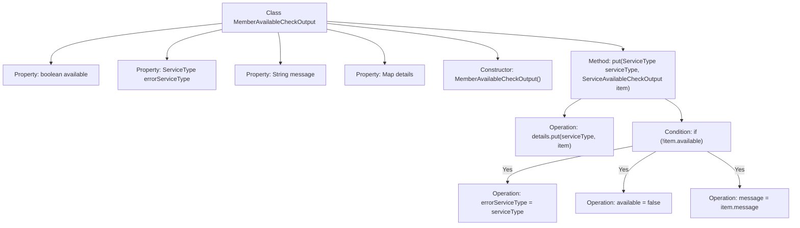

# Basic Information

|      |      |
|------|------|
| Name | MemberAvailableCheckOutput |
| Language | .java |
| Code Path | WeFe/common/java/common-wefe/src/main/java/com/welab/wefe/common/wefe/checkpoint/dto/MemberAvailableCheckOutput.java |
| Package Name | com.welab.wefe.common.wefe.checkpoint.dto |
| Dependencies | ['com.welab.wefe.common.wefe.enums.ServiceType', 'java.util.LinkedHashMap', 'java.util.Map'] |
| Brief Description | The class MemberAvailableCheckOutput checks member availability, including status, error type, message, and service details. Updates error information when unavailable. |

# Description

The MemberAvailableCheckOutput class is used to check member availability status, containing an availability flag, error service type, message, and a detailed check result map. The constructor initializes the object, and the put method adds a service type and its check result. If the service is unavailable, it updates the error type, availability status, and error message.

# Class Summary

| Name   | Type  | Description |
|-------|------|-------------|
| MemberAvailableCheckOutput | class | The class MemberAvailableCheckOutput checks member availability, including availability status, erroneous service type, message, and detailed results. If a sub-service is unavailable, it updates the error information and marks it as unavailable. |


## Class MemberAvailableCheckOutput

|      |      |
|------|------|
| Access Modifier | public |
| Type | class |
| Name | MemberAvailableCheckOutput |
| Description | The class MemberAvailableCheckOutput checks member availability, including availability status, erroneous service type, message, and detailed results. If a sub-service is unavailable, it updates the error information and marks it as unavailable. |


### UML Class Diagram

```mermaid
classDiagram
    class MemberAvailableCheckOutput {
        +boolean available
        +ServiceType errorServiceType
        +String message
        +Map~ServiceType, ServiceAvailableCheckOutput~ details
        +MemberAvailableCheckOutput()
        +put(ServiceType serviceType, ServiceAvailableCheckOutput item) void
    }

    class ServiceAvailableCheckOutput {
        <<Interface>>
    }
    // MemberAvailableCheckOutput depends on ServiceType
    MemberAvailableCheckOutput --> ServiceType : Dependency
    // MemberAvailableCheckOutput contains ServiceAvailableCheckOutput
    MemberAvailableCheckOutput "1" *-- "0..*" ServiceAvailableCheckOutput : Contains
```

This code defines a `MemberAvailableCheckOutput` class for checking member availability status. The class includes an availability flag, error service type, message, and a map of detailed check results. When adding unavailable services, it automatically updates the error status. The class diagram illustrates its dependency relationship with `ServiceType` and its aggregation relationship (one-to-many) with the `ServiceAvailableCheckOutput` interface, which stores specific service check results. The structural design supports flexible extension of availability checks for different service types.


### Internal Method Call Graph



This flowchart illustrates the structure and core method logic of the MemberAvailableCheckOutput class. The class contains 4 properties and 2 methods, with the key put() method storing service check results via LinkedHashMap and updating error states when services are unavailable. The process clearly depicts conditional branching and property update paths, demonstrating a complete logical chain for state transitions.

### Field List

| Name  | Type  | Description |
|-------|-------|------|
| errorServiceType | ServiceType | Define a public variable errorServiceType of type ServiceType. |
| available = true | boolean | The variable `available` is of boolean type, with an initial value of `true`, indicating the available status. |
| message | String | Common string variable message. |
| details = new LinkedHashMap<>() | Map<ServiceType, ServiceAvailableCheckOutput> | Defined a public map named details, with ServiceType as the key and ServiceAvailableCheckOutput as the value, implemented using LinkedHashMap. |

### Method List

| Name  | Type  | Description |
|-------|-------|------|
| put | void | The method maps the service type to the inspection result. If the service is unavailable, it logs the error type, status, and message. |


