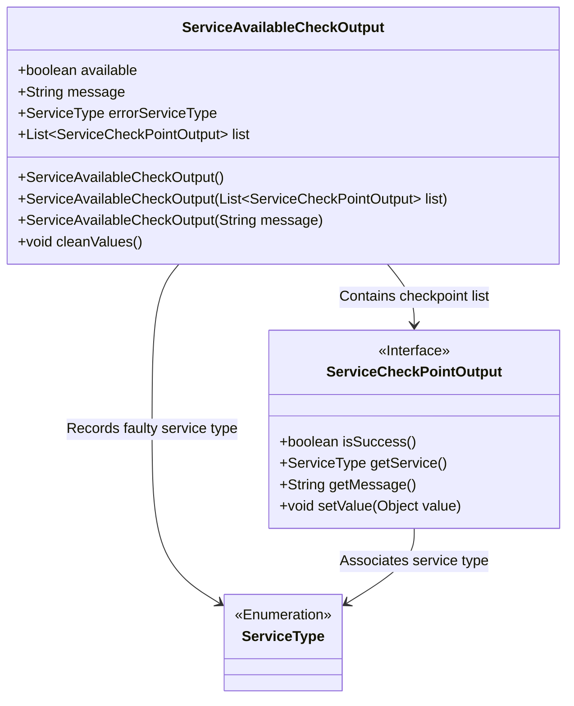
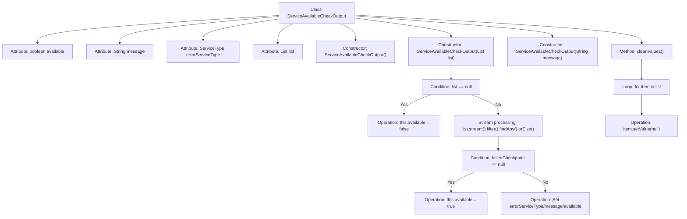

# Basic Information

|      |      |
|------|------|
| Name | ServiceAvailableCheckOutput |
| Language | .java |
| Code Path | WeFe/common/java/common-wefe/src/main/java/com/welab/wefe/common/wefe/checkpoint/dto/ServiceAvailableCheckOutput.java |
| Package Name | com.welab.wefe.common.wefe.checkpoint.dto |
| Dependencies | ['com.welab.wefe.common.wefe.enums.ServiceType', 'java.util.List'] |
| Brief Description | Service availability check output class, containing availability status, message, error service type, and checkpoint list. The constructor processes the list to determine availability and provides a cleanup method to clear checkpoint values. |

# Description

The ServiceAvailableCheckOutput class is used to check service availability and contains four attributes: `available` indicates whether the service is available, `message` stores status information, `errorServiceType` records the failed service type, and `list` holds the checkpoint result list. The constructor supports three initialization methods: default construction, construction based on a checkpoint list (automatically setting the `available` status and error message), and construction based on a message. The `cleanValues` method is used to clear sensitive data in the checkpoints. This class automatically determines the overall service status by traversing the checkpoint list—if any checkpoint fails, the service is marked as unavailable and the error information is recorded.

# Class Summary

| Name   | Type  | Description |
|-------|------|-------------|
| ServiceAvailableCheckOutput | class | Service availability check output class, containing availability status, message, error service type, and checkpoint list. The constructor processes list status and sets availability. Provides a method for cleaning up checkpoint values. |

## Class ServiceAvailableCheckOutput

|      |      |
|------|------|
| Access Modifier | public |
| Type | class |
| Name | ServiceAvailableCheckOutput |
| Description | Service availability check output class, containing availability status, message, error service type, and checkpoint list. The constructor processes list status and sets availability. Provides a method for cleaning up checkpoint values. |

### UML Class Diagram

This class diagram illustrates the structure of the ServiceAvailableCheckOutput class, which contains four public fields and three constructors. Its core functionality is to determine service availability through a checkpoint list (ServiceCheckPointOutput), while recording faulty service types (ServiceType) and related information. The cleanValues() method is designed to clear sensitive data, reflecting security considerations. The inter-class relationships clearly demonstrate data flow directions, with ServiceCheckPointOutput serving as an interface that defines essential checkpoint operation methods.

### Internal Method Call Graph

This flowchart illustrates the structure and core logic of the ServiceAvailableCheckOutput class. The class contains 4 attributes and 3 constructors, with the list-parameterized constructor implementing the key business logic: it uses stream processing to check for failed items in the list and accordingly sets the availability status and related error information. The cleanValues method clears the value of all items in the list. The process clearly demonstrates conditional branching and loop handling logic.

### Field List

| Name  | Type  | Description |
|-------|-------|------|
| errorServiceType | ServiceType | Define a public enumeration variable `errorServiceType` to identify the type of error service. |
| message | String | Declare a public string variable named message. |
| list | List<ServiceCheckPointOutput> | This is a public list that stores objects of the ServiceCheckPointOutput type. |
| available | boolean | The boolean variable `available` indicates the status of availability. |

### Method List

| Name  | Type  | Description |
|-------|-------|------|
| cleanValues | void | Clearing values in a list: If the list is not empty, iterate through and set the value of each item to null. |

