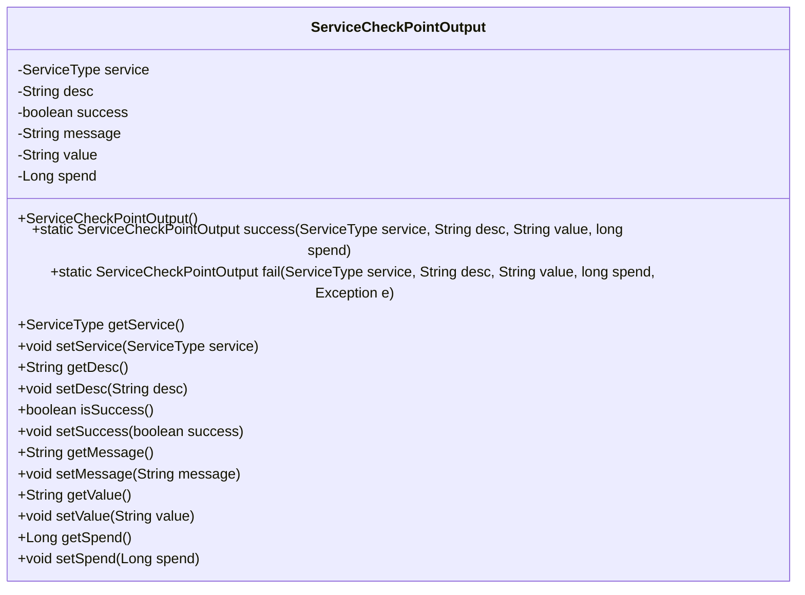
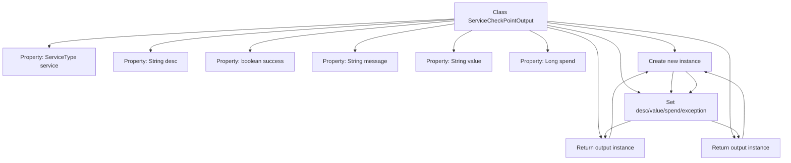

# Basic Information

|      |      |
|------|------|
| Name | ServiceCheckPointOutput |
| Language | .java |
| Code Path | WeFe/common/java/common-wefe/src/main/java/com/welab/wefe/common/wefe/checkpoint/dto/ServiceCheckPointOutput.java |
| Package Name | com.welab.wefe.common.wefe.checkpoint.dto |
| Dependencies | ['com.welab.wefe.common.wefe.enums.ServiceType'] |
| Brief Description | The `ServiceCheckPointOutput` class is used to record service check results, including service type, description, success status, message, value, and time consumed. It provides static constructor methods for success and failure cases, along with getter and setter methods. |

# Description

The `ServiceCheckPointOutput` class is used to encapsulate the output results of service checkpoints, including attributes such as service type, description, success status, message, value, and time consumption. It provides two static methods: `success` for constructing successful results and `fail` for constructing failed results with exception information. The class includes getter and setter methods for all attributes, supporting flexible setting and retrieval of each field value.

# Class Summary

| Name   | Type  | Description |
|-------|------|-------------|
| ServiceCheckPointOutput | class | The `ServiceCheckPointOutput` class is used to record service check results, including service type, description, success status, message, value, and time consumption, providing static construction methods for both success and failure cases. |

## Class ServiceCheckPointOutput

|      |      |
|------|------|
| Access Modifier | public |
| Type | class |
| Name | ServiceCheckPointOutput |
| Description | The `ServiceCheckPointOutput` class is used to record service check results, including service type, description, success status, message, value, and time consumption, providing static construction methods for both success and failure cases. |

### UML Class Diagram

This code defines a class named `ServiceCheckPointOutput`, which represents the output result of a service checkpoint. The class includes multiple private fields such as `service`, `desc`, `success`, etc., along with corresponding getter and setter methods. Additionally, it provides two static factory methods, `success` and `fail`, for creating instances of successful and failed checkpoint outputs, respectively. This class is primarily used to encapsulate the status information of a service checkpoint, including the service type, description, success status, message, value, and time spent.

### Internal Method Call Graph

This code defines a service checkpoint output class containing 6 core properties and two core static factory methods. The success method constructs successful responses by initializing service, description, value, and duration fields; the fail method constructs failure responses with additional exception handling and error message setup. All properties include standard getter/setter methods for flexible object construction and data access. The class is designed to encapsulate service invocation results including status, duration, and supplementary information.

### Field List

| Name  | Type  | Description |
|-------|-------|------|
| spend | Long | The private long integer variable "spend" is used to store numerical values. |
| service | ServiceType | Private service type variable `service`. |
| message | String | Private string variable message. |
| value | String | Declare a private string variable named value. |
| desc | String | Private string type variable desc. |
| success | boolean | The boolean variable `success` indicates whether the operation was successful. |

### Method List

| Name  | Type  | Description |
|-------|-------|------|
| getService | ServiceType | Get the ServiceType object of the current service. |
| getValue | String | This is a Java method that returns the value of the member variable "value" of type String. |
| isSuccess | boolean | This is a Java method that returns the status of the boolean value success. |
| getMessage | String | This is a Java method that returns the value of the string-type message variable. |
| getDesc | String | Methods for obtaining descriptive information, returning the desc value of string type. |
| fail | ServiceCheckPointOutput | The static method `fail` creates and returns a `ServiceCheckPointOutput` instance, marking the service check as failed, while setting the description, error message, time consumed, and exception details. |
| setService | void | The method to set the service type assigns the incoming `service` to the `service` property of the current object. |
| setDesc | void | This is a Java method used to set the description information of an object. The method takes a string parameter `desc` and assigns it to the `desc` property of the object. |
| setSuccess | void | Methods for setting boolean values of operation success status. |
| setValue | void | This is a Java method used to set the value of a class member variable `value`. The method takes a string parameter `value` and assigns it to the `value` property of the current object. |
| success | ServiceCheckPointOutput | Create a ServiceCheckPointOutput instance, set the service type, description, value, time consumption, and success status to false, then return the output object. |
| getSpend | Long | This is a Java method that returns the value of a Long type variable named spend. |
| setSpend | void | This is a Java method used to set the value of the class member variable 'spend'. The method takes a Long type parameter and assigns it to the 'spend' property of the current object. |
| setMessage | void | This is a Java method used to set the value of the message property in a class. The method takes a string parameter message and assigns it to the member variable this.message of the class. |

