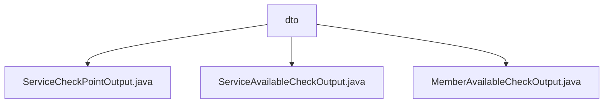

# Basic Information

|      |      |
|------|------|
| Name | dto |
| Language | .java |
| Code Path | WeFe/common/java/common-wefe/src/main/java/com/welab/wefe/common/wefe/checkpoint/dto |
| Package Name | docs.common.java.common-wefe.src.main.java.com.welab.wefe.common.wefe.checkpoint.dto |
| Brief Description | The ServiceCheckPointOutput class encapsulates service checkpoint outputs, including attributes such as type and status, and provides success/failure construction methods. The ServiceAvailableCheckOutput class checks service availability, automatically determines the overall status, and handles sensitive data. The MemberAvailableCheckOutput class verifies member availability, manages service type-to-result mappings, and automatically updates error states. |

# Description

## Overview  
The core responsibility of this module is to encapsulate service availability check results, providing standardized output structures and status determination logic. The interface specification includes three types of DTOs: ServiceCheckPointOutput records single-check details (e.g., duration/status), ServiceAvailableCheckOutput aggregates multiple checkpoints and automatically calculates overall availability, while MemberAvailableCheckOutput extends this to member-level check result mappings. Key data structures include check status flags, error type enumerations, and result lists/mappings. It relies on Java base libraries with no external dependencies. For example, ServiceAvailableCheckOutput automatically marks failure statuses by iterating through sub-checkpoints.

## Primary Business Scenarios  
The typical workflow involves: first constructing atomic check results via ServiceCheckPointOutput (e.g., latency metrics), then aggregating multi-service check results through ServiceAvailableCheckOutput (similar to circuit breaker patterns), and finally generating member-dimension views via MemberAvailableCheckOutput. The interaction model follows a "construct-aggregate-report" chain—for instance, when a service check fails, the error type propagates hierarchically from ServiceCheckPointOutput to the top-level output. Full functionality covers single-service checks, batch result aggregation, and sensitive data cleanup.

### Package Internal Structure View

This flowchart illustrates the structural relationships within the dto directory of the checkpoint module in the WeFe project. It includes three output class files: ServiceCheckPointOutput, ServiceAvailableCheckOutput, and MemberAvailableCheckOutput, all directly subordinate to the dto directory with no deeper nesting hierarchy.

# File List

| Name   | Type  | Description |
|-------|------|-------------|
| [ServiceCheckPointOutput.java](ServiceCheckPointOutput.md) | file | The `ServiceCheckPointOutput` class is used to record service check results, including service type, description, success status, message, value, and time consumption. It provides static factory methods for success and failure cases, along with getter/setter methods. |
| [ServiceAvailableCheckOutput.java](ServiceAvailableCheckOutput.md) | file | Service availability check output class, containing availability status, message, error service type, and checkpoint list. The constructor processes the list to determine availability and provides a cleanup method to clear checkpoint values. |
| [MemberAvailableCheckOutput.java](MemberAvailableCheckOutput.md) | file | The class `MemberAvailableCheckOutput` checks member availability, including status, error type, message, and service details. It updates error information when unavailable. |

