# Basic Information

|      |      |
|------|------|
| Name | dto |
| Language | .java |
| Code Path | WeFe/common/java/common-wefe/src/main/java/com/welab/wefe/common/wefe/dto |
| Package Name | docs.common.java.common-wefe.src.main.java.com.welab.wefe.common.wefe.dto |
| Brief Description | The core module centrally manages global configurations and data source connections, supporting standardized multi-scenario configurations and database-specific management. It enables flexible extension through base classes, annotations, and inheritance, covering full lifecycle functionalities such as validation, versioning, and URL generation. It relies on reflection mechanisms and cloud service SDKs. |

# Description

## Overview  
This module serves as the core framework for unified management of global configurations and data source connections, employing a hybrid design similar to a registry center and factory pattern. It enables multi-scenario configuration management through the AbstractConfigModel base class and standardized interfaces (such as non-null validation and URL construction). Key data structures include basic configuration models, connection parameters (e.g., host addresses), and cloud provider credentials (e.g., Alibaba Cloud OSS). External dependencies encompass JDBC drivers (e.g., ClickHouse), cloud service SDKs, and Java reflection mechanisms. For instance, it manages storage types through inheritance chains or overrides buildUrl to generate specialized database connections.

## Primary Business Scenarios  
The module supports four typical scenarios: 1) Hierarchical management of infrastructure configurations (e.g., mail servers); 2) Backend switching for cloud service integrations (e.g., OSS/Spark); 3) Versioned updates of business parameters (e.g., gateway addresses); 4) Full lifecycle management of multi-data source connections (e.g., ClickHouse). Interaction patterns include annotation-driven validation, inheritance specialization (similar to the factory pattern), and reflection-based queries. For example, a typical workflow involves: mandatory parameter validation → connection pool configuration → generation of database-specific URLs. API types range from constant references to reflection interfaces, supporting advanced configurations like batch insert optimization.

### Package Internal Structure View

```mermaid
graph TD
    dto --> global_config
    dto --> storage
    global_config --> storage
    global_config --> calculation_engine
    global_config --> base
    storage --> StorageBaseConfigModel.java
    storage --> ClickHouseStorageConfigModel.java
    calculation_engine --> fc
    calculation_engine --> spark
    calculation_engine --> CalculationEngineBaseConfigModel.java
    fc --> FunctionComputeBaseConfigModel.java
    fc --> AliyunFunctionComputeConfigModel.java
    fc --> TencentServerlessCloudFunctionConfigModel.java
    spark --> SparkStandaloneConfigModel.java
    base --> GlobalConfigInput.java
    base --> ConfigModel.java
    base --> AbstractConfigModel.java
    base --> ConfigGroupConstant.java
    global_config --> GatewayConfigModel.java
    global_config --> ServerCertInfoModel.java
    global_config --> BoardConfigModel.java
    global_config --> DeepLearningConfigModel.java
    global_config --> MailServerModel.java
    global_config --> PrivacyConfigModel.java
    global_config --> ServingConfigModel.java
    global_config --> GlobalConfigFlag.java
    global_config --> AlertConfigModel.java
    global_config --> MemberInfoModel.java
    global_config --> FlowConfigModel.java
    global_config --> AliyunSmsChannelConfigModel.java
    storage --> DataSourceConfig.java
    storage --> ClickhouseConfig.java
```

This flowchart illustrates the hierarchical structure within the dto directory of the WeFe project, comprising two main subdirectories: global_config and storage. The global_config is further divided into three submodules: storage, calculation_engine, and base, where calculation_engine includes configurations for two computing engines, fc and spark. The entire structure clearly presents the organizational relationships among various configuration model files, encompassing base configurations, storage configurations, computing engine configurations, and a total of 25 nodes.

# File List

| Name   | Type  | Description |
|-------|------|-------------|
| [storage](storage/_module.md) | package | The abstract class DataSourceConfig configures data source connection parameters, including connection pool settings and validation functionality. ClickhouseConfig inherits from this class, implementing the JDBC connection URL and driver class name for ClickHouse. |
| [global_config](global_config/_module.md) | package | The storage configuration module manages basic storage and ClickHouse connection parameters. The compute engine module handles multi-cloud resource allocation and compute backend switching. The global configuration module centrally manages various configuration items, supporting grouped queries. It includes specific configuration model classes such as gateway, certificate, deep learning, and mail server for parameter settings in different business scenarios. |

