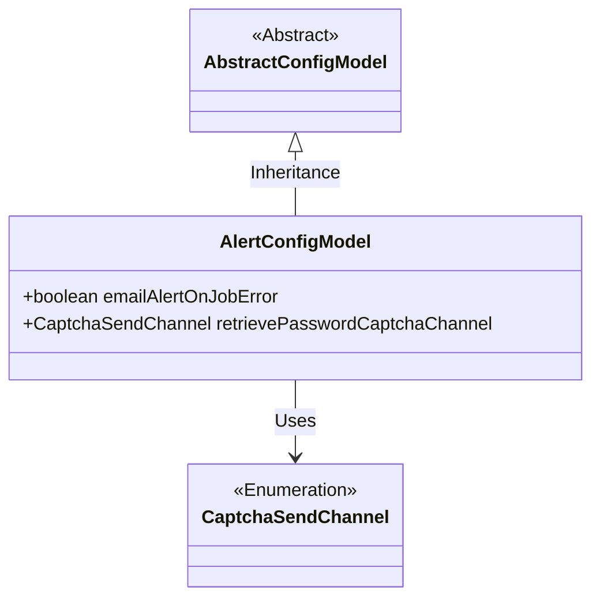
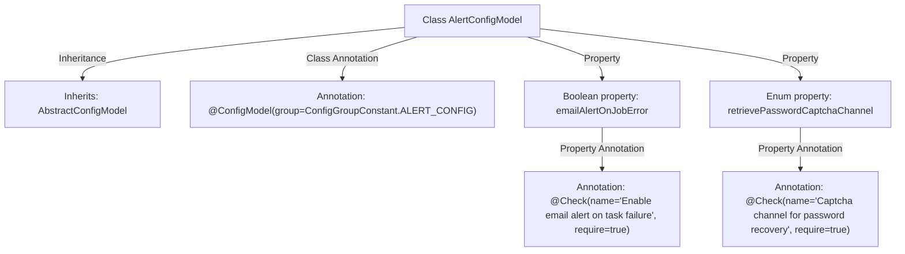

# Basic Information

|      |      |
|------|------|
| Name | AlertConfigModel |
| Language | .java |
| Code Path | WeFe/common/java/common-wefe/src/main/java/com/welab/wefe/common/wefe/dto/global_config/AlertConfigModel.java |
| Package Name | com.welab.wefe.common.wefe.dto.global_config |
| Dependencies | ['com.welab.wefe.common.fieldvalidate.annotation.Check', 'com.welab.wefe.common.verification.code.common.CaptchaSendChannel', 'com.welab.wefe.common.wefe.dto.global_config.base.AbstractConfigModel', 'com.welab.wefe.common.wefe.dto.global_config.base.ConfigGroupConstant', 'com.welab.wefe.common.wefe.dto.global_config.base.ConfigModel'] |
| Brief Description | The AlertConfigModel configuration class includes settings for the task failure email notification switch and the password recovery verification code sending channel. |

# Description

The content defines a configuration model class named `AlertConfigModel`, which belongs to the `ALERT_CONFIG` configuration group. The class contains two configuration items: The first is a boolean configuration `emailAlertOnJobError`, used to control whether to send email alerts when a job fails, with a default value of `false` and marked as mandatory. The second is an enum-type configuration `retrievePasswordCaptchaChannel`, used to set the verification code delivery channel for the password recovery feature, with a default value of sending via email and marked as mandatory. Both configuration items include validation annotations and descriptions in Chinese.

# Class Summary

| Name   | Type  | Description |
|-------|------|-------------|
| AlertConfigModel | class | AlertConfigModel configuration class, including task failure email notification switch and password recovery verification code sending channel settings. |

## Class AlertConfigModel

|      |      |
|------|------|
| Access Modifier | @ConfigModel(group = ConfigGroupConstant.ALERT_CONFIG);public |
| Type | class |
| Name | AlertConfigModel |
| Description | AlertConfigModel configuration class, including task failure email notification switch and password recovery verification code sending channel settings. |

### UML Class Diagram

Class Diagram Description: This diagram illustrates that AlertConfigModel inherits from the abstract class AbstractConfigModel and contains two configuration fields: a boolean emailAlertOnJobError and an enumeration type retrievePasswordCaptchaChannel. The configuration grouping and validation functionalities are implemented through @ConfigModel and @Check annotations, where the enumeration type CaptchaSendChannel is depended upon by AlertConfigModel. The overall structure reflects the inheritance relationship of configuration models and the field constraint mechanism.

### Internal Method Call Graph

This flowchart illustrates the structure of the AlertConfigModel class, including inheritance relationships, class-level configuration annotations, and two properties with validation annotations. The boolean property controls email alerts for task failures, while the enum property defines the captcha delivery channel for password recovery, both enforced through @Check validations. The design complies with configuration model specifications, achieving declarative validation of configuration items through annotations.

### Field List

| Name  | Type  | Description |
|-------|-------|------|
| retrievePasswordCaptchaChannel = CaptchaSendChannel.email | CaptchaSendChannel | The password recovery function requires a verification code, which is sent by email by default and is mandatory. |
| emailAlertOnJobError = false | boolean | Define a boolean variable `emailAlertOnJobError` with a default value of `false`, and enforce configuration via the `@Check` annotation to determine whether to send email notifications upon task failure. |

### Method List

| Name  | Type  | Description |
|-------|-------|------|

