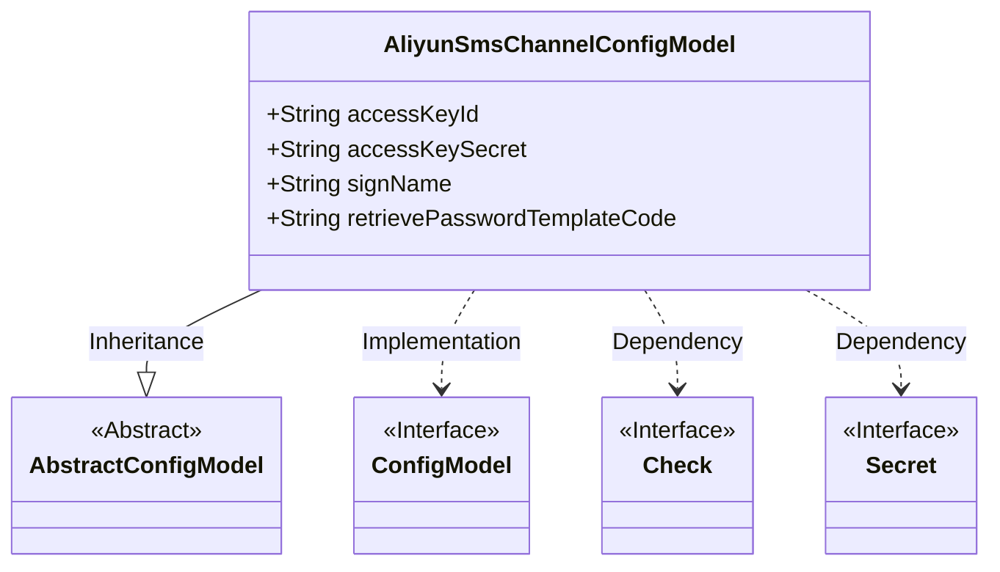
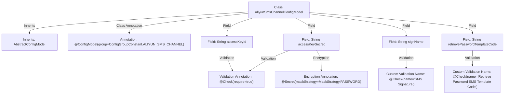

# Basic Information

|      |      |
|------|------|
| Name | AliyunSmsChannelConfigModel |
| Language | .java |
| Code Path | WeFe/common/java/common-wefe/src/main/java/com/welab/wefe/common/wefe/dto/global_config/AliyunSmsChannelConfigModel.java |
| Package Name | com.welab.wefe.common.wefe.dto.global_config |
| Dependencies | ['com.welab.wefe.common.fieldvalidate.annotation.Check', 'com.welab.wefe.common.wefe.dto.global_config.base.AbstractConfigModel', 'com.welab.wefe.common.wefe.dto.global_config.base.ConfigGroupConstant', 'com.welab.wefe.common.wefe.dto.global_config.base.ConfigModel', 'com.welab.wefe.common.fieldvalidate.secret.MaskStrategy', 'com.welab.wefe.common.fieldvalidate.secret.Secret'] |
| Brief Description | Alibaba Cloud SMS configuration class, including required fields such as AccessKey ID, AccessKey Secret (encrypted), signature, and password recovery template code. |

# Description

This is a configuration model class for an Alibaba Cloud SMS channel, containing four mandatory fields: accessKeyId (Access Key ID), accessKeySecret (Access Key, using a password masking strategy), signName (SMS signature), and retrievePasswordTemplateCode (retrieve password SMS template code). This class inherits from an abstract configuration model and belongs to the Alibaba Cloud SMS channel configuration group.

# Class Summary

| Name   | Type  | Description |
|-------|------|-------------|
| AliyunSmsChannelConfigModel | class | Alibaba Cloud SMS configuration class, including the required accessKeyId, encrypted accessKeySecret, SMS signature signName, and password retrieval template retrievePasswordTemplateCode. |

## Class AliyunSmsChannelConfigModel

|      |      |
|------|------|
| Access Modifier | @ConfigModel(group = ConfigGroupConstant.ALIYUN_SMS_CHANNEL);public |
| Type | class |
| Name | AliyunSmsChannelConfigModel |
| Description | Alibaba Cloud SMS configuration class, including the required accessKeyId, encrypted accessKeySecret, SMS signature signName, and password retrieval template retrievePasswordTemplateCode. |

### UML Class Diagram

This code defines an Alibaba Cloud SMS channel configuration model class, which inherits from an abstract configuration model base class and implements the ConfigModel interface. The class contains four public fields: accessKeyId (access key ID), accessKeySecret (access key with password masking policy), signName (SMS signature), and retrievePasswordTemplateCode (password retrieval template code). All fields are marked as mandatory through the @Check annotation. The configuration class specifies the configuration group via the @ConfigModel annotation and is primarily used for parameter configuration management in Alibaba Cloud SMS services.

### Internal Method Call Graph

This flowchart illustrates the structure of the AliyunSmsChannelConfigModel class, including inheritance relationships, class-level configuration annotations, and field-level validation rules. The class inherits from AbstractConfigModel and is annotated with @ConfigModel. All four key fields are marked with @Check mandatory validation, with accessKeySecret additionally annotated with a password masking strategy. The signName and retrievePasswordTemplateCode fields include custom validation names reflecting business semantics. The overall structure clearly represents the metadata constraints of SMS channel configuration.

### Field List

| Name  | Type  | Description |
|-------|-------|------|
| accessKeySecret | String | The code defines a sensitive field `accessKeySecret` that requires validation, employing a password masking strategy. |
| accessKeyId | String | The code defines a string-type variable `accessKeyId` that must be validated. |
| signName | String | SMS signature field, mandatory. |
| retrievePasswordTemplateCode | String | The check item is the password recovery SMS template code, a required field of string type. |

### Method List

| Name  | Type  | Description |
|-------|-------|------|

