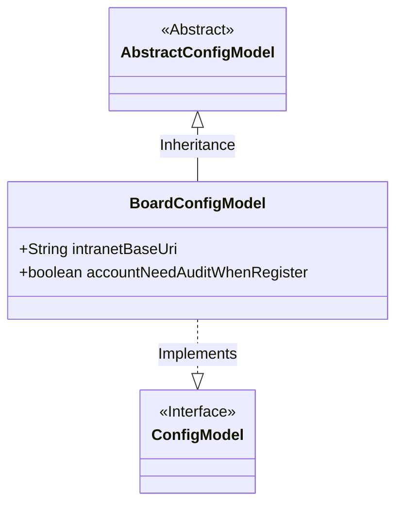
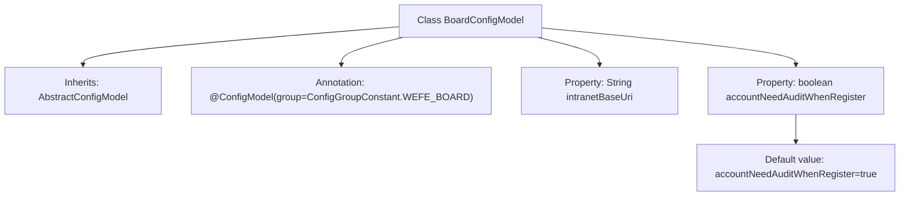

# Basic Information

|      |      |
|------|------|
| Name | BoardConfigModel |
| Language | .java |
| Code Path | WeFe/common/java/common-wefe/src/main/java/com/welab/wefe/common/wefe/dto/global_config/BoardConfigModel.java |
| Package Name | com.welab.wefe.common.wefe.dto.global_config |
| Dependencies | ['com.welab.wefe.common.wefe.dto.global_config.base.AbstractConfigModel', 'com.welab.wefe.common.wefe.dto.global_config.base.ConfigGroupConstant', 'com.welab.wefe.common.wefe.dto.global_config.base.ConfigModel'] |
| Brief Description | The BoardConfigModel configuration class includes the intranet base URL and a boolean value indicating whether new account registration requires review, with the default setting being review required. |

# Description

This is a configuration model class named BoardConfigModel, belonging to the WEFE_BOARD configuration group. It inherits from the base class AbstractConfigModel. The class contains two configuration items: the string variable intranetBaseUri represents the internal network base URL of the Board service; the boolean variable accountNeedAuditWhenRegister controls whether newly registered accounts require administrator approval, with a default value of true.

# Class Summary

| Name   | Type  | Description |
|-------|------|-------------|
| BoardConfigModel | class | The BoardConfigModel configuration class includes the intranet base URL and a boolean value indicating whether new account registrations require review, with the default setting requiring review. |

## Class BoardConfigModel

|      |      |
|------|------|
| Access Modifier | @ConfigModel(group = ConfigGroupConstant.WEFE_BOARD);public |
| Type | class |
| Name | BoardConfigModel |
| Description | The BoardConfigModel configuration class includes the intranet base URL and a boolean value indicating whether new account registrations require review, with the default setting requiring review. |

### UML Class Diagram

This class diagram illustrates the structure where BoardConfigModel inherits from the AbstractConfigModel abstract class and implements the ConfigModel interface. BoardConfigModel contains two public fields: intranetBaseUri (intranet base URL) and accountNeedAuditWhenRegister (flag indicating whether account requires audit upon registration, defaulting to true). It is marked with the @ConfigModel annotation to denote its configuration group, exemplifying a typical design pattern for Java configuration classes. Here, the abstract base class provides common functionality, concrete configuration classes extend field definitions, and the interface standardizes configuration behavior.

### Internal Method Call Graph

This flowchart illustrates the structure of the BoardConfigModel class, which is a configuration model class inheriting from AbstractConfigModel with the @ConfigModel annotation specifying a configuration group. The class contains two main properties: an intranetBaseUri string and an accountNeedAuditWhenRegister boolean (defaulting to true). This configuration class manages the internal network base URL for board services and the audit policy configuration during user registration.

### Field List

| Name  | Type  | Description |
|-------|-------|------|
| intranetBaseUri | String | Declare a public string variable intranetBaseUri to store the intranet base URI. |
| accountNeedAuditWhenRegister = true | boolean | Account requires approval upon registration |

### Method List

| Name  | Type  | Description |
|-------|-------|------|

