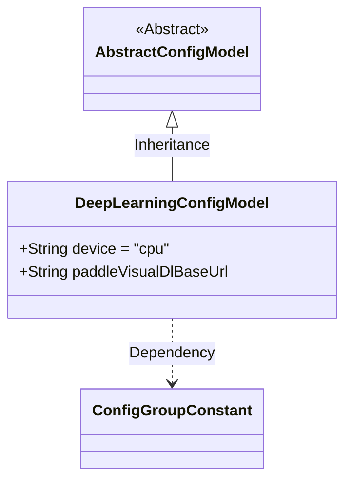
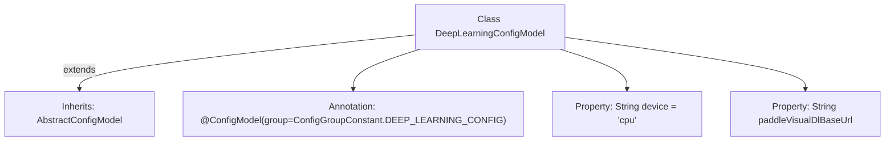

# Basic Information

|      |      |
|------|------|
| Name | DeepLearningConfigModel |
| Language | .java |
| Code Path | WeFe/common/java/common-wefe/src/main/java/com/welab/wefe/common/wefe/dto/global_config/DeepLearningConfigModel.java |
| Package Name | com.welab.wefe.common.wefe.dto.global_config |
| Dependencies | ['com.welab.wefe.common.wefe.dto.global_config.base.AbstractConfigModel', 'com.welab.wefe.common.wefe.dto.global_config.base.ConfigGroupConstant', 'com.welab.wefe.common.wefe.dto.global_config.base.ConfigModel'] |
| Brief Description | The configuration model for deep learning defaults to CPU and includes the base URL configuration item for PaddleVisualDl. |

# Description

The content defines a configuration model class named `DeepLearningConfigModel`, which inherits from `AbstractConfigModel`. The class is annotated with `@ConfigModel`, specifying the configuration group as `DEEP_LEARNING_CONFIG`. The class contains two configuration items: `device` defaults to `"cpu"`, and `paddleVisualDlBaseUrl` has no default value. This configuration model is used for deep learning-related parameter settings.

# Class Summary

| Name   | Type  | Description |
|-------|------|-------------|
| DeepLearningConfigModel | class | Deep learning configuration model, with the default device set to CPU, includes the PaddleVisualDl base URL configuration item. |

## Class DeepLearningConfigModel

|      |      |
|------|------|
| Access Modifier | @ConfigModel(group = ConfigGroupConstant.DEEP_LEARNING_CONFIG);public |
| Type | class |
| Name | DeepLearningConfigModel |
| Description | Deep learning configuration model, with the default device set to CPU, includes the PaddleVisualDl base URL configuration item. |

### UML Class Diagram

Class Diagram Description: This diagram illustrates the structure of a deep learning configuration model, where DeepLearningConfigModel inherits from the abstract base class AbstractConfigModel and contains two public string fields: device and paddleVisualDlBaseUrl. The @ConfigModel annotation indicates it belongs to the DEEP_LEARNING_CONFIG group, demonstrating the hierarchical relationship and attribute definitions of configuration classes.

### Internal Method Call Graph

This flowchart illustrates the structure of the DeepLearningConfigModel class, which inherits from the AbstractConfigModel class and carries the @ConfigModel annotation. The class contains two string properties: device with a default value of "cpu", and paddleVisualDlBaseUrl which is uninitialized. This configuration class belongs to the deep learning configuration group and is used to manage parameters related to deep learning settings.

### Field List

| Name  | Type  | Description |
|-------|-------|------|
| device = "cpu" | String | Device set to CPU. |
| paddleVisualDlBaseUrl | String | Declare a public string variable paddleVisualDlBaseUrl to store the base URL. |

### Method List

| Name  | Type  | Description |
|-------|-------|------|

