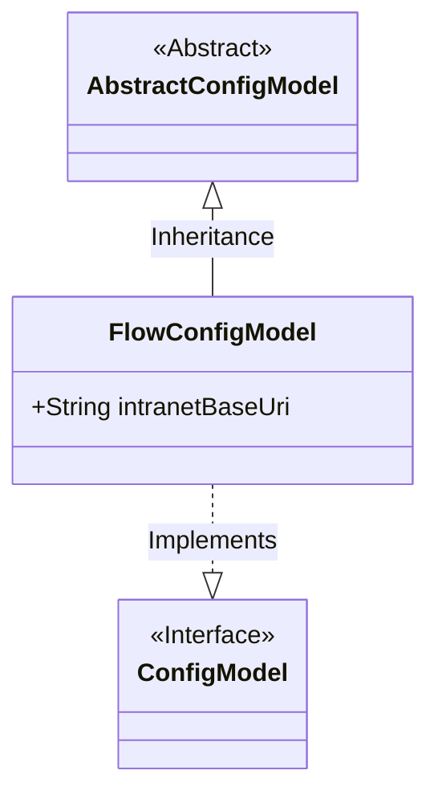
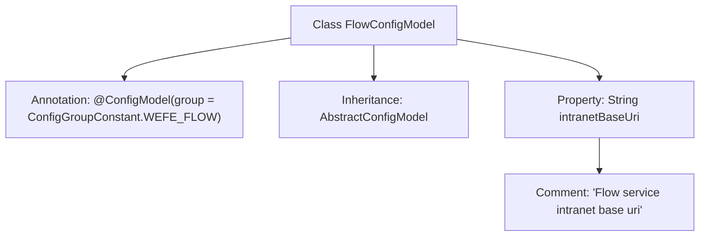

# Basic Information

|      |      |
|------|------|
| Name | FlowConfigModel |
| Language | .java |
| Code Path | WeFe/common/java/common-wefe/src/main/java/com/welab/wefe/common/wefe/dto/global_config/FlowConfigModel.java |
| Package Name | com.welab.wefe.common.wefe.dto.global_config |
| Dependencies | ['com.welab.wefe.common.wefe.dto.global_config.base.AbstractConfigModel', 'com.welab.wefe.common.wefe.dto.global_config.base.ConfigGroupConstant', 'com.welab.wefe.common.wefe.dto.global_config.base.ConfigModel'] |
| Brief Description | The FlowConfigModel class belongs to the WEFE_FLOW configuration group and includes the intranet base URI field. |

# Description

The content defines a configuration model class named FlowConfigModel, which belongs to the WEFE_FLOW configuration group. This class inherits from the AbstractConfigModel base class and includes a string-type intranetBaseUri field used to store the intranet base URI address of the Flow service. The field is annotated to indicate its purpose as recording the intranet base URI of the Flow service. The entire class is identified as a configuration model via the @ConfigModel annotation, with the specified configuration group constant.

# Class Summary

| Name   | Type  | Description |
|-------|------|-------------|
| FlowConfigModel | class | FlowConfigModel is the configuration class for the WEFE_FLOW group, containing the intranet base URI field. |

## Class FlowConfigModel

|      |      |
|------|------|
| Access Modifier | @ConfigModel(group = ConfigGroupConstant.WEFE_FLOW);public |
| Type | class |
| Name | FlowConfigModel |
| Description | FlowConfigModel is the configuration class for the WEFE_FLOW group, containing the intranet base URI field. |

### UML Class Diagram

This class diagram illustrates the structure where FlowConfigModel inherits from the abstract class AbstractConfigModel and implements the ConfigModel interface. FlowConfigModel contains a public string field intranetBaseUri, which stores the intranet base URI for the flow service. The @ConfigModel annotation indicates that this class belongs to the WEFE_FLOW configuration group, reflecting the Spring Boot-style configuration class design pattern.

### Internal Method Call Graph

This flowchart illustrates the structure of the FlowConfigModel class, which is a configuration model class with a specific group annotation, inheriting from the base class AbstractConfigModel. The class contains a String property intranetBaseUri describing the intranet base URI, with a comment explaining the purpose of this property. The entire structure reflects a typical design pattern for configuration classes, achieving configuration functionality through annotations and inheritance.

### Field List

| Name  | Type  | Description |
|-------|-------|------|
| intranetBaseUri | String | Declare a public string variable intranetBaseUri to store the intranet base URI. |

### Method List

| Name  | Type  | Description |
|-------|-------|------|

