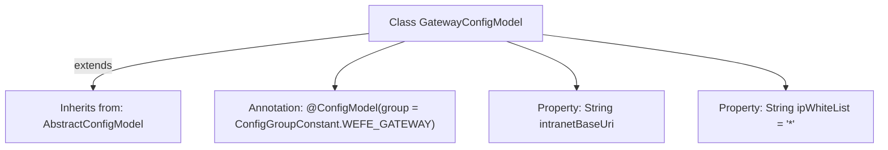

# Basic Information

|      |      |
|------|------|
| Name | GatewayConfigModel |
| Language | .java |
| Code Path | WeFe/common/java/common-wefe/src/main/java/com/welab/wefe/common/wefe/dto/global_config/GatewayConfigModel.java |
| Package Name | com.welab.wefe.common.wefe.dto.global_config |
| Dependencies | ['com.welab.wefe.common.wefe.dto.global_config.base.AbstractConfigModel', 'com.welab.wefe.common.wefe.dto.global_config.base.ConfigGroupConstant', 'com.welab.wefe.common.wefe.dto.global_config.base.ConfigModel'] |
| Brief Description | GatewayConfigModel configuration class, including intranet address and IP whitelist, with the default whitelist set to wildcard. |

# Description

The content describes a configuration model class named GatewayConfigModel, which belongs to the WEFE_GATEWAY configuration group. This class inherits from AbstractConfigModel and includes two key configuration items: intranetBaseUri represents the intranet address of the gateway service (in ip:port format), and ipWhiteList defines the IP whitelist for the gateway service, with the default value being the wildcard "*" to allow access from all IPs.

# Class Summary

| Name   | Type  | Description |
|-------|------|-------------|
| GatewayConfigModel | class | Gateway configuration class, defining internal network addresses and IP whitelist, with the default whitelist set to wildcard. |


## Class GatewayConfigModel

|      |      |
|------|------|
| Access Modifier | @ConfigModel(group = ConfigGroupConstant.WEFE_GATEWAY);public |
| Type | class |
| Name | GatewayConfigModel |
| Description | Gateway configuration class, defining internal network addresses and IP whitelist, with the default whitelist set to wildcard. |


### UML Class Diagram

```mermaid
classDiagram
    class AbstractConfigModel {
        <<Abstract>>
    }
    
    class GatewayConfigModel {
        +String intranetBaseUri
        +String ipWhiteList = "*"
    }
    
    AbstractConfigModel <|-- GatewayConfigModel : Inheritance
    GatewayConfigModel ..|> ConfigModel : Implementation
    
    interface ConfigModel {
        <<Interface>>
    }
```

This class diagram illustrates the structure where GatewayConfigModel inherits from the AbstractConfigModel abstract class and implements the ConfigModel interface. GatewayConfigModel contains two public fields: intranetBaseUri (intranet address of the gateway service) and ipWhiteList (IP whitelist, with a default value of "*"). The class is marked with the @ConfigModel annotation, indicating it belongs to the WEFE_GATEWAY configuration group. This design reflects the basic configuration items of the gateway service in the configuration center, where the default wildcard setting for the IP whitelist provides a flexible foundation for access control.


### Internal Method Call Graph



This code illustrates a configuration class named GatewayConfigModel, which inherits from AbstractConfigModel and is annotated with @ConfigModel. The class contains two properties: intranetBaseUri (gateway intranet address) and ipWhiteList (IP whitelist, default value is wildcard *). This design is used for gateway service configuration management, specifying the configuration group via annotation while leveraging inheritance to reuse parent class functionality.

### Field List

| Name  | Type  | Description |
|-------|-------|------|
| ipWhiteList = "*" | String | The global variable ipWhiteList has a default value of "*", indicating that all IPs are allowed to access. |
| intranetBaseUri | String | Declare a public string variable intranetBaseUri to store the intranet base URI. |

### Method List

| Name  | Type  | Description |
|-------|-------|------|


