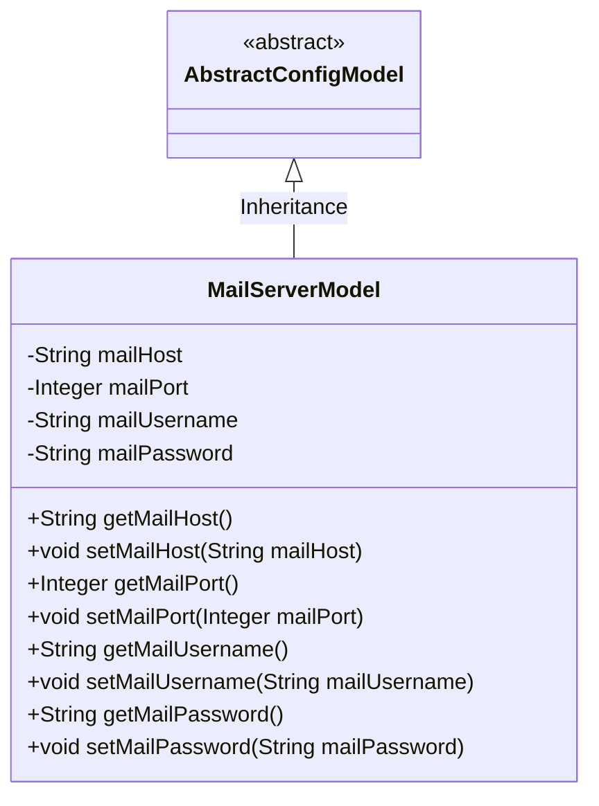

# Basic Information

|      |      |
|------|------|
| Name | MailServerModel |
| Language | .java |
| Code Path | WeFe/common/java/common-wefe/src/main/java/com/welab/wefe/common/wefe/dto/global_config/MailServerModel.java |
| Package Name | com.welab.wefe.common.wefe.dto.global_config |
| Dependencies | ['com.welab.wefe.common.fieldvalidate.annotation.Check', 'com.welab.wefe.common.wefe.dto.global_config.base.AbstractConfigModel', 'com.welab.wefe.common.wefe.dto.global_config.base.ConfigGroupConstant', 'com.welab.wefe.common.wefe.dto.global_config.base.ConfigModel', 'com.welab.wefe.common.fieldvalidate.secret.MaskStrategy', 'com.welab.wefe.common.fieldvalidate.secret.Secret'] |
| Brief Description | Email server configuration class, including fields for address, port, username, and password, with password encryption processing, providing getter/setter methods. |

# Description

This is a configuration model class named MailServerModel, belonging to the mail server configuration group. It inherits from AbstractConfigModel and contains four key attributes: mail server address (mailHost), mail server port (mailPort), mail username (mailUsername), and mail password (mailPassword). The password field is protected using a password masking strategy. The class provides standard getter and setter methods for each attribute, facilitating access and modification of these configuration values.

# Class Summary

| Name   | Type  | Description |
|-------|------|-------------|
| MailServerModel | class | Email server configuration class, containing fields for host, port, username, and password, with password encryption processing, providing getter/setter methods. |

## Class MailServerModel

|      |      |
|------|------|
| Access Modifier | @ConfigModel(group = ConfigGroupConstant.MAIL_SERVER);public |
| Type | class |
| Name | MailServerModel |
| Description | Email server configuration class, containing fields for host, port, username, and password, with password encryption processing, providing getter/setter methods. |

### UML Class Diagram

This code describes a mail server configuration model MailServerModel, which inherits from the abstract base class AbstractConfigModel. The class contains four private fields: mailHost (server address), mailPort (port), mailUsername (username), and mailPassword (password), each with corresponding getter and setter methods. It is particularly noteworthy that the mailPassword field uses the @Secret annotation for sensitive information masking. This configuration model class is marked as a mail server configuration group via the @ConfigModel annotation, and all fields are validated using the @Check annotation.

### Internal Method Call Graph

```mermaid
graph TD
    A["Class MailServerModel"]
    B["Annotation: @ConfigModel(group=ConfigGroupConstant.MAIL_SERVER)"]
    C["Parent Class: AbstractConfigModel"]
    D["Field: String mailHost"]
    E["Field: Integer mailPort"]
    F["Field: String mailUsername"]
    G["Field: String mailPassword"]
    H["Method: getMailHost()"]
    I["Method: setMailHost(String)"]
    J["Method: getMailPort()"]
    K["Method: setMailPort(Integer)"]
    L["Method: getMailUsername()"]
    M["Method: setMailUsername(String)"]
    N["Method: getMailPassword()"]
    O["Method: setMailPassword(String)"]
    P["Annotation: @Check(name='Mail server address')"]
    Q["Annotation: @Check(name='Mail server port')"]
    R["Annotation: @Check(name='Mail username')"]
    S["Annotation: @Check(name='Mail password')"]
    T["Annotation: @Secret(maskStrategy=MaskStrategy.PASSWORD)"]

    A --> B
    A --> C
    A --> D
    A --> E
    A --> F
    A --> G
    A --> H
    A --> I
    A --> J
    A --> K
    A --> L
    A --> M
    A --> N
    A --> O
    D --> P
    E --> Q
    F --> R
    G --> S
    G --> T
```

This flowchart illustrates the complete structure of the MailServerModel class, including class annotations, inheritance relationships, attribute fields with their validation annotations, and getter/setter methods. This configuration model class is specifically designed for mail server settings, containing sensitive information such as host address, port, username, and password, where the password field is desensitized using the PASSWORD strategy. All fields are validated for configuration item legitimacy through @Check annotations and belong to the mail server configuration group via the @ConfigModel annotation.

### Field List

| Name  | Type  | Description |
|-------|-------|------|
| mailPassword | String | The code defines a private string variable mailPassword, validates the email password using the @Check annotation, and masks it with password policy via the @Secret annotation. |
| mailUsername | String | The code defines a private string variable named mailUsername, annotated with a validation check to verify the email username. |
| mailPort | Integer | Email server port check field. |
| mailHost | String | Email server address verification field. |

### Method List

| Name  | Type  | Description |
|-------|-------|------|
| getMailPort | Integer | Method to obtain the mail port, returns an integer value mailPort. |
| getMailUsername | String | Methods to obtain the email username, returns the value of the mailUsername variable. |
| setMailPort | void | The method for setting the mail port, with the parameter as an integer mailPort, assigns the value to the class variable this.mailPort. |
| getMailHost | String | Methods to Obtain Email Host Address. |
| setMailHost | void | The method for setting the mail host address assigns the parameter `mailHost` to the class member variable `mailHost`. |
| setMailUsername | void | This is a Java method used to set the mail username property. The method is named setMailUsername, which takes a string parameter mailUsername and assigns it to the member variable of the same name in the class. |
| getMailPassword | String | Methods to obtain the mailbox password, returns the string mailPassword. |
| setMailPassword | void | Method to set the mailbox password: Assign the parameter mailPassword to the class member variable of the same name. |

