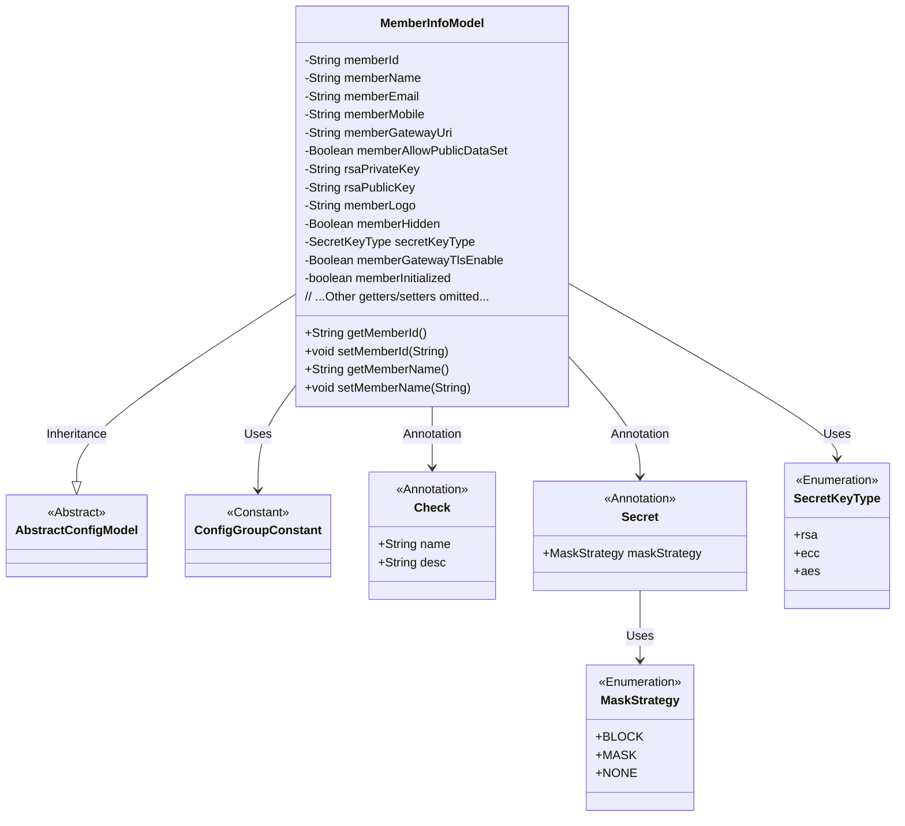

# Basic Information

|      |      |
|------|------|
| Name | MemberInfoModel |
| Language | .java |
| Code Path | WeFe/common/java/common-wefe/src/main/java/com/welab/wefe/common/wefe/dto/global_config/MemberInfoModel.java |
| Package Name | com.welab.wefe.common.wefe.dto.global_config |
| Dependencies | ['com.welab.wefe.common.constant.SecretKeyType', 'com.welab.wefe.common.fieldvalidate.annotation.Check', 'com.welab.wefe.common.wefe.dto.global_config.base.AbstractConfigModel', 'com.welab.wefe.common.wefe.dto.global_config.base.ConfigGroupConstant', 'com.welab.wefe.common.wefe.dto.global_config.base.ConfigModel', 'com.welab.wefe.common.fieldvalidate.secret.MaskStrategy', 'com.welab.wefe.common.fieldvalidate.secret.Secret', 'java.util.UUID'] |
| Brief Description | Federate member information configuration class, containing fields such as ID, name, email, phone number, gateway address, key pair, stealth status, TLS switch, and initialization status, providing getter/setter methods. |

# Description

The content describes a configuration model class named MemberInfoModel, which belongs to the member information configuration group. The class contains multiple member attributes, including member ID (default generated as UUID), name, email, phone number, gateway access address, whether to disclose dataset information, RSA public/private keys (with a masking policy for the private key), member avatar, stealth status, key type (default RSA), gateway TLS communication switch, and initialization status. Each attribute has corresponding getter and setter methods, with some attributes including validation annotations and descriptive notes.

# Class Summary

| Name   | Type  | Description |
|-------|------|-------------|
| MemberInfoModel | class | Federation Member Information Configuration Class, containing attributes such as member ID, name, contact information, gateway address, secret key, stealth status, TLS switch, and initialization status. |

## Class MemberInfoModel

|      |      |
|------|------|
| Access Modifier | @ConfigModel(group = ConfigGroupConstant.MEMBER_INFO);public |
| Type | class |
| Name | MemberInfoModel |
| Description | Federation Member Information Configuration Class, containing attributes such as member ID, name, contact information, gateway address, secret key, stealth status, TLS switch, and initialization status. |

### UML Class Diagram

Class Diagram Description: The MemberInfoModel class inherits from AbstractConfigModel and serves as a configuration model containing various information about federation members. It uses the @ConfigModel annotation to specify its configuration group, encompassing basic details such as member ID, name, contact information, as well as security-related attributes like key configurations and gateway settings. Field validation and sensitive data masking are implemented through @Check and @Secret annotations, with the SecretKeyType enumeration defining key types. This class manages all attributes via 20+ getter/setter methods, typically applied in federated learning scenarios requiring strict configuration management.

### Internal Method Call Graph

```mermaid
graph TD
    A["Class MemberInfoModel"]
    B["Inheritance: AbstractConfigModel"]
    C["Annotation: @ConfigModel(group=ConfigGroupConstant.MEMBER_INFO)"]
    D["Field: String memberId = UUID generation"]
    E["Field: String memberName"]
    F["Field: String memberEmail"]
    G["Field: String memberMobile"]
    H["Field: String memberGatewayUri"]
    I["Field: Boolean memberAllowPublicDataSet"]
    J["Field: @Secret String rsaPrivateKey"]
    K["Field: String rsaPublicKey"]
    L["Field: String memberLogo"]
    M["Field: Boolean memberHidden = false"]
    N["Field: SecretKeyType secretKeyType = rsa"]
    O["Field: Boolean memberGatewayTlsEnable"]
    P["Field: boolean memberInitialized = false"]
    Q["Method: getter/setter pairs (14 pairs)"]

    A --> B
    A --> C
    A --> D
    A --> E
    A --> F
    A --> G
    A --> H
    A --> I
    A --> J
    A --> K
    A --> L
    A --> M
    A --> N
    A --> O
    A --> P
    A --> Q
```

This flowchart illustrates the complete structure of the MemberInfoModel class, which is a federated member information configuration model. The class inherits from AbstractConfigModel and carries the @ConfigModel annotation, containing 15 member fields (including default UUID-generated memberId, encrypted private key, and other special fields) and 14 pairs of getter/setter methods. The fields utilize annotations such as @Check and @Secret for validation and desensitization control, covering core attributes like member basic information, key configuration, gateway settings, and status flags, forming a comprehensive federated member configuration system.

### Field List

| Name  | Type  | Description |
|-------|-------|------|
| memberInitialized = false | boolean | Check the boolean variable indicating whether the member is initialized, with a default value of false. |
| secretKeyType = SecretKeyType.rsa | SecretKeyType | The code defines a private field `secretKeyType` with a default value of `rsa`, and marks the field name as "Key Type" using the `@Check` annotation. |
| memberId = UUID.randomUUID().toString().replaceAll("-", "") | String | The federated member ID is globally unique and defaults to a hyphen-stripped UUID. |
| rsaPrivateKey | String | The code defines a private string variable named `rsaPrivateKey`, marked with `@Check` and `@Secret` annotations to enforce private key validity checks and implement masking strategies for protecting sensitive information. |
| memberAllowPublicDataSet | Boolean | Check whether the boolean member variable allowing the disclosure of basic dataset information is enabled. |
| rsaPublicKey | String | The class member variable rsaPublicKey is annotated with @Check as "public key" and has a type of String. |
| memberMobile | String | Federated member phone field, validated using the @Check annotation, of type String. |
| memberName | String | The code defines a private string variable memberName, which is used to store the federate member name, and validates it through the @Check annotation. |
| memberHidden = false | Boolean | Member stealth status check, default value is false. |
| memberGatewayUri | String | Define a private string variable `memberGatewayUri` to store the federation member gateway access address, and validate it using the `@Check` annotation. |
| memberLogo | String | Member avatar field, marked with the @Check annotation. |
| memberEmail | String | Define a private string variable memberEmail, marked with the @Check annotation as the validation item for "Federated Member Email". |
| memberGatewayTlsEnable | Boolean | Member Gateway TLS Communication Enablement Check |

### Method List

| Name  | Type  | Description |
|-------|-------|------|
| getMemberName | String | The method getMemberName returns the value of the member variable memberName. |
| setMemberHidden | void | A public method for setting the member hidden state, with a boolean parameter `memberHidden` to control whether the member is hidden. |
| getRsaPublicKey | String | Methods to Obtain an RSA Public Key. |
| getMemberMobile | String | Methods to obtain member's mobile number, returns the member variable memberMobile. |
| setSecretKeyType | void | The method for setting the key type assigns the parameter secretKeyType to the class's secretKeyType property. |
| setRsaPrivateKey | void | The method to set the RSA private key assigns the input string to the class variable rsaPrivateKey. |
| setMemberEmail | void | This is a Java method used to set the value of the member variable `memberEmail`. The method takes a string parameter `memberEmail` and assigns it to the class's member variable of the same name. |
| setMemberName | void | The method to set the member name assigns the input parameter to the member variable `memberName`. |
| setMemberMobile | void | A public method for setting a member's mobile phone number, with the parameter being of string type. |
| setMemberAllowPublicDataSet | void | A boolean method to set whether members are allowed to have public datasets. |
| getMemberHidden | Boolean | Get the boolean method for member's hidden status. |
| setMemberId | void | The method to set the member ID assigns the input parameter to the class's member variable memberId. |
| getRsaPrivateKey | String | Methods to obtain an RSA private key, returning the private key value as a string. |
| setRsaPublicKey | void | Method to set the RSA public key, assigning the input string to the class member variable rsaPublicKey. |
| setMemberLogo | void | This is a Java method used to set the string value of the member logo. The method is named setMemberLogo, which accepts a String parameter memberLogo and assigns it to the class member variable this.memberLogo. |
| getMemberAllowPublicDataSet | Boolean | This is a Java method that returns the boolean value of the member variable memberAllowPublicDataSet. |
| getSecretKeyType | SecretKeyType | Method to obtain the key type, returns secretKeyType. |
| getMemberEmail | String | Methods to retrieve member email, returns the member email string. |
| getMemberGatewayUri | String | Method to obtain the member gateway URI, returns the member gateway URI string. |
| setMemberGatewayUri | void | The method to set the member gateway URI assigns the input parameter to the class's member variable memberGatewayUri. |
| getMemberId | String | Methods to obtain member ID, returns memberId of string type. |
| getMemberGatewayTlsEnable | Boolean | Get the boolean method for the TLS enablement status of the member gateway. |
| setMemberGatewayTlsEnable | void | A public method to set the TLS enablement status for member gateways, with a boolean parameter. |
| isMemberInitialized | boolean | A boolean method to check if a member variable has been initialized. |
| setMemberInitialized | void | A public method to set the initialization state of members, with a boolean parameter. |
| getMemberLogo | String | Get the string value of the member Logo. |

