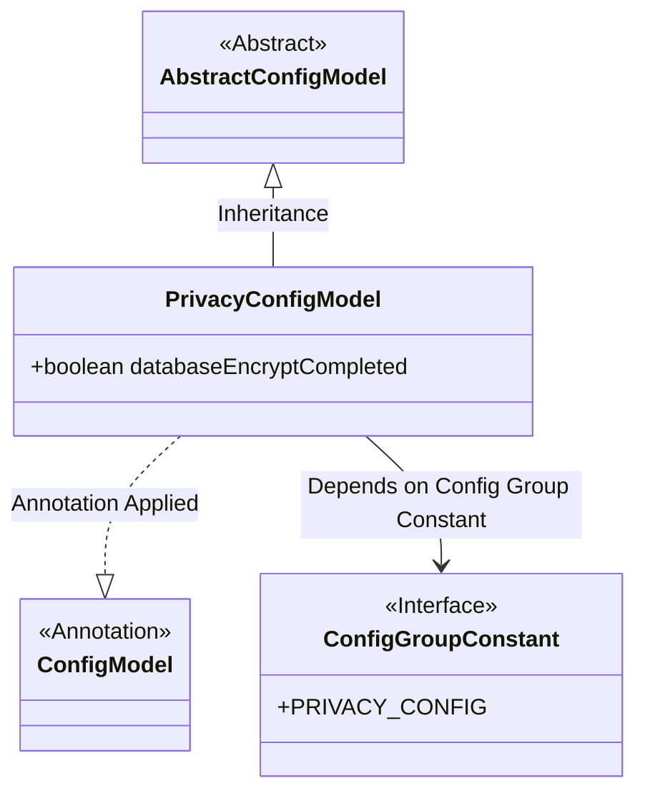
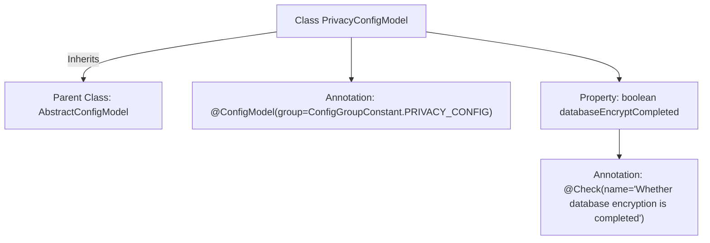

# Basic Information

|      |      |
|------|------|
| Name | PrivacyConfigModel |
| Language | .java |
| Code Path | WeFe/common/java/common-wefe/src/main/java/com/welab/wefe/common/wefe/dto/global_config/PrivacyConfigModel.java |
| Package Name | com.welab.wefe.common.wefe.dto.global_config |
| Dependencies | ['com.welab.wefe.common.fieldvalidate.annotation.Check', 'com.welab.wefe.common.wefe.dto.global_config.base.AbstractConfigModel', 'com.welab.wefe.common.wefe.dto.global_config.base.ConfigGroupConstant', 'com.welab.wefe.common.wefe.dto.global_config.base.ConfigModel'] |
| Brief Description | Privacy configuration model class, marking the completion status of database encryption. |

# Description

This is a configuration model class named PrivacyConfigModel, belonging to the PRIVACY_CONFIG configuration group. It inherits from the AbstractConfigModel base class and contains a boolean field databaseEncryptCompleted, used to check whether database encryption has been completed. This field is marked with the @Check annotation, indicating it is a configuration item that requires validation. The entire class is identified as a configuration model through the @ConfigModel annotation.

# Class Summary

| Name   | Type  | Description |
|-------|------|-------------|
| PrivacyConfigModel | class | Privacy configuration model class, marked as a privacy configuration group, inherits from the abstract configuration model, and includes a database encryption completion status check field. |

## Class PrivacyConfigModel

|      |      |
|------|------|
| Access Modifier | @ConfigModel(group = ConfigGroupConstant.PRIVACY_CONFIG);public |
| Type | class |
| Name | PrivacyConfigModel |
| Description | Privacy configuration model class, marked as a privacy configuration group, inherits from the abstract configuration model, and includes a database encryption completion status check field. |

### UML Class Diagram

This class diagram illustrates that PrivacyConfigModel inherits from AbstractConfigModel and is annotated with @ConfigModel, which depends on the PRIVACY_CONFIG constant from the ConfigGroupConstant interface. PrivacyConfigModel contains a public boolean field databaseEncryptCompleted to indicate the database encryption status. The overall structure demonstrates the inheritance relationship of configuration models and the usage of annotations, conforming to the typical pattern of Java configuration class design.

### Internal Method Call Graph

This flowchart depicts the structure of the PrivacyConfigModel class, which inherits from AbstractConfigModel and is annotated with @ConfigModel. The class contains a boolean property databaseEncryptCompleted, marked by the @Check annotation with the parameter 'Whether database encryption is completed'. The entire structure illustrates the class inheritance relationship, configuration grouping markers, and the hierarchical relationship of property validation annotations, reflecting the fundamental design pattern of a configuration model class.

### Field List

| Name  | Type  | Description |
|-------|-------|------|
| databaseEncryptCompleted | boolean | The boolean variable to check if database encryption is completed. |

### Method List

| Name  | Type  | Description |
|-------|-------|------|

