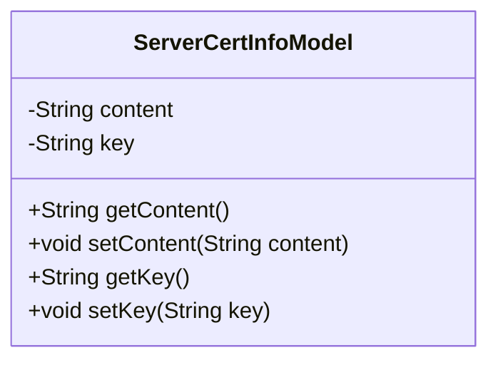
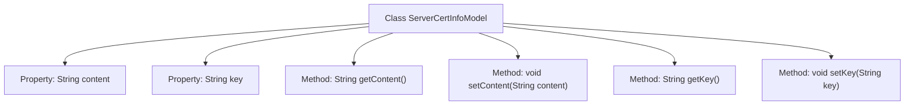

# Basic Information

|      |      |
|------|------|
| Name | ServerCertInfoModel |
| Language | .java |
| Code Path | WeFe/common/java/common-wefe/src/main/java/com/welab/wefe/common/wefe/dto/global_config/ServerCertInfoModel.java |
| Package Name | com.welab.wefe.common.wefe.dto.global_config |
| Dependencies | [] |
| Brief Description | The ServerCertInfoModel class contains two private attributes, content and key, and provides corresponding getter and setter methods. |

# Description

The content defines a Java class named ServerCertInfoModel, which is used to store server certificate information. The class contains two private string-type member variables: content and key, representing the certificate content and key respectively. Standard getter and setter methods are provided for accessing and modifying these two variables. This is a typical POJO class designed to encapsulate certificate-related data.

# Class Summary

| Name   | Type  | Description |
|-------|------|-------------|
| ServerCertInfoModel | class | The ServerCertInfoModel class contains two private attributes, content and key, and provides corresponding getter and setter methods. |

## Class ServerCertInfoModel

|      |      |
|------|------|
| Access Modifier | public |
| Type | class |
| Name | ServerCertInfoModel |
| Description | The ServerCertInfoModel class contains two private attributes, content and key, and provides corresponding getter and setter methods. |

### UML Class Diagram

This class diagram depicts a simple data model class ServerCertInfoModel, designed to store server certificate information. The class contains two private string attributes, `content` and `key`, representing the certificate content and key respectively, along with corresponding getter and setter methods for accessing and modifying these attributes. It is a typical Java Bean-style data encapsulation class, primarily used for transferring and managing certificate-related data within applications.

### Internal Method Call Graph

This code defines a class named ServerCertInfoModel, which includes two private string properties (content and key) along with their corresponding getter and setter methods. The flowchart clearly illustrates the hierarchical relationship between the class and its properties/methods, with the class as the root node connected to two properties and four methods. This model is primarily used for storing server certificate information, allowing retrieval of content or keys via getter methods and modification of values via setter methods, making it suitable for scenarios requiring dynamic management of certificate data.

### Field List

| Name  | Type  | Description |
|-------|-------|------|
| content | String | private String variable content |
| key | String | Private string type variable key. |

### Method List

| Name  | Type  | Description |
|-------|-------|------|
| getContent | String | The method getContent returns the value of the string content. |
| getKey | String | Public methods for obtaining key values. |
| setContent | void | Methods for setting content attributes, assigning the input string to the class's content variable. |
| setKey | void | This is a Java method used to set the key property value of a class. The method takes a String parameter key and assigns it to the member variable this.key of the class. |

