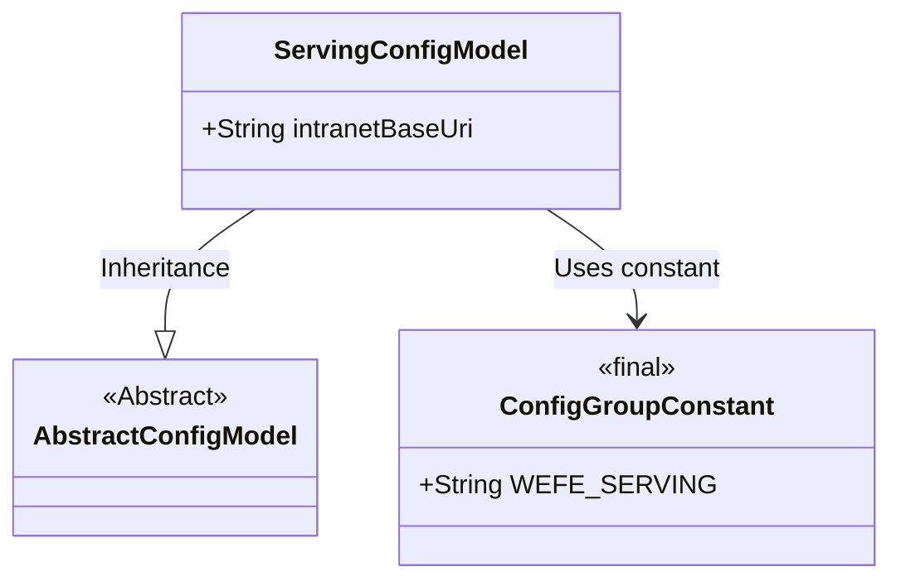
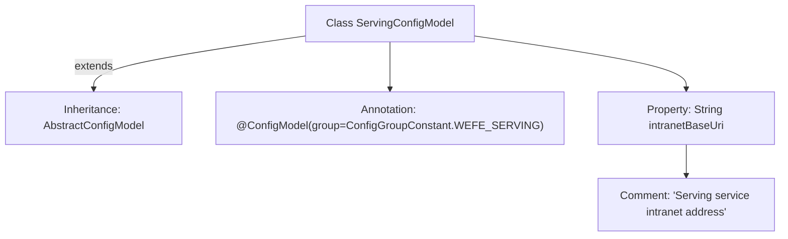

# Basic Information

|      |      |
|------|------|
| Name | ServingConfigModel |
| Language | .java |
| Code Path | WeFe/common/java/common-wefe/src/main/java/com/welab/wefe/common/wefe/dto/global_config/ServingConfigModel.java |
| Package Name | com.welab.wefe.common.wefe.dto.global_config |
| Dependencies | ['com.welab.wefe.common.wefe.dto.global_config.base.AbstractConfigModel', 'com.welab.wefe.common.wefe.dto.global_config.base.ConfigGroupConstant', 'com.welab.wefe.common.wefe.dto.global_config.base.ConfigModel'] |
| Brief Description | This is a configuration model class used to define the configuration items for the service's intranet address, belonging to the WEFE_SERVING group. |

# Description

This is a configuration model class named ServingConfigModel, belonging to the WEFE_SERVING configuration group. It inherits from the base class AbstractConfigModel. The class includes a public field of string type called intranetBaseUri, used to store the intranet base address of the Serving service. The field's purpose is documented via a comment, indicating it records the intranet address of the Serving service. The entire class is identified as a configuration model through the @ConfigModel annotation, with the specified configuration group it belongs to.

# Class Summary

| Name   | Type  | Description |
|-------|------|-------------|
| ServingConfigModel | class | Configuration class ServingConfigModel, belonging to the WEFE_SERVING group, includes the intranet address field intranetBaseUri. |

## Class ServingConfigModel

|      |      |
|------|------|
| Access Modifier | @ConfigModel(group = ConfigGroupConstant.WEFE_SERVING);public |
| Type | class |
| Name | ServingConfigModel |
| Description | Configuration class ServingConfigModel, belonging to the WEFE_SERVING group, includes the intranet address field intranetBaseUri. |

### UML Class Diagram

This class diagram illustrates that ServingConfigModel inherits from the abstract class AbstractConfigModel and utilizes the WEFE_SERVING constant from ConfigGroupConstant as a configuration group identifier. ServingConfigModel, as a configuration model class, contains a public intranetBaseUri string field for storing the service's intranet base address. The association between the @ConfigModel annotation's group property and the constant reflects the hierarchical relationship of configuration models and their dependency on constants.

### Internal Method Call Graph

This code demonstrates a configuration class named ServingConfigModel, marked with the @ConfigModel annotation as part of the WEFE_SERVING configuration group, which inherits from the base class AbstractConfigModel. The class contains a String property intranetBaseUri describing the intranet service address, accompanied by detailed comments explaining its purpose. This structure exemplifies a typical design pattern for Java configuration classes, achieving centralized management of configuration information through inheritance and annotations.

### Field List

| Name  | Type  | Description |
|-------|-------|------|
| intranetBaseUri | String | Declare a public string variable intranetBaseUri to store the intranet base URI. |

### Method List

| Name  | Type  | Description |
|-------|-------|------|

