# Basic Information

|      |      |
|------|------|
| Name | global_config |
| Language | .java |
| Code Path | WeFe/common/java/common-wefe/src/main/java/com/welab/wefe/common/wefe/dto/global_config |
| Package Name | docs.common.java.common-wefe.src.main.java.com.welab.wefe.common.wefe.dto.global_config |
| Brief Description | The storage configuration module manages basic storage and ClickHouse connection parameters. The compute engine module handles multi-cloud resource allocation and compute backend switching. The global configuration module centrally manages various configuration items, supporting grouped queries. It includes specific configuration model classes such as gateway, certificate, deep learning, and mail server for parameter settings in different business scenarios. |

# Description

## Overview  
This module serves as the core system for unified management of global configurations, adopting a design pattern similar to a registry center. It covers scenarios such as configuration storage, multi-cloud computing engines, and service gateways. Standardized interfaces are implemented through the `AbstractConfigModel` base class and `@ConfigModel`/`@Check` annotations. Key data structures include basic configuration models (e.g., `StorageBaseConfigModel`), service addresses (e.g., `intranetBaseUri`), and cloud provider credentials (e.g., Alibaba Cloud OSS). External dependencies include the `DataResourceStorageType` enum, Java reflection mechanism, and cloud service SDKs (e.g., Alibaba Cloud OSS). For example, multi-storage type management is achieved through inheritance chains, or configuration classes are automatically discovered via annotations.

## Core Business Scenarios  
The module supports three typical scenarios: 1) Infrastructure configuration (e.g., mail servers, IP whitelists), featuring hierarchical management akin to the strategy pattern; 2) Cloud service integration (e.g., Alibaba Cloud SMS, Spark engines), with computational backends switched via `JobBackendType`; 3) Business system parameters (e.g., gateway addresses, database encryption status). Interaction modes include configuration conversion (e.g., to `ClickhouseConfig`), field validation (e.g., password masking), and versioned updates. Example initialization flow: Set cost threshold → Bind cloud storage → Configure computational parameters (e.g., `executorMemory`). API types encompass constant references (`ConfigGroupConstant`) and reflection-based query interfaces (`getModelClasses`).

### Package Internal Structure View

```mermaid
graph TD
    global_config --> storage
    global_config --> calculation_engine
    global_config --> base
    global_config --> GatewayConfigModel.java
    global_config --> ServerCertInfoModel.java
    global_config --> BoardConfigModel.java
    global_config --> DeepLearningConfigModel.java
    global_config --> MailServerModel.java
    global_config --> PrivacyConfigModel.java
    global_config --> ServingConfigModel.java
    global_config --> GlobalConfigFlag.java
    global_config --> AlertConfigModel.java
    global_config --> MemberInfoModel.java
    global_config --> FlowConfigModel.java
    global_config --> AliyunSmsChannelConfigModel.java
    storage --> StorageBaseConfigModel.java
    storage --> ClickHouseStorageConfigModel.java
    calculation_engine --> fc
    calculation_engine --> spark
    calculation_engine --> CalculationEngineBaseConfigModel.java
    fc --> FunctionComputeBaseConfigModel.java
    fc --> AliyunFunctionComputeConfigModel.java
    fc --> TencentServerlessCloudFunctionConfigModel.java
    spark --> SparkStandaloneConfigModel.java
    base --> GlobalConfigInput.java
    base --> ConfigModel.java
    base --> AbstractConfigModel.java
    base --> ConfigGroupConstant.java
```

This flowchart illustrates the complete hierarchical structure under the global_config directory, including three main subdirectories: storage, calculation_engine, and base, along with their respective configuration files. The calculation_engine is further divided into two submodules, fc and spark, each containing corresponding configuration model classes. The top level also directly includes multiple standalone configuration files such as GatewayConfigModel, MailServerModel, etc., presenting a clear modular configuration management structure.

# File List

| Name   | Type  | Description |
|-------|------|-------------|
| [GatewayConfigModel.java](GatewayConfigModel.md) | file | GatewayConfigModel configuration class, including intranet address and IP whitelist, with the default whitelist set to wildcard. |
| [ServerCertInfoModel.java](ServerCertInfoModel.md) | file | The ServerCertInfoModel class contains two private attributes, content and key, and provides corresponding getter and setter methods. |
| [BoardConfigModel.java](BoardConfigModel.md) | file | The BoardConfigModel configuration class includes the intranet base URL and a boolean value indicating whether new account registration requires review, with the default setting requiring review. |
| [DeepLearningConfigModel.java](DeepLearningConfigModel.md) | file | The configuration model for deep learning defaults to CPU and includes the base URL configuration item for PaddleVisualDl. |
| [MailServerModel.java](MailServerModel.md) | file | Email server configuration class, including fields for address, port, username, and password, with password encryption processing, providing getter/setter methods. |
| [PrivacyConfigModel.java](PrivacyConfigModel.md) | file | Privacy configuration model class, marking the completion status of database encryption. |
| [ServingConfigModel.java](ServingConfigModel.md) | file | This is a configuration model class used to define the configuration items for the service's intranet address, belonging to the WEFE_SERVING group. |
| [GlobalConfigFlag.java](GlobalConfigFlag.md) | file | GlobalConfigFlag is an empty public class, possibly used for global configuration flags. |
| [AlertConfigModel.java](AlertConfigModel.md) | file | The AlertConfigModel configuration class includes settings for the task failure email notification switch and the password recovery verification code delivery channel. |
| [MemberInfoModel.java](MemberInfoModel.md) | file | Federation Member Information Configuration Class, containing fields such as ID, name, email, phone number, gateway address, key pair, stealth status, TLS switch, and initialization status, with getter/setter methods provided. |
| [FlowConfigModel.java](FlowConfigModel.md) | file | The FlowConfigModel class belongs to the WEFE_FLOW configuration group and includes the intranet base URI field. |
| [AliyunSmsChannelConfigModel.java](AliyunSmsChannelConfigModel.md) | file | Alibaba Cloud SMS configuration class, containing required fields such as AccessKey ID, Secret Key (encrypted), Signature, and Password Recovery Template Code. |
| [base](base/_module.md) | package | The GlobalConfigInput class stores global configurations, containing fields for group, name, and value. ConfigModel is a runtime class annotation that requires specifying a group. AbstractConfigModel manages configuration classes through reflection. ConfigGroupConstant defines configuration group constants for each module. |
| [calculation_engine](calculation_engine/_module.md) | package | This module is a multi-cloud function computing configuration management system that uniformly manages Alibaba Cloud/Tencent Cloud resources. It supports parameter validation, default value settings, and relies on OSS/COS storage. Key configurations include account credentials, region information, etc., with a standardized inheritance system enabling end-to-end management. |
| [storage](storage/_module.md) | package | StorageBaseConfigModel is a Java class for the STORAGE configuration group that inherits from AbstractConfigModel, containing a default CLICKHOUSE storageType field. ClickHouseStorageConfigModel is its subclass, belonging to the CLICKHOUSE_STORAGE group, which includes fields such as host, port, username, and password. It provides a method to convert to ClickhouseConfig and validates required fields. |

