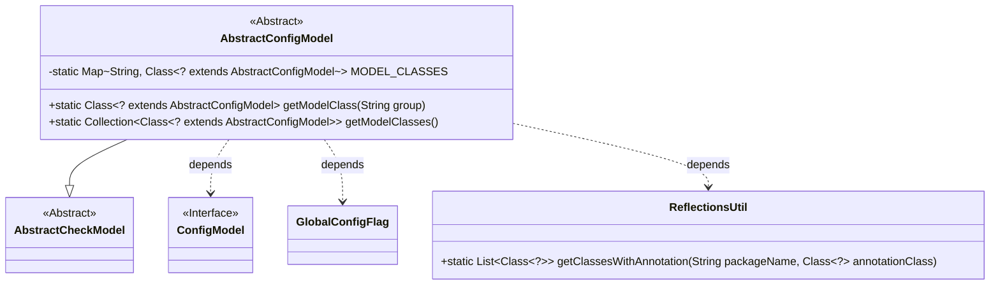
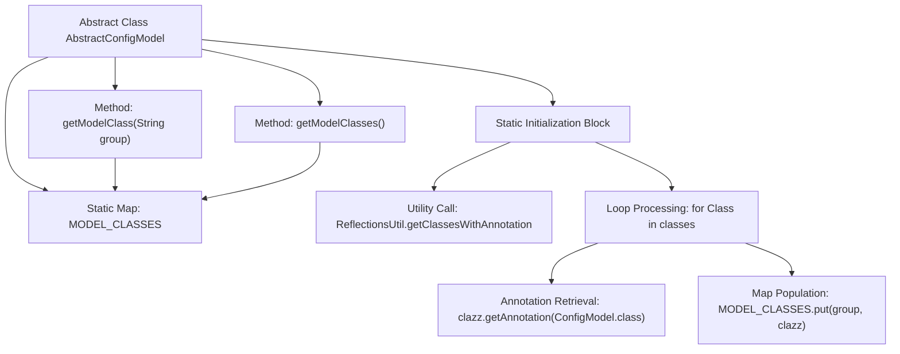

# Basic Information

|      |      |
|------|------|
| Name | AbstractConfigModel |
| Language | .java |
| Code Path | WeFe/common/java/common-wefe/src/main/java/com/welab/wefe/common/wefe/dto/global_config/base/AbstractConfigModel.java |
| Package Name | com.welab.wefe.common.wefe.dto.global_config.base |
| Dependencies | ['com.welab.wefe.common.fieldvalidate.AbstractCheckModel', 'com.welab.wefe.common.util.ReflectionsUtil', 'com.welab.wefe.common.wefe.dto.global_config.GlobalConfigFlag', 'java.util.Collection', 'java.util.HashMap', 'java.util.List', 'java.util.Map'] |
| Brief Description | The abstract class AbstractConfigModel inherits from AbstractCheckModel. It collects classes annotated with @ConfigModel through reflection and stores them in a static Map, providing methods to retrieve model classes either by group name or in their entirety. |

# Description

This is an abstract configuration model base class `AbstractConfigModel`, which inherits from `AbstractCheckModel`. It uses reflection mechanism in a static code block to scan classes annotated with `@ConfigModel`, and stores them into the static Map `MODEL_CLASSES` grouped by the `group` specified in the annotation. It provides two static methods: `getModelClass` retrieves the corresponding configuration class by group, while `getModelClasses` fetches the collection of all configuration classes. This class implements centralized management and on-demand retrieval functionality for configuration models.

# Class Summary

| Name   | Type  | Description |
|-------|------|-------------|
| AbstractConfigModel | class | The abstract class `AbstractConfigModel` extends `AbstractCheckModel`, collects classes annotated with `@ConfigModel` via reflection, and stores them in a static Map. It provides methods to retrieve model classes either by group name or in their entirety. |

## Class AbstractConfigModel

|      |      |
|------|------|
| Access Modifier | public abstract |
| Type | class |
| Name | AbstractConfigModel |
| Description | The abstract class `AbstractConfigModel` extends `AbstractCheckModel`, collects classes annotated with `@ConfigModel` via reflection, and stores them in a static Map. It provides methods to retrieve model classes either by group name or in their entirety. |

### UML Class Diagram

Class Diagram Description:
This diagram illustrates that the abstract class AbstractConfigModel inherits from AbstractCheckModel and utilizes the ReflectionsUtil utility class via a static initialization block to scan classes annotated with ConfigModel. AbstractConfigModel maintains a static MODEL_CLASSES map storing the mapping between configuration group names and their corresponding model classes, providing getModelClass and getModelClasses methods to retrieve configuration model classes. GlobalConfigFlag is used to limit the package scanning scope, while ConfigModel serves as an annotation interface to mark configuration model classes.

### Internal Method Call Graph

This flowchart illustrates the core structure and workflow of the AbstractConfigModel class. The static initialization block uses reflection utilities to retrieve classes annotated with @ConfigModel and stores them in the MODEL_CLASSES map grouped by annotation values. The class provides two static methods: getModelClass fetches the corresponding configuration class by group name, while getModelClasses returns the collection of all configuration classes. The entire process implements an annotation-based automatic discovery and categorized management mechanism for configuration classes, providing foundational support for subsequent dynamic configuration loading.

### Field List

| Name  | Type  | Description |
|-------|-------|------|
| MODEL_CLASSES | Map<String, Class<? extends AbstractConfigModel>> | Private static mapping with string keys and values of subclasses of AbstractConfigModel. |

### Method List

| Name  | Type  | Description |
|-------|-------|------|
| getModelClass | Class<? extends AbstractConfigModel> | Get the configuration model class corresponding to the specified group. |
| getModelClasses | Collection<Class<? extends AbstractConfigModel>> | Retrieve the collection of configuration model classes, returning the stored list of model classes. |

