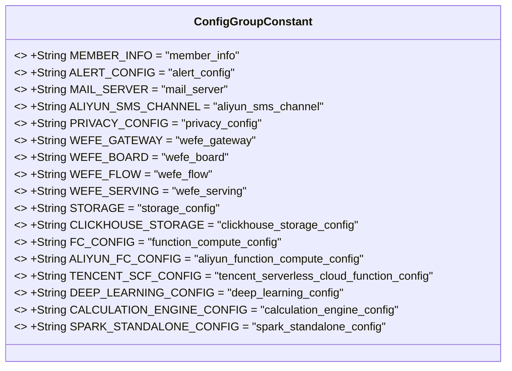

# Basic Information

|      |      |
|------|------|
| Name | ConfigGroupConstant |
| Language | .java |
| Code Path | WeFe/common/java/common-wefe/src/main/java/com/welab/wefe/common/wefe/dto/global_config/base/ConfigGroupConstant.java |
| Package Name | com.welab.wefe.common.wefe.dto.global_config.base |
| Dependencies | [] |
| Brief Description | The ConfigGroupConstant class defines configuration group constants for system settings, subsystems, dependent services, function computing, deep learning, and computing engines. |

# Description

The code defines a public class named `ConfigGroupConstant`, which contains multiple static constant strings used to categorically store configuration group names for different modules. The system settings section includes member information, alert configuration, email server, Alibaba Cloud SMS channel, and privacy configuration. The subsystem section covers gateway, dashboard, workflow, and service modules. Dependency services involve storage and ClickHouse configurations. Function computing includes serverless configurations for Alibaba Cloud and Tencent Cloud. The deep learning and compute engine sections provide relevant configurations respectively, with the latter also including Spark standalone mode configurations. These constants are used to uniformly manage configuration identifiers for various modules of the system.

# Class Summary

| Name   | Type  | Description |
|-------|------|-------------|
| ConfigGroupConstant | class | The ConfigGroupConstant class defines configuration group constants for system settings, subsystems, dependent services, function computing, deep learning, and computing engines. |

## Class ConfigGroupConstant

|      |      |
|------|------|
| Access Modifier | public |
| Type | class |
| Name | ConfigGroupConstant |
| Description | The ConfigGroupConstant class defines configuration group constants for system settings, subsystems, dependent services, function computing, deep learning, and computing engines. |

### UML Class Diagram

This code defines a constant class named `ConfigGroupConstant`, containing multiple static immutable string constants representing names of different configuration groups. These constants are categorized into six major types: system settings, subsystems, dependent services, function computing, deep learning, and computation engines, with each category including specific configuration items. The class primarily serves to centrally manage grouping identifiers for various configurations in the system, facilitating unified referencing and maintenance. All constants are modified with `public static final` to ensure global uniqueness and immutability.

### Internal Method Call Graph

```mermaid
graph TD
    A["Class ConfigGroupConstant"]
    B["System Settings Constant Group"]
    C["Subsystem Constant Group"]
    D["Dependent Service Constant Group"]
    E["Function Compute Constant Group"]
    F["Deep Learning Constant Group"]
    G["Computing Engine Constant Group"]

    B1["MEMBER_INFO: 'member_info'"]
    B2["ALERT_CONFIG: 'alert_config'"]
    B3["MAIL_SERVER: 'mail_server'"]
    B4["ALIYUN_SMS_CHANNEL: 'aliyun_sms_channel'"]
    B5["PRIVACY_CONFIG: 'privacy_config'"]

    C1["WEFE_GATEWAY: 'wefe_gateway'"]
    C2["WEFE_BOARD: 'wefe_board'"]
    C3["WEFE_FLOW: 'wefe_flow'"]
    C4["WEFE_SERVING: 'wefe_serving'"]

    D1["STORAGE: 'storage_config'"]
    D2["CLICKHOUSE_STORAGE: 'clickhouse_storage_config'"]

    E1["FC_CONFIG: 'function_compute_config'"]
    E2["ALIYUN_FC_CONFIG: 'aliyun_function_compute_config'"]
    E3["TENCENT_SCF_CONFIG: 'tencent_serverless_cloud_function_config'"]

    F1["DEEP_LEARNING_CONFIG: 'deep_learning_config'"]

    G1["CALCULATION_ENGINE_CONFIG: 'calculation_engine_config'"]
    G2["SPARK_STANDALONE_CONFIG: 'spark_standalone_config'"]

    A --> B
    A --> C
    A --> D
    A --> E
    A --> F
    A --> G

    B --> B1
    B --> B2
    B --> B3
    B --> B4
    B --> B5

    C --> C1
    C --> C2
    C --> C3
    C --> C4

    D --> D1
    D --> D2

    E --> E1
    E --> E2
    E --> E3

    F --> F1

    G --> G1
    G --> G2
```

This flowchart illustrates the structure of the ConfigGroupConstant class, which serves as a container class for configuration constants. It comprises six primary constant groups: System Settings, Subsystem, Dependent Service, Function Compute, Deep Learning, and Computing Engine. Each constant group contains several static string constants used to identify configuration items for different modules. This classification approach facilitates system configuration management by logically isolating configuration items through constant grouping, thereby enhancing code readability and maintainability.

### Field List

| Name  | Type  | Description |
|-------|-------|------|
| FC_CONFIG = "function_compute_config" | String | Define a static constant string FC_CONFIG with the value "function_compute_config". |
| WEFE_GATEWAY = "wefe_gateway" | String | Define a static constant string WEFE_GATEWAY with the value "wefe_gateway". |
| TENCENT_SCF_CONFIG = "tencent_serverless_cloud_function_config" | String | Tencent Cloud Function Configuration Constants |
| WEFE_SERVING = "wefe_serving" | String | Defined a public static constant string WEFE_SERVING with the value "wefe_serving". |
| ALERT_CONFIG = "alert_config" | String | A public static constant ALERT_CONFIG is defined in the code, with its value being the string "alert_config". |
| CLICKHOUSE_STORAGE = "clickhouse_storage_config" | String | Define a static constant CLICKHOUSE_STORAGE with the value clickhouse_storage_config. |
| MAIL_SERVER = "mail_server" | String | Define a constant string MAIL_SERVER with the value "mail_server". |
| STORAGE = "storage_config" | String | Define a static constant STORAGE with the value "storage_config". |
| PRIVACY_CONFIG = "privacy_config" | String | Define a static constant PRIVACY_CONFIG with the value "privacy_config". |
| ALIYUN_SMS_CHANNEL = "aliyun_sms_channel" | String | Define static constant string identifiers for Alibaba Cloud SMS channel. |
| ALIYUN_FC_CONFIG = "aliyun_function_compute_config" | String | Aliyun Function Compute configuration constant names. |
| MEMBER_INFO = "member_info" | String | Static constant string MEMBER_INFO with the value "member_info". |
| WEFE_FLOW = "wefe_flow" | String | Define a static constant string WEFE_FLOW with the value "wefe_flow". |
| WEFE_BOARD = "wefe_board" | String | Define a public static constant string WEFE_BOARD with the value "wefe_board". |
| DEEP_LEARNING_CONFIG = "deep_learning_config" | String | Defined a public static constant string DEEP_LEARNING_CONFIG with the value "deep_learning_config". |
| CALCULATION_ENGINE_CONFIG = "calculation_engine_config" | String | Defined a public static constant string named CALCULATION_ENGINE_CONFIG with the value "calculation_engine_config". |
| SPARK_STANDALONE_CONFIG = "spark_standalone_config" | String | Define the static constant SPARK_STANDALONE_CONFIG with the value spark_standalone_config. |

### Method List

| Name  | Type  | Description |
|-------|-------|------|

