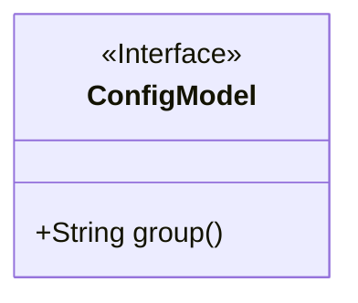
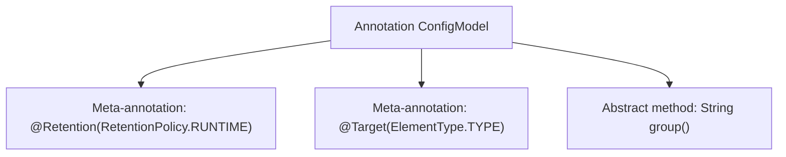

# Basic Information

|      |      |
|------|------|
| Name | ConfigModel |
| Language | .java |
| Code Path | WeFe/common/java/common-wefe/src/main/java/com/welab/wefe/common/wefe/dto/global_config/base/ConfigModel.java |
| Package Name | com.welab.wefe.common.wefe.dto.global_config.base |
| Dependencies | ['java.lang.annotation.ElementType', 'java.lang.annotation.Retention', 'java.lang.annotation.RetentionPolicy', 'java.lang.annotation.Target'] |
| Brief Description | The Java annotation `ConfigModel`, retained at runtime, targets classes, and requires a `group` string parameter to be specified. |

# Description

Here is the definition of a Java annotation named ConfigModel. The annotation is marked with @Retention(RetentionPolicy.RUNTIME), indicating it is retained at runtime and can be read via reflection. @Target(ElementType.TYPE) restricts this annotation to be used only on classes, interfaces, or enum types. The annotation includes a member variable named "group" of type String, which must be provided when using the annotation. This annotation is typically used for metadata tagging of configuration model classes.

# Class Summary

| Name   | Type  | Description |
|-------|------|-------------|
| ConfigModel | annotation | Define the runtime-retained class annotation ConfigModel, containing a mandatory group string attribute. |

## Class ConfigModel

|      |      |
|------|------|
| Access Modifier | @Retention(RetentionPolicy.RUNTIME);@Target(ElementType.TYPE);public |
| Type | annotation |
| Name | ConfigModel |
| Description | Define the runtime-retained class annotation ConfigModel, containing a mandatory group string attribute. |

### UML Class Diagram

This code defines a runtime annotation interface named `ConfigModel`, which can only be applied to class/interface types. The annotation includes a mandatory string attribute called `group`. The class diagram clearly shows this is an annotation type marked with `<<Interface>>`, containing a public abstract method `group()` that corresponds to the attribute defined in the annotation. This structure is commonly used in metadata tagging scenarios for configuration models.

### Internal Method Call Graph

This flowchart illustrates the structure of the Java annotation `ConfigModel`, which includes two meta-annotation configurations (runtime retention, class-level target) and the declaration of an abstract method `group()`. The meta-annotations control the retention policy and applicable target of the annotation, while the abstract method defines attributes that must be provided when using the annotation. This design is commonly used in framework configuration model marking scenarios.

### Field List

| Name  | Type  | Description |
|-------|-------|------|
| group | String | Get the group name of the current string. |

### Method List

| Name  | Type  | Description |
|-------|-------|------|

