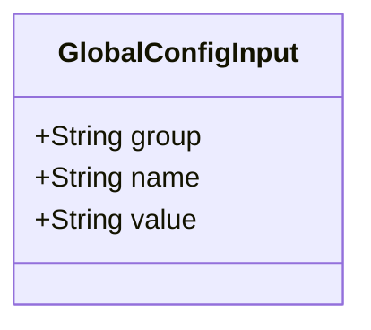
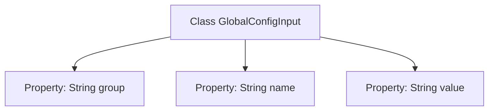

# Basic Information

|      |      |
|------|------|
| Name | GlobalConfigInput |
| Language | .java |
| Code Path | WeFe/common/java/common-wefe/src/main/java/com/welab/wefe/common/wefe/dto/global_config/base/GlobalConfigInput.java |
| Package Name | com.welab.wefe.common.wefe.dto.global_config.base |
| Dependencies | [] |
| Brief Description | The GlobalConfigInput class contains three string attributes: group, name, and value, which are used for configuration item grouping, naming, and values. |

# Description

The `GlobalConfigInput` class is a simple data structure designed to store global configuration information. It contains three public string-type fields: `group` indicates the configuration group, `name` represents the name of the configuration item, and `value` stores the specific configuration value. This struct is designed concisely for easy passing of configuration parameters between different modules.

# Class Summary

| Name   | Type  | Description |
|-------|------|-------------|
| GlobalConfigInput | class | The GlobalConfigInput class contains three string attributes: group, name, and value, which are used for configuration item grouping, naming, and values. |

## Class GlobalConfigInput

|      |      |
|------|------|
| Access Modifier | public |
| Type | class |
| Name | GlobalConfigInput |
| Description | The GlobalConfigInput class contains three string attributes: group, name, and value, which are used for configuration item grouping, naming, and values. |

### UML Class Diagram

This class diagram depicts a simple configuration input class GlobalConfigInput, containing three public string fields: group represents the configuration category, name indicates the configuration item name, and value stores the configuration value. Designed as a Data Transfer Object (DTO), this class exposes fields directly for external read/write operations without encapsulation logic, making it suitable for scenarios requiring rapid access to configuration information.

### Internal Method Call Graph

This flowchart illustrates the structure of the GlobalConfigInput class, which serves as a simple data carrier class containing three public string-type properties: group, name, and value. The diagram clearly depicts the ownership relationship between the class and its properties, with each property directly linked to the GlobalConfigInput class without methods or complex logic. Such a structure is typically used in configuration management or data transfer scenarios, where data is stored and accessed directly through properties.

### Field List

| Name  | Type  | Description |
|-------|-------|------|
| value | String | Common string variable value. |
| group | String | A public string variable group is defined. |
| name | String | public string name; |

### Method List

| Name  | Type  | Description |
|-------|-------|------|

