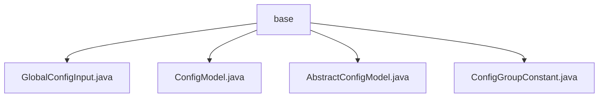

# Basic Information

|      |      |
|------|------|
| Name | base |
| Language | .java |
| Code Path | WeFe/common/java/common-wefe/src/main/java/com/welab/wefe/common/wefe/dto/global_config/base |
| Package Name | docs.common.java.common-wefe.src.main.java.com.welab.wefe.common.wefe.dto.global_config.base |
| Brief Description | The GlobalConfigInput class stores global configurations, containing fields for group, name, and value. ConfigModel is a runtime class annotation that requires specifying a group. AbstractConfigModel manages configuration classes through reflection. ConfigGroupConstant defines configuration group constants for each module. |

# Description

## Overview  
This module implements centralized management of global configurations, with core responsibilities including structured storage of configuration items (e.g., `GlobalConfigInput`), metadata tagging of model classes (e.g., `ConfigModel` annotation), and group management (e.g., `AbstractConfigModel`). The interface specification uniformly adopts static Maps to store configuration classes, enabling group-based retrieval through reflection mechanisms, such as the `getModelClass` method. Key data structures include configuration items with group identifiers (similar to an enhanced key-value pair) and configuration group constant enums (e.g., `ConfigGroupConstant`). External dependencies are limited to the Java reflection mechanism. For example, model classes are tagged with the `ConfigModel` annotation and then uniformly managed via the `AbstractConfigModel` base class.  

## Primary Business Scenarios  
The module supports configuration isolation across multiple business lines, with typical scenarios including system settings (e.g., email servers), subsystem parameters (e.g., gateway configurations), and cloud service integrations (e.g., function computing). The interaction mode resembles a registry center, where configuration classes are registered via annotations and can then be queried by group. Functional completeness is demonstrated by full-scenario coverage from basic configuration items to complex cloud services, such as Alibaba Cloud SMS and Spark engine configurations. API types include constant references (e.g., `ConfigGroupConstant`) and class query interfaces (e.g., `getModelClasses`). Integration examples include automatic discovery of all configuration classes annotated with `ConfigModel` via `AbstractConfigModel`.

### Package Internal Structure View

This flowchart illustrates the file structure relationships under the global_config/base directory in the WeFe project. The "base" serves as the parent node, containing four child file nodes: GlobalConfigInput.java, ConfigModel.java, AbstractConfigModel.java, and ConfigGroupConstant.java. These files belong to the foundational DTO layer of the global configuration module, representing the core data structure definitions of the configuration model.

# File List

| Name   | Type  | Description |
|-------|------|-------------|
| [GlobalConfigInput.java](GlobalConfigInput.md) | file | The GlobalConfigInput class contains three string attributes: group, name, and value, which are used for configuration item grouping, naming, and values. |
| [ConfigModel.java](ConfigModel.md) | file | The Java annotation `ConfigModel`, retained at runtime, targets classes, and requires specifying a `group` string parameter. |
| [AbstractConfigModel.java](AbstractConfigModel.md) | file | The abstract class AbstractConfigModel inherits from AbstractConfigModel, collects classes annotated with @ConfigModel via reflection and stores them in a static Map, providing methods to retrieve model classes by group name or all at once. |
| [ConfigGroupConstant.java](ConfigGroupConstant.md) | file | The ConfigGroupConstant class defines configuration group constants for system settings, subsystems, dependent services, function computing, deep learning, and computing engines. |

