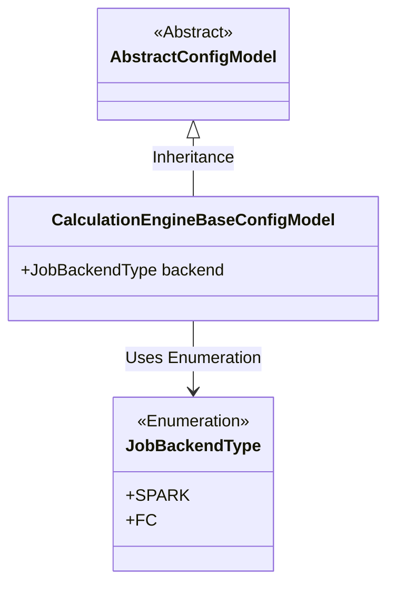
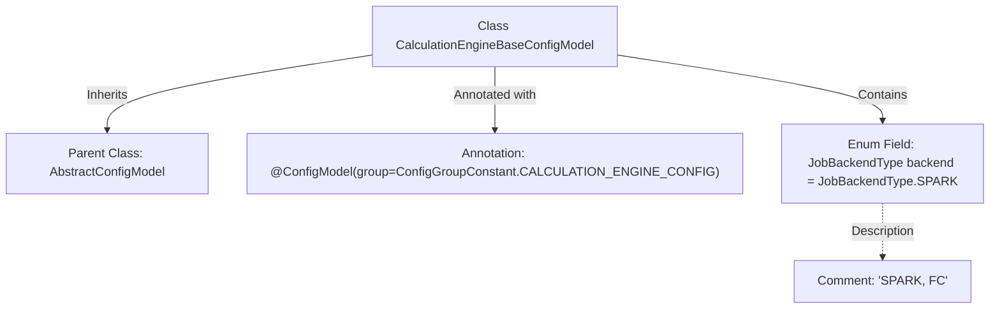

# Basic Information

|      |      |
|------|------|
| Name | CalculationEngineBaseConfigModel |
| Language | .java |
| Code Path | WeFe/common/java/common-wefe/src/main/java/com/welab/wefe/common/wefe/dto/global_config/calculation_engine/CalculationEngineBaseConfigModel.java |
| Package Name | com.welab.wefe.common.wefe.dto.global_config.calculation_engine |
| Dependencies | ['com.welab.wefe.common.wefe.dto.global_config.base.AbstractConfigModel', 'com.welab.wefe.common.wefe.dto.global_config.base.ConfigGroupConstant', 'com.welab.wefe.common.wefe.dto.global_config.base.ConfigModel', 'com.welab.wefe.common.wefe.enums.JobBackendType'] |
| Brief Description | Basic configuration class for computing engine, using SPARK as the default backend type. |

# Description

The content defines a configuration model class named CalculationEngineBaseConfigModel, which inherits from AbstractConfigModel. The @ConfigModel annotation specifies the configuration group as CALCULATION_ENGINE_CONFIG. The class includes a public property named backend, of type JobBackendType enum, with a default value of SPARK and optional values including SPARK and FC. This configuration is used to set the backend type of the calculation engine.

# Class Summary

| Name   | Type  | Description |
|-------|------|-------------|
| CalculationEngineBaseConfigModel | class | Basic configuration class for the computing engine, using SPARK as the default backend type. |

## Class CalculationEngineBaseConfigModel

|      |      |
|------|------|
| Access Modifier | @ConfigModel(group = ConfigGroupConstant.CALCULATION_ENGINE_CONFIG);public |
| Type | class |
| Name | CalculationEngineBaseConfigModel |
| Description | Basic configuration class for the computing engine, using SPARK as the default backend type. |

### UML Class Diagram

This class diagram illustrates the core structure of the configuration model. The CalculationEngineBaseConfigModel inherits from the abstract class AbstractConfigModel and contains a backend field of the JobBackendType enumeration, with a default value of SPARK. The JobBackendType enumeration defines two job backend types, SPARK and FC, used to identify the runtime environment of the calculation engine. The overall design meets the extensibility requirements of the configuration model, achieving common functionality through inheritance.

### Internal Method Call Graph

This flowchart illustrates the core structure of the CalculationEngineBaseConfigModel class, which inherits from AbstractConfigModel and is annotated with @ConfigModel. It primarily contains a backend field of type JobBackendType with a default value of SPARK, and the comment indicates support for both SPARK and FC backend types. The annotation specifies the configuration group as CALCULATION_ENGINE_CONFIG, reflecting the foundational role of this configuration class in the calculation engine module.

### Field List

| Name  | Type  | Description |
|-------|-------|------|
| backend = JobBackendType.SPARK | JobBackendType | Defined a public variable named backend, of type JobBackendType, with an initial value of SPARK. |

### Method List

| Name  | Type  | Description |
|-------|-------|------|

