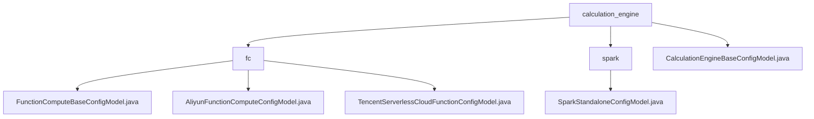

# Basic Information

|      |      |
|------|------|
| Name | calculation_engine |
| Language | .java |
| Code Path | WeFe/common/java/common-wefe/src/main/java/com/welab/wefe/common/wefe/dto/global_config/calculation_engine |
| Package Name | docs.common.java.common-wefe.src.main.java.com.welab.wefe.common.wefe.dto.global_config.calculation_engine |
| Brief Description | This module is a multi-cloud function computing configuration management system that uniformly manages Alibaba Cloud/Tencent Cloud resources. It supports parameter validation, default value settings, and relies on OSS/COS storage. Key configurations include account credentials, region information, etc., with a standardized inheritance system enabling end-to-end management. |

# Description

## Overview  
This module serves as the core system for unified management of multi-cloud function computing and computing engine configurations, adopting a design pattern similar to a resource bus. It standardizes interfaces through the AbstractConfigModel base class, utilizes @Check/@ConfigModel annotations for validation and grouping, and includes key data structures such as cloud provider credentials, resource quotas (e.g., memory/GPU), and region information. External dependencies include Alibaba Cloud OSS, Tencent Cloud COS, and the Spark computing framework. For example, it supports setting Driver memory (default: 1g) and hardware acceleration options (NONE/GPU).  

## Primary Business Scenarios  
The module primarily handles two types of scenarios: multi-cloud resource configuration and computing engine management. The former enables cross-cloud account binding (e.g., Alibaba Cloud VPC/Tencent Cloud COS buckets), while the latter switches computing backends via the JobBackendType enum (SPARK/FC). Typical workflows include: initializing cost thresholds → associating storage services → configuring computing parameters (e.g., executorMemory). All operations adhere to a versioned update mechanism, covering the entire lifecycle from authentication to resource allocation.

### Package Internal Structure View

This flowchart illustrates the hierarchical structure of computation engine configurations. The top-level directory `calculation_engine` contains two subdirectories (`fc` and `spark`) along with a base configuration class. The `fc` directory includes three distinct function compute configuration models, while the `spark` directory contains a standalone deployment configuration model. The entire structure clearly reflects the classification relationships of configurations for different computation engines.

# File List

| Name   | Type  | Description |
|-------|------|-------------|
| [CalculationEngineBaseConfigModel.java](CalculationEngineBaseConfigModel.md) | file | Basic configuration class for the computation engine, using SPARK as the default backend type. |
| [spark](spark/_module.md) | package | Spark standalone configuration class, including Driver memory, result set size, Executor memory, and hardware acceleration settings, all defaulting to 1g or NONE. |
| [fc](fc/_module.md) | package | The `FunctionComputeBaseConfigModel` class inherits from `AbstractConfigModel` and includes provider, daily cost limit, and monthly cost limit. The `AliyunFunctionComputeConfigModel` class contains Alibaba Cloud configurations such as account, region, and secret key. The `TencentServerlessCloudFunctionConfigModel` class includes Tencent Cloud configurations such as account, region, and secret key. |

