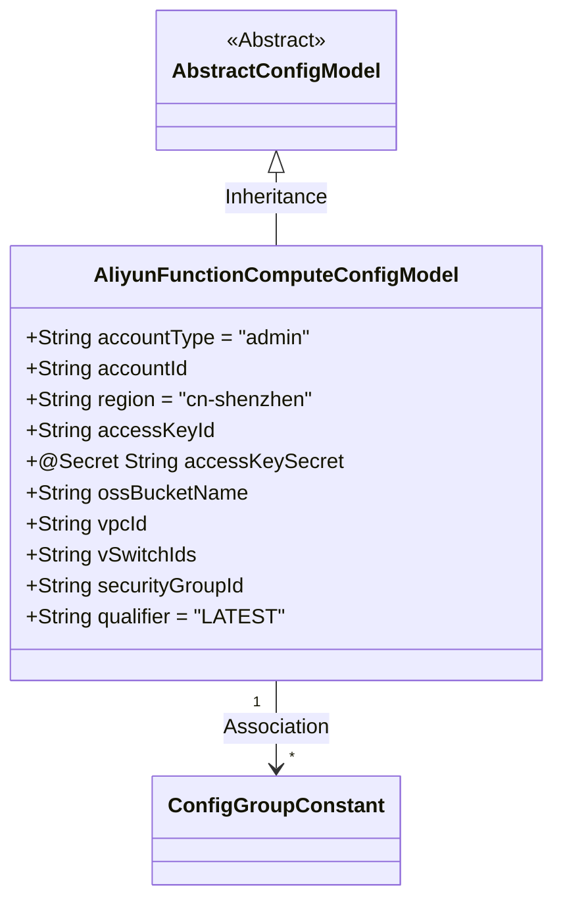

# Basic Information

|      |      |
|------|------|
| Name | AliyunFunctionComputeConfigModel |
| Language | .java |
| Code Path | WeFe/common/java/common-wefe/src/main/java/com/welab/wefe/common/wefe/dto/global_config/calculation_engine/fc/AliyunFunctionComputeConfigModel.java |
| Package Name | com.welab.wefe.common.wefe.dto.global_config.calculation_engine.fc |
| Dependencies | ['com.welab.wefe.common.fieldvalidate.secret.MaskStrategy', 'com.welab.wefe.common.fieldvalidate.secret.Secret', 'com.welab.wefe.common.wefe.dto.global_config.base.AbstractConfigModel', 'com.welab.wefe.common.wefe.dto.global_config.base.ConfigGroupConstant', 'com.welab.wefe.common.wefe.dto.global_config.base.ConfigModel'] |
| Brief Description | Alibaba Cloud Function Compute configuration class, including account type, ID, region, key, OSS bucket name, and optional VPC, switch, security group ID, and version number, with the default region set to cn-shenzhen. |

# Description

The code defines a configuration model class named `AliyunFunctionComputeConfigModel`, which belongs to the Alibaba Cloud Function Compute configuration group. The class includes multiple configuration fields: the account type defaults to `admin`, the account ID, the region defaults to `cn-shenzhen`, the `AccessKeyId`, and the encrypted `AccessKeySecret`, as well as the OSS `bucketName`. Optional fields include the VPC ID (`vpc id`), the VSwitch ID (`v switch id`), and the security group ID (`secure group id`). The version number defaults to `LATEST`. All fields are used to configure parameters related to the Alibaba Cloud Function Compute service.

# Class Summary

| Name   | Type  | Description |
|-------|------|-------------|
| AliyunFunctionComputeConfigModel | class | Alibaba Cloud Function Compute configuration class, including account type, ID, region, key, OSS bucket name, and optional network parameters such as VPC, vSwitch, security group ID, with the version defaulting to LATEST. |

## Class AliyunFunctionComputeConfigModel

|      |      |
|------|------|
| Access Modifier | @ConfigModel(group = ConfigGroupConstant.ALIYUN_FC_CONFIG);public |
| Type | class |
| Name | AliyunFunctionComputeConfigModel |
| Description | Alibaba Cloud Function Compute configuration class, including account type, ID, region, key, OSS bucket name, and optional network parameters such as VPC, vSwitch, security group ID, with the version defaulting to LATEST. |

### UML Class Diagram

This class diagram illustrates the structure of the Alibaba Cloud Function Compute configuration model. AliyunFunctionComputeConfigModel inherits from AbstractConfigModel and includes public fields such as account type, region, and access keys, with the accessKeySecret marked by the @Secret annotation. The class is associated with the ConfigGroupConstant.ALIYUN_FC_CONFIG configuration group via the @ConfigModel annotation, providing optional configuration items like network and security group settings required for the Function Compute service, with a default version qualifier of "LATEST".

### Internal Method Call Graph

```mermaid
graph TD
    A["Class AliyunFunctionComputeConfigModel"]
    B["Inherits: AbstractConfigModel"]
    C["Annotation: @ConfigModel(group=ConfigGroupConstant.ALIYUN_FC_CONFIG)"]
    D["Property: String accountType = 'admin'"]
    E["Property: String accountId"]
    F["Property: String region = 'cn-shenzhen'"]
    G["Property: String accessKeyId"]
    H["Property: @Secret String accessKeySecret"]
    I["Property: String ossBucketName"]
    J["Property: String vpcId"]
    K["Property: String vSwitchIds"]
    L["Property: String securityGroupId"]
    M["Property: String qualifier = 'LATEST'"]

    A --> B
    A --> C
    A --> D
    A --> E
    A --> F
    A --> G
    A --> H
    A --> I
    A --> J
    A --> K
    A --> L
    A --> M
```

This flowchart illustrates the structure of the AliyunFunctionComputeConfigModel class, including its inheritance relationship, configuration annotation, and all property fields. The class inherits from AbstractConfigModel and is annotated with @ConfigModel to mark it as part of the Alibaba Cloud Function Compute configuration group. Properties include account information, region configuration, access keys (with sensitive field encryption annotation), OSS bucket name, and optional network and security-related parameters, with several fields having default values.

### Field List

| Name  | Type  | Description |
|-------|-------|------|
| vpcId | String | Declare a public string variable vpcId. |
| accessKeySecret | String | The code defines a sensitive field accessKeySecret using a password policy mask. |
| accountType = "admin" | String | A public string variable accountType is defined with the value "admin". |
| qualifier = "LATEST" | String | The code defines a public string variable named qualifier with an initial value of "LATEST". |
| ossBucketName | String | Defined a public string variable ossBucketName for storing the OSS bucket name. |
| accessKeyId | String | Declare a public string variable accessKeyId. |
| region = "cn-shenzhen" | String | The public string variable `region` has a value of "cn-shenzhen", indicating the region is Shenzhen. |
| accountId | String | Declare a public string-type variable accountId. |
| securityGroupId | String | Security Group ID String Variable Declaration |
| vSwitchIds | String | The string-type variable vSwitchIds represents a list of virtual switch IDs. |

### Method List

| Name  | Type  | Description |
|-------|-------|------|

