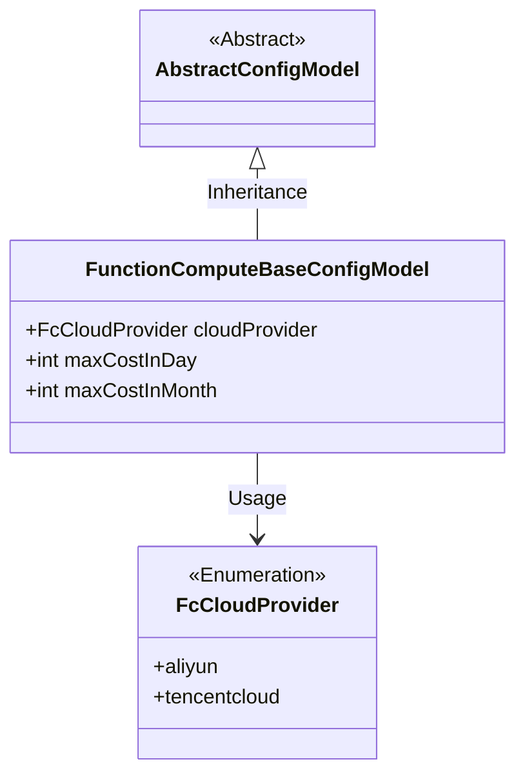
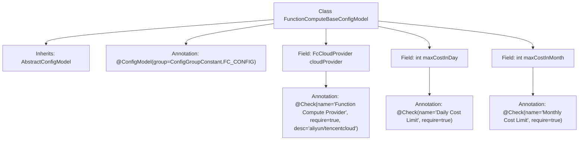

# Basic Information

|      |      |
|------|------|
| Name | FunctionComputeBaseConfigModel |
| Language | .java |
| Code Path | WeFe/common/java/common-wefe/src/main/java/com/welab/wefe/common/wefe/dto/global_config/calculation_engine/fc/FunctionComputeBaseConfigModel.java |
| Package Name | com.welab.wefe.common.wefe.dto.global_config.calculation_engine.fc |
| Dependencies | ['com.welab.wefe.common.fieldvalidate.annotation.Check', 'com.welab.wefe.common.wefe.dto.global_config.base.AbstractConfigModel', 'com.welab.wefe.common.wefe.dto.global_config.base.ConfigGroupConstant', 'com.welab.wefe.common.wefe.dto.global_config.base.ConfigModel', 'com.welab.wefe.common.wefe.enums.FcCloudProvider'] |
| Brief Description | Function Compute basic configuration class, including mandatory configuration items such as provider (default Alibaba Cloud), daily cost limit (default 500), and monthly cost limit (default 1000). |

# Description

This is a configuration model class named FunctionComputeBaseConfigModel, belonging to the FC_CONFIG configuration group. It inherits from AbstractConfigModel and includes three key configuration items: the function compute provider (required, default value is aliyun, options are aliyun or tencentcloud), daily cost limit (required, default 500), and monthly cost limit (required, default 1000). Each configuration item is marked with parameter validation via the @Check annotation.

# Class Summary

| Name   | Type  | Description |
|-------|------|-------------|
| FunctionComputeBaseConfigModel | class | Function computing basic configuration class, including required configuration items such as provider (default Alibaba Cloud), daily cost limit (default 500), and monthly cost limit (default 1000). |

## Class FunctionComputeBaseConfigModel

|      |      |
|------|------|
| Access Modifier | @ConfigModel(group = ConfigGroupConstant.FC_CONFIG);public |
| Type | class |
| Name | FunctionComputeBaseConfigModel |
| Description | Function computing basic configuration class, including required configuration items such as provider (default Alibaba Cloud), daily cost limit (default 500), and monthly cost limit (default 1000). |

### UML Class Diagram

This class diagram illustrates that FunctionComputeBaseConfigModel inherits from AbstractConfigModel and contains three configuration fields: cloudProvider (an enumeration type representing cloud service providers), maxCostInDay (daily cost limit), and maxCostInMonth (monthly cost limit). The cloudProvider field is annotated to restrict its options to either aliyun or tencentcloud, with all fields marked as mandatory and accompanied by business descriptions. The configuration model is associated with a specific configuration group via the @ConfigModel annotation, and the overall structure clearly reflects the inheritance relationship of the configuration class and field constraints.

### Internal Method Call Graph

This flowchart illustrates the structure of the `FunctionComputeBaseConfigModel` class, which inherits from the `AbstractConfigModel` class and is annotated with `@ConfigModel`. The class contains three fields: `cloudProvider`, `maxCostInDay`, and `maxCostInMonth`, each accompanied by corresponding `@Check` annotations for configuration validation. The annotation for the `cloudProvider` field includes more detailed descriptive information, while the annotations for the other two fields are relatively simple, containing only the name and a required marker. The entire class is used to configure basic parameters for function computing, including cloud service provider selection and cost limits.

### Field List

| Name  | Type  | Description |
|-------|-------|------|
| maxCostInDay = 500 | int | The code defines a public integer variable named maxCostInDay with a default value of 500, and includes a required validation annotation labeled "Daily Cost Limit". |
| cloudProvider = FcCloudProvider.aliyun | FcCloudProvider | The code defines a required check item named "Function Compute Provider," with optional values being aliyun or tencentcloud, and a default value of aliyun. |
| maxCostInMonth = 1000 | int | The code defines an integer variable named maxCostInMonth with an initial value of 1000, and marks it as a required field through the @Check annotation with the check name being "Monthly Cost Limit". |

### Method List

| Name  | Type  | Description |
|-------|-------|------|

